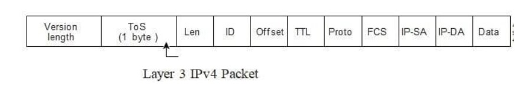
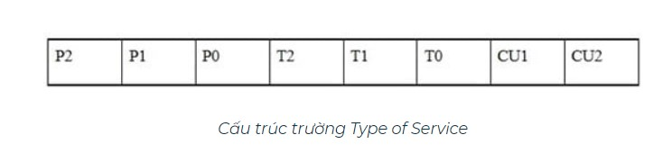
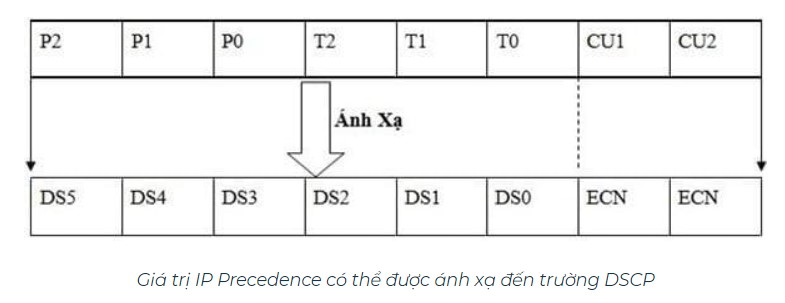
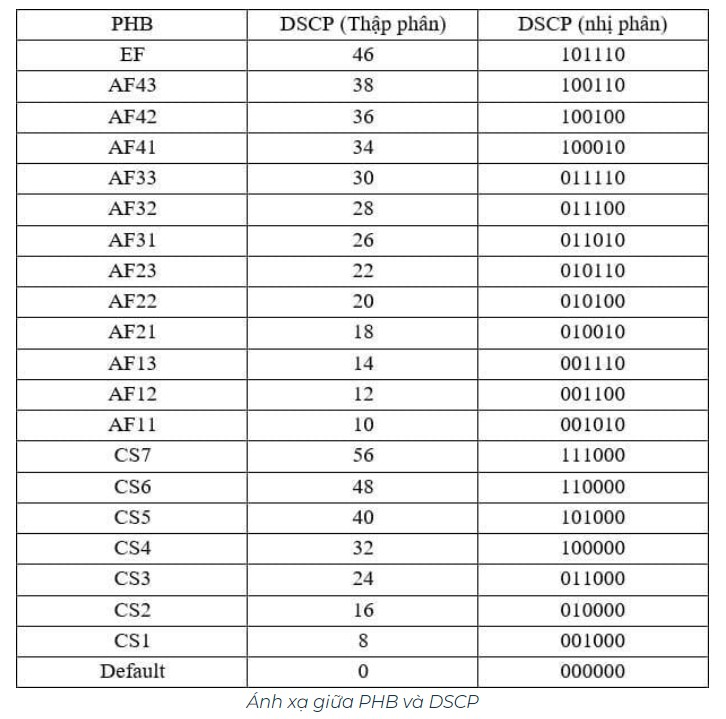

# Tìm hiểu về Quality of Service (QoS)

## 1. Tổng quan

Thông thường, hệ thống mạng hoạt động trên cơ sở phân phối tốt nhất, có nghĩa là tất cả các gói tin trên mạng đều có mức độ ưu tiên ngang nhau và có cơ hội được chuyển đến đích một cách kịp thời. Khi tắc nghẽn xảy ra, tất cả các gói tin đều có khả năng bị tắc nghẽn. Nếu không có QoS, Switch sẽ cung cấp dịch vụ tốt nhất cho tất cả các gói, bất kể nội dung gói hay kích cỡ. Nó sẽ gửi các gói tin mà không có bất kỳ sự đảm bảo về độ tin cậy, giới hạn độ trễ hoặc thông lượng nào.

Khi sử dụng tính năng QoS, ta có thể chọn một dạng gói tin cụ thể, ưu tiên nó theo tầm quan trọng tương đối của nó và sử dụng kỹ thuật quản lý tắc nghẽn và tránh tắc nghẽn để cung cấp ưu đãi. Việc triển khai QoS trong mạng làm cho hiệu năng mạng dễ dự đoán hơn và sử dụng băng thông hiệu quả hơn.

## 2. Cơ chế hoạt động

Việc thực hiện QoS được dựa trên kiến trúc dịch vụ phân biệt (Diff-Serv), kiến trúc này chỉ định rằng mỗi gói tin được phân loại khi nhập vào mạng. Các gói tin sẽ được đánh dấu như Class of Service (CoS), DSCP, IP Precedence ... Nên đánh dấu gói tin càng sớm càng tốt, khi được ưu tiên sớm thì luồng đi qua thiết bị tiếp theo sẽ trơn tru.

### 2.1. Giá trị IP Precedence và DSCP (Differentiated Service Code Point) - Layer 3

IP Precedence và DSCP là hai trường được sử dụng nhiều nhất để đánh dấu. Các công cụ QoS sử dụng chúng bởi vì header của gói tin IP tồn tại ở mọi nơi trên mạng.

Trong IP header của mỗi gói tin có chứa một trường gọi là ToS (Type of Service). Trường ToS có giá trị 1 byte. Và 3 bít đầu tiên (P2 đến P0) dùng để quy định các giá trị đánh dấu độ ưu tiên của packet và các giá trị này được gọi là IP Precedence.





Giá trị IP Precedence nằm trong khoảng từ 0 đến 7, 3 bits (P2 đến P0). Do sử dụng 3 bits nên sẽ có 8 giá trị (000 đến 111) định ra độ ưu tiên của gói tin từ thấp đến cao. Giúp router xử lý các gói tin này theo chất lượng dịch vụ. Ví dụ, gói tin được đánh dấu với giá trị IP Precedence là 7 (111) sẽ có độ ưu tiên về bandwidth, được ra khỏi hàng đợi trước các gói tin được đánh dấu với giá trị IP Precedence là 3 (011).

3 bits tiếp theo (T2 đến T0):

- T2 (T2=1): Yêu cầu truyền gấp.

- T1 (T1=1): Yêu cầu truyền với đường truyền chất lượng cao

- T0 (T0=1): Yêu cầu truyền đảm bảo.

2 bits cuối (CU1-CU2): Không dùng tới.

Tuy nhiên, hiện nay không dùng các giá trị của IP Precedence để đánh dấu gói tin. Với mục đích làm tăng hiệu quả chất lượng dịch vụ thì các công cụ QoS sẽ dùng các giá trị được gọi là điểm mã dịch vụ phân biệt DSCP (Differentiated Service Code Point) để tiến hành đánh dấu gói tin. 3 bits IP Precedence sẽ kết hợp với 3 bits tiếp theo (từ T2 đến T0) tạo thành 6 bits thể hiện các giá trị của DSCP. Do đó các giá trị DSCP nằm trong khoảng từ 0 đến 63.



6 bits DiffServ (DS) từ DS5 đến DS0 được dùng để đánh dấu gói tin và chỉ ra cách thức mỗi router xử lý gói tin như thế nào. Với 6 bits có thể tạo ra đến 64 class dịch vụ.

Lựa chọn giá trị DSCP phải tương thích với thứ tự IP Precedence. Nói cách khác là phải so trùng khớp với giá trị của 3 bits đầu tiên. Mọi sự thay đổi đều phải chú ý đến sự trùng khớp này. (Ví dụ: IP Precedence là 101 thì giá trị DSCP có thể là 101000)

Giá trị DSCP sẽ xác định một hành vi Perhop Behavior (PHB) để kích hoạt và hỗ trợ QoS cho các gói tin được đánh dấu.

Một số giá trị PHB chuẩn:

- Default: Tương đương với yêu cầu Best-Effort 

- AF (Assured Forwarding) - Chuyển tiếp đảm bảo: Định rõ những dịch vụ khác nhau sẽ được đảm bảo chuyển tiếp, thông qua miền DiffServ. AF được chia làm 4 lớp (class) đảm bảo chuyển tiếp khác nhau với 3 mức độ ưu tiên loại bỏ gói (drop precedence) xác định khác nhau. AFxy, x (chỉ số lớp) càng cao thì xếp vào hàng đợi tốt hơn, x càng nhỏ thì càng dễ bị loại bỏ, y càng cao thì gói tin càng dễ bị loại bỏ.

- EF (Expedited Forwarding): Chuyển tiếp nhanh: Độ trễ, độ biến động trễ, tỉ lệ mất gói thấp, băng thông được đảm bảo, và dịch vụ ở đầu cuối phải thông qua miền DiffServ. EF được sử dụng cho những luồng có độ ưu tiên rất cao.



### 2.2. Giá trị CoS (Class of Service) - Layer 2

Trường CoS chỉ tồn tại bên trong Ethernet frame khi các đường trunk 802.1Q và ISL được sử dụng. Có thể sử dụng trường này để thiết lập 8 giá trị nhị phân khác nhau mà có thể dùng cho chức năng phân loại của công cụ QoS như IP Precedence và DSCP. Giá trị CoS càng cao thì gói tin frame càng được ưu tiên.

- CoS 7: Không sử dụng (reserved)

- CoS 6: Không sử dụng (reserved)

- CoS 5: Dữ liệu voice (voice bearer)

- CoS 4: Dữ liệu video conferencing 

- CoS 3: Call signalling

- CoS 2: High priority data

- CoS 1: Medium priority data

- CoS 0: Best-Effort data

## 3. QoS trong Neutron

Trong Neutron hiện đang hỗ trợ các rule QoS sau:

- **bandwidth_limit**: Hỗ trợ giới hạn băng thông tối đa trên từng network, port và IP floating

- **dscp_marking**: Hỗ trợ giới hạn băng thông dựa trên DSCP value. Với QoS, Marking là 1 task nhỏ trong Classifycation. Classifycation có 2 task là identify gói tin và marking gói tin, sau đó đẩy vào các queue, dùng scheduling để quyết định gói nào ra trước, gói nào phải chờ.

- **minimum_bandwidth**: Giới hạn băng thông tối thiểu.

Dưới đây là bảng một số các backend, QoS rule hỗ trợ tương ứng và các hướng đi của traffic.


## 4. Cấu hình

### 4.1. Network node

Thêm QoS service vào `service_plugin` trong file `/etc/neutron/neutron.conf`:

```
[DEFAULT]

service_plugins = router,qos
```

Khai báo file `/etc/neutron/plugins/ml2/ml2_conf.ini`

```
[ml2]
extension_drivers = port_security, qos
```

Khai báo trong file `/etc/neutron/plugins/ml2/openvswitch_agent.ini`

```
[agent]
extensions = qos
```

Khởi động lại dịch vụ:

```
systemctl restart neutron-server neutron-openvswitch-agent
```

### 4.2. Compute node

Trên compute node, khai báo extensions trong file `/etc/neutron/plugins/ml2/openvswitch_agent.ini`

```
[agent]
extensions = qos
```

Khởi động lại agent

```
systemctl restart neutron-openvswitch-agent
```

### 4.3. Thao tác

- Tạo policy mới:

```
[root@controller ~]# openstack network qos policy create bw-limiter

+-------------+---------------------------------------------------------------------------------------------------------------------------------------------------------+
| Field       | Value                                                                                                                                                   |
+-------------+---------------------------------------------------------------------------------------------------------------------------------------------------------+
| description |                                                                                                                                                         |
| id          | a8aba0c7-8f21-48f1-8b00-65fe531cff0a                                                                                                                    |
| is_default  | False                                                                                                                                                   |
| location    | cloud='', project.domain_id=, project.domain_name='Default', project.id='0e4c96f6de7d46f481573515809cfb0e', project.name='admin', region_name='', zone= |
| name        | bw-limiter                                                                                                                                              |
| project_id  | 0e4c96f6de7d46f481573515809cfb0e                                                                                                                        |
| rules       | []                                                                                                                                                      |
| shared      | False                                                                                                                                                   |
| tags        | []                                                                                                                                                      |
+-------------+---------------------------------------------------------------------------------------------------------------------------------------------------------+
```

- Tạo rule

```
[root@controller ~]# openstack network qos rule create --type bandwidth-limit --max-kbps 3000 --max-burst-kbits 300 --egress bw-limiter

+----------------+---------------------------------------------------------------------------------------------------------------------------------------------------------+
| Field          | Value                                                                                                                                                   |
+----------------+---------------------------------------------------------------------------------------------------------------------------------------------------------+
| direction      | egress                                                                                                                                                  |
| id             | 79d54f9f-f1ec-4430-8865-c52b26f53cb9                                                                                                                    |
| location       | cloud='', project.domain_id=, project.domain_name='Default', project.id='0e4c96f6de7d46f481573515809cfb0e', project.name='admin', region_name='', zone= |
| max_burst_kbps | 300                                                                                                                                                     |
| max_kbps       | 3000                                                                                                                                                    |
| name           | None                                                                                                                                                    |
| project_id     |                                                                                                                                                         |
+----------------+---------------------------------------------------------------------------------------------------------------------------------------------------------+
```

- Kiểm tra các rule trong policy

```
[root@controller ~]# openstack network qos policy list
+--------------------------------------+------------+--------+---------+----------------------------------+
| ID                                   | Name       | Shared | Default | Project                          |
+--------------------------------------+------------+--------+---------+----------------------------------+
| a8aba0c7-8f21-48f1-8b00-65fe531cff0a | bw-limiter | False  | False   | 0e4c96f6de7d46f481573515809cfb0e |
+--------------------------------------+------------+--------+---------+----------------------------------+


[root@controller ~]# openstack network qos rule list a8aba0c7-8f21-48f1-8b00-65fe531cff0a
+--------------------------------------+--------------------------------------+-----------------+----------+-----------------+----------+-----------+-----------+
| ID                                   | QoS Policy ID                        | Type            | Max Kbps | Max Burst Kbits | Min Kbps | DSCP mark | Direction |
+--------------------------------------+--------------------------------------+-----------------+----------+-----------------+----------+-----------+-----------+
| 79d54f9f-f1ec-4430-8865-c52b26f53cb9 | a8aba0c7-8f21-48f1-8b00-65fe531cff0a | bandwidth_limit |     3000 |             300 |          |           | egress    |
+--------------------------------------+--------------------------------------+-----------------+----------+-----------------+----------+-----------+-----------+
```

Các QoS policy có thể được gắn vào port hoặc network cụ thể:

```
[root@controller ~]# openstack port list
+--------------------------------------+------+-------------------+-------------------------------------------------------------------------------+--------+
| ID                                   | Name | MAC Address       | Fixed IP Addresses                                                            | Status |
+--------------------------------------+------+-------------------+-------------------------------------------------------------------------------+--------+
| 109c8109-2cf5-457a-8ab0-044e996dcba5 |      | fa:16:3e:92:d4:2a | ip_address='10.10.10.2', subnet_id='98138aed-5a7c-4f34-bd6f-d64020305501'     | ACTIVE |
| 1c67b943-cf89-479b-8885-4437c6978e90 |      | fa:16:3e:79:5a:4f | ip_address='10.10.20.1', subnet_id='e747cb0b-0484-4487-834d-2ef59df01b4b'     | ACTIVE |
| 67576893-67e6-48ee-bebe-97a0df589a5b |      | fa:16:3e:b7:8c:21 | ip_address='192.168.70.110', subnet_id='0c932ad4-bf23-4014-97bd-5e9baf6be7b7' | ACTIVE |
| 8ed43ed8-f830-4a3a-81f4-d818f807f194 |      | fa:16:3e:05:a4:76 | ip_address='192.168.70.111', subnet_id='0c932ad4-bf23-4014-97bd-5e9baf6be7b7' | N/A    |
| 99497748-f614-452d-b019-b1a396db97ff |      | fa:16:3e:2b:3b:0b | ip_address='10.10.10.44', subnet_id='98138aed-5a7c-4f34-bd6f-d64020305501'    | ACTIVE |
| a86c6dec-ed46-4f4e-9929-f6c37c3d9a1c |      | fa:16:3e:13:9f:6c | ip_address='10.10.20.58', subnet_id='e747cb0b-0484-4487-834d-2ef59df01b4b'    | ACTIVE |
| a9bdb9c9-46ed-4b97-8177-9576bf95f831 |      | fa:16:3e:c9:75:0c | ip_address='10.10.10.1', subnet_id='98138aed-5a7c-4f34-bd6f-d64020305501'     | ACTIVE |
| c3fca761-74e6-4eff-be14-8244b0639ec3 |      | fa:16:3e:bf:03:76 | ip_address='192.168.70.120', subnet_id='0c932ad4-bf23-4014-97bd-5e9baf6be7b7' | ACTIVE |
| d2dcbdcf-9d7d-4982-a4d6-b11f1f253a63 |      | fa:16:3e:00:0e:1c | ip_address='10.10.20.2', subnet_id='e747cb0b-0484-4487-834d-2ef59df01b4b'     | ACTIVE |
+--------------------------------------+------+-------------------+-------------------------------------------------------------------------------+--------+

[root@controller ~]# openstack port set --qos-policy bw-limiter 99497748-f614-452d-b019-b1a396db97ff

[root@controller ~]# openstack port show 99497748-f614-452d-b019-b1a396db97ff
+-------------------------+---------------------------------------------------------------------------------------------------------------------------------------------------------+
| Field                   | Value                                                                                                                                                   |
+-------------------------+---------------------------------------------------------------------------------------------------------------------------------------------------------+
| admin_state_up          | UP                                                                                                                                                      |
| allowed_address_pairs   |                                                                                                                                                         |
| binding_host_id         | compute1.localdomain                                                                                                                                    |
| binding_profile         |                                                                                                                                                         |
| binding_vif_details     | bridge_name='br-int', datapath_type='system', ovs_hybrid_plug='False', port_filter='True'                                                               |
| binding_vif_type        | ovs                                                                                                                                                     |
| binding_vnic_type       | normal                                                                                                                                                  |
| created_at              | 2019-11-19T04:07:11Z                                                                                                                                    |
| data_plane_status       | None                                                                                                                                                    |
| description             |                                                                                                                                                         |
| device_id               | 3f8ea650-2812-4ee2-be5b-b1120720f407                                                                                                                    |
| device_owner            | compute:nova                                                                                                                                            |
| dns_assignment          | None                                                                                                                                                    |
| dns_domain              | None                                                                                                                                                    |
| dns_name                | None                                                                                                                                                    |
| extra_dhcp_opts         |                                                                                                                                                         |
| fixed_ips               | ip_address='10.10.10.44', subnet_id='98138aed-5a7c-4f34-bd6f-d64020305501'                                                                              |
| id                      | 99497748-f614-452d-b019-b1a396db97ff                                                                                                                    |
| location                | cloud='', project.domain_id=, project.domain_name='Default', project.id='0e4c96f6de7d46f481573515809cfb0e', project.name='admin', region_name='', zone= |
| mac_address             | fa:16:3e:2b:3b:0b                                                                                                                                       |
| name                    |                                                                                                                                                         |
| network_id              | deb9a445-063b-4b58-a3db-f5a6d6e60a91                                                                                                                    |
| port_security_enabled   | True                                                                                                                                                    |
| project_id              | 0e4c96f6de7d46f481573515809cfb0e                                                                                                                        |
| propagate_uplink_status | None                                                                                                                                                    |
| qos_policy_id           | a8aba0c7-8f21-48f1-8b00-65fe531cff0a                                                                                                                    |
| resource_request        | None                                                                                                                                                    |
| revision_number         | 8                                                                                                                                                       |
| security_group_ids      | 3870abd6-aaea-4b8f-9497-c20403a9939d                                                                                                                    |
| status                  | ACTIVE                                                                                                                                                  |
| tags                    |                                                                                                                                                         |
| trunk_details           | None                                                                                                                                                    |
| updated_at              | 2019-12-11T10:29:36Z                                                                                                                                    |
+-------------------------+---------------------------------------------------------------------------------------------------------------------------------------------------------+
```

Gỡ port khỏi QoS policy:

```
openstack port unset --no-qos-policy <id_port>
```

Sửa rule:

```
openstack network qos rule set --[option] [value] <id_policy> <id_rule>
```

## Nguồn tham khảo

https://www.daihockhonggiay.com/blogs/post/quality-of-service

https://vnpro.vn/tin-tuc/tong-quan-va-nguyen-ly-hoat-dong-cua-mo-hinh-differentiated-service-diffserv-1052.html

https://github.com/trangnth/Timhieu_Openstack/blob/master/Doc/04.%20Neutron/09.%20QoS.md

https://github.com/thaonguyenvan/meditech-thuctap/blob/master/ThaoNV/Tim%20hieu%20OpenStack/docs/neutron/qos.md