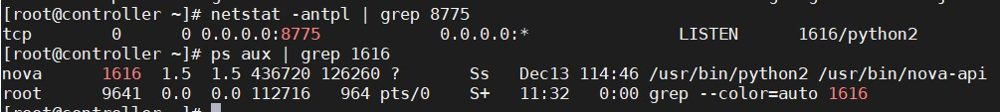
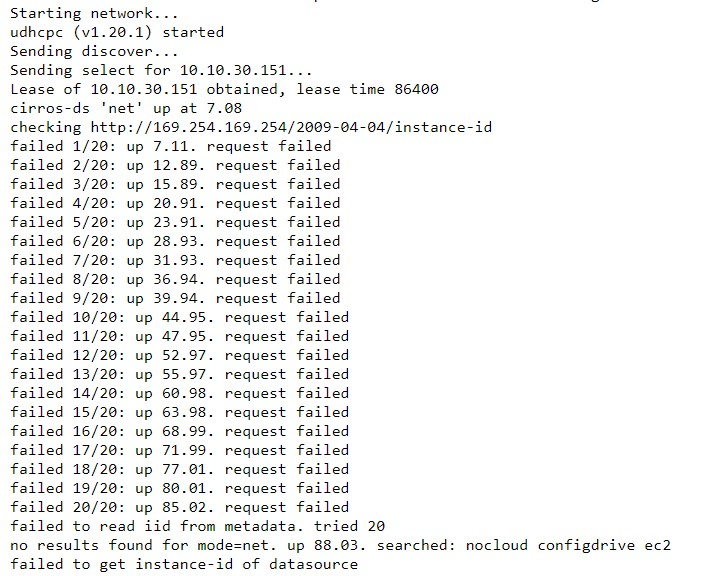
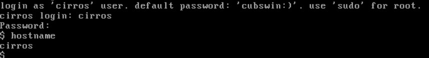
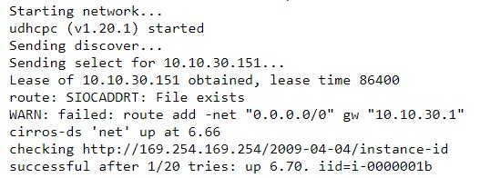
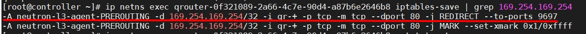

# Tìm hiểu OpenStack Metadata Service

## 1. Giới thiệu

OpenStack Metadata Service là một dịch vụ cung cấp các thông tin cấu hình cho các instance (các thông tin này gọi chung là metadata). Khi instance khởi động, nó yêu cầu và thu thập các metadata của chính nó như IP, hostname, SSH keys, thông tin routing,... từ Metadata Service. Cloud-init của instance được cá nhân hoá theo metadata.

Cloud-init là một dịch vụ trong OpenStack hoàn toàn khác biệt với metadata service. Nó sẽ dùng metadata service để truyền cho máy ảo các tuỳ chọn cấu hình khi khởi động lần đầu.

## 2. Cấu trúc của Metadata Service


### Nova-api-metadata

Nova-api-metadata là một service con của service nova-api. Nó là nơi cung cấp metadata. Khi một VM được khởi động, bạn có thể chọn các metadata thông qua REST API của nova-api-metadata.

nova-api-metadata service chạy trên controller node với port là 8775 (có thể được sửa đổi bởi cấu hình của nova).



nova-api-metadata được gộp với nova-api service. Bạn có thể enable nova-api-metadata qua tuỳ chọn `enabled_apis` trong file `nova.conf`

```
enabled_apis = osapi_compute,metadata
```

### Neutron-metadata-agent

nova-api-metadata sẽ đi qua management network và VM thì đi qua business network, vậy nên VM sẽ không thể kết nối trực tiếp được với nova-api-metadata. Lúc đó, nó sẽ cần sử dụng tới neutron-metadata-agent service đang chạy trên network node.

Trên network node chạy 2 thành phần l3 agent và dhcp agent, chúng sẽ tạo ra một tiến trình haproxy, chạy trong các namespace tương ứng của chúng, nhận các metadata request từ các VM, và forward request tới Unix Domain Socket. neutron-metadata-agent service sau đó sẽ chuyển tiếp tới nova-api-metadata.

Toàn bộ quá trình được tóm tắt như sau:

- Instance gửi metadata request tới router hoặc haproxy process được tạo bởi dhcp agent

- haproxy process gửi request tới neutron-metadata-agent qua Unix Domain Socket

- neutron-metadata-agent gửi request tới nova-api-metadata service thông qua internal management network

### neutron-ns-metadata-proxy

neutron-ns-metadata-proxy được tạo bởi dhcp agent và l3 agent (nó chạy trên namespace nơi chứa dhcp agent hoặc router)

neutron-ns-metadata-proxy được kết nối trực tiếp với neutron-metadata-agent thông qua Unix Domain Socket

## 3. Cách thức hoạt động, luồng của metadata trong OpenStack

Đường đi tổng quan của metadata:

- Máy ảo gửi request tới neutron-ns-metadata-proxy thông qua neutron network (Project network)

- neutron-ns-metadata-proxy gửi request tới neutron-metadata-agent thông qua Unix Domain Socket

- neutron-metadata-agent gửi request tới nova-api-metadata thông qua internal management network

### Ví dụ:

Tạo một network private với dhcp (không có router) và thử chạy một máy ảo với network vừa tạo rồi theo dõi log. Kết quả:



Có thể thấy rằng máy ảo đã nhận IP từ DHCP tuy nhiên nó không thể truy cập vào địa chỉ `http://169.254.169.254/2009-04-04/instance-id` (truy cập 20 lần thất bại)

### Địa chỉ 169.254.169.254 là gì

Địa chỉ này bắt nguồn từ AWS, khi mà Amazon bắt đầu thiết kế lên public cloud, họ dùng 169.254.169.254 làm địa chỉ cho server để máy ảo có thể request metadata. 

Với ví dụ trên, khi máy ảo không thể truy cập tới 169.254.169.254 thì đương nhiên nó không thể lấy được metadata. Bởi thế hostname (mặc định là instance name) sẽ không được set.



OpenStack sẽ tạo ra một haproxy process thông qua L3 agent hoặc DHCP agent để thực hiện forwarding metadata. Đầu tiên chúng ta sẽ check haproxy process trên network node sẽ không tìm thấy tiến trình haproxy đang chạy, điều này sẽ giải thích nguyên nhân instance fail.

Mặc định thì haproxy process được tạo bởi L3 agent (dhcp agent đang tắt). Vì mạng hiện tại không được kết nối với router nên haproxy process không được tạo ra.

Gắn mạng vào router, và khởi động lại máy ảo



VM đã thu thập metadata thành công từ 169.254.169.254

Quá trình lấy metadata của máy ảo:

- Sau khi máy ảo khởi động xong, nó sẽ tạo ra một metadata request tới port 80 của địa chỉ `169.254.169.254`

- Metadata request sẽ được định tuyến đi vào PREROUTING chain, và địa chỉ đích là 169.254.169.254, vào port `qr-port` port đích sẽ là 80 và được chuyển hướng tới 9697, vì khi haproxy process được tạo bởi router đang lắng nghe trên port 9697.



- haproxy process chuyển tiếp các request tới neutron-metadata-agent qua Unix Domain Socket, lần lượt chuyển tiếp nó tới nova-api-metadata thông qua management gateway.

## 4. DHCP agent 

Mặc định OpenStack quản lý các việc triển khai metadata thông qua L3 agent, và sau đó kết nối với nova-api-metadata. Tuy nhiên, không phải tất cả các môi trường đều có L3 agent. Các môi trường không có L3 agent có thể thực hiện lấy được metadata bằng cách sử dụng DHCP agent.

- Đầu tiên, cấu hình tuỳ chọn `enable_isolated_metadata = true` trong file `/etc/neutron/dhcp_agent.ini`, sau đó khởi động lại `neutron-dhcp-agent`

- Kiểm tra haproxy process trên network node. Ở đây có thể tìm thấy network với dhcp được bật sẽ tạo ra một haproxy process tương ứng và cấu hình `169.254.169.254` trên dhcp port tương ứng.

- Khởi động lại máy ảo, máy ảo sẽ gửi metadata request tới port 80 của `169.254.169.254`. Theo internal route của instance, request sẽ đi tới dhcp_port

- Metadata request tới dhcp namespace, ở đây nó sẽ được giám sát bởi haproxy process.

- Giống với L3 agent, haproxy process sẽ chuyển tiếp request tới neutron-metadata-agent qua Unix Domain Socket, và chuyển tiếp lần lượt tới nova-api-metadata thông qua management gateway.

## Tham khảo

https://github.com/trangnth/Timhieu_Openstack/blob/master/Doc/05.%20Metadata/1.%20metadata.md

https://github.com/thaonguyenvan/meditech-thuctap/blob/master/ThaoNV/Tim%20hieu%20OpenStack/docs/metadata/metadata.md