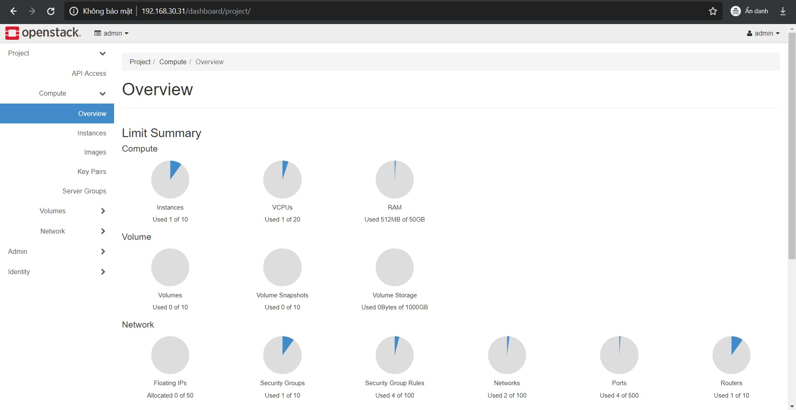
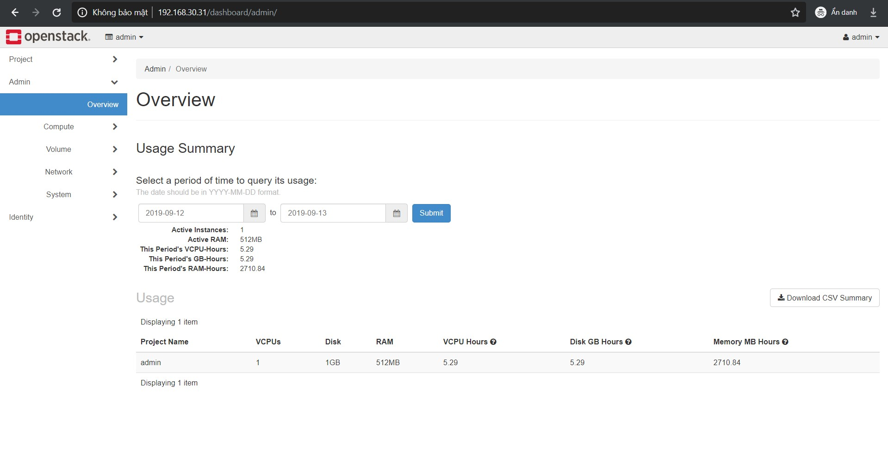

# Làm quen với Dashboard Openstack

## 1. Các tab

### 1.1. Project tab

Projects là trung tâm tổ chức (organizational units) của cloud, nó còn được gọi là tenants hoặc accounts. Mỗi user là một thành viên của một hoặc nhiều projects. Với project, user có thể tạo và quản lý các máy ảo.

Ở tab project, bạn có thể xem và quản lý tài nguyên trong một project đã chọn bao gồm các máy ảo và file image.

Từ project tab, có thể truy cập tới các thành phần sau:

#### API Access: Xem các API endpoint

#### Compute tab

- **Overview**: Xem thống kê của project

- **Instances**: Xem, tạo máy ảo, tạo snapshot hoặc kết nối đến chúng thông qua VNC

- **Images**: Xem những image và snapshot máy ảo được tạo bởi user. Tạo, sửa và xoá images. Launch máy ảo từ image hoặc snapshot.

- **KeyPairs**: Xem, tạo, sửa, nhập và xoá keypairs

#### Volume tab

- **Volumes**: Xem, tạo, sửa và xoá các volume

- **Backups**: Xem, tạo, sửa và xoá các backup

- **Snapshots**: Xem, tạo, sửa và xoá các volume snapshot

- **Consistency Groups**: Xem, tạo, sửa và xoá các Consistency group

- **Consistency Group Snapshots**: Xem, tạo, sửa và xoá các consistency group snapshot

#### Network tab

- **Network Topology**: Xem mô hình mạng

- **Networks**: Tạo và quản lý các public/private network

- **Routers**: Tạo và quản lý router

- **Security Groups**: Xem, tạo, sửa và xoá các security group và security group rule

- **Floating IPs**: Cấp hoặc giải phóng một địa chỉ IP từ một project

#### Object Store tab

- **Containers**: Tạo và quản lý các container và object.

### 1.2. Admin tab

Người quản trị có thể dùng `Admin` tab để xem mức độ sử dụng và quản lý các instance, volume, flavor, image, network,...

Từ Admin tab, có thể truy cập và thực hiện các tác vụ sau:

#### Overview tab

- **Overview**: Xem báo cáo

#### Compute tab

- **Hypervisors**: Xem tóm tắt hypervisor

- **Host Aggregates**: Xem, tạo và chỉnh sửa host aggregates. Xem danh sách availability zones. (host aggregates có thể được coi là cơ chế cho việc phân vùng dành cho các availability zones)

- **Instances**: View, pause, resume, suspend, migrate, soft hoặc hard reboot, xoá các instance đang chạy thuộc về các user của một vài project. Cũng có thể xem log của instance hoặc truy cập instance qua VNC.

- **Flavors**: Xem, tạo, sửa, xem thông tin và xoá các flavor. Flavor chính là kích thước của máy ảo.

- **Images**: Xem, tạo, chỉnh sửa thuộc tính và xoá các image tuỳ chỉnh.

#### Volume tab

- **Volumes**: Xem, tạo, quản lý và xoá các volume

- **Snapshots**: Xem, quản lý và xoá các volume snapshot

- **Volume Types**: Xem, tạo, quản lý và xoá các volume type

#### Network tab

- **Networks**: Xem, tạo, chỉnh sửa thuộc tính và xoá các network

- **Routers**: Xem, tạo, chỉnh sửa thuộc tính và xoá các router

- **Floating IPs**: Cấp một địa chỉ IP cho project hoặc giải phóng nó

#### System tab

- **Defaults**: Xem các giá trị quotas mặc định. Quotas cho biết các kích thước tối đa và số lượng tài nguyên.

- **Metadata Definitions**: Import namespace và xem các thông tin metadata

- **System Information**: Sử dụng các tab sau để xem thông tin service:

	- **Services**: Xem danh sách service
	
	- **Compute Services**: Xem danh sách tất cả các compute service
	
	- **Block Storage Services**: Xem danh sách tất cả các Block Storage service
	
	- **Network Agents**: Xem các network agents
	
### 1.3. Identity tab

- **Projects**: Xem, tạo, xoá project, gán hoặc loại user khỏi project

- **Users**: Xem, tạo, kích hoạt, vô hiệu hoá và xoá user

### 1.4. Settings tab

Click vào `Settings` ở góc trên cùng bên phải, phần drop down menu của user. Tại đây bạn có thể:

- **User Settings**: Xem và quản lý cài đặt dashboard

- **Change Password**: Thay đổi mật khẩu cho user.

## 2. Các thao tác cơ bản

## Nguồn

https://docs.openstack.org/horizon/stein/user/log-in.html