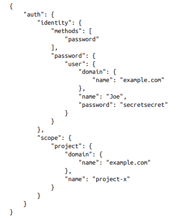
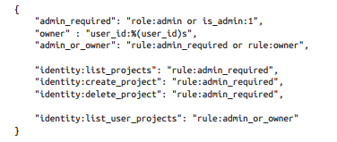

# Tìm hiểu tổng quan về Keystone

## 1. Identity service overview

OpenStack Identity service cung cấp một single point of integration để quản lý authentication, authorization và catalog of services.

Identity service là service tiêu biểu đầu tiên mà người dùng tương tác với. Sau khi xác thực, người dùng cuối có thể sử dụng định danh của họ để truy cập các OpenStack service khác. Tương tự, các openstack service khác tận dụng Identity service để đảm bảo người dùng nói họ là ai và discover nơi các service khác nằm trong triển khai. Identity service có thể tích hợp với một số hệ thống quản lý người dùng bên ngoài (ví dụ như LDAP)

Các user và services có thể xác định các service khác bằng cách sử dụng service catalog được quản lý bởi Identity service. Như tên gọi của nó, một service catalog là tập hợp các service hiện có trong triển khai OpenStack. Mỗi service có thể có một hoặc nhiều endpoint và mỗi endpoint có thể là một trong 3 loại: admin, internal và public. Trong môi trường production, các loại endpoint khác nhau có thể nằm trên các mạng riêng biệt tiếp xúc với các loại user khác nhau vì lý do bảo mật. Chẳng hạn, public API network có thể hiển thị từ Internet để khách hàng có thể quản lý cloud của họ. Admin API network có thể hạn chế đối với các operator trong tổ chức quản lý cơ sở hạ tầng cloud. Internal API network có thể hạn chế đối với hosts chứa OpenStack service. Ngoài ra, OpenStack hỗ trợ nhiều vùng cho khả năng mở rộng. Mỗi OpenStack service trong triển khai của bạn cần một service entry với các endpoint tương ứng được lưu trong Identity service. 

Identity service gồm các thành phần:

- **Server**: Một máy chủ tập trung cung cấp dịch vụ authentication và authorization sử dụng một RESTful interface.

- **Drivers**: Các driver hoặc service backend được tích hợp vào máy chủ tập trung. Chúng được sử dụng để truy cập thông tin nhận dạng trong các kho lưu trữ bên ngoài OpenStack, và có thể đã tồn tại trong cơ sở hạ tầng nơi OpenStack được triển khai (ví dụ như SQL database hoặc LDAP server).

- **Modules**: Các middleware modules chạy trên các thành phần của OpenStack mà sử dụng dịch vụ Identity. Các module này chặn các request tới các service và trích xuất lấy thông tin của user, và gửi chúng tới máy chủ tập trung để xác thực. Sự tích hợp giữa các module middleware và các thành phần của OpenStack sử dụng Python Web Serve Gateway Interface.

## 2. Tổng quan Keystone

Keystone là một OpenStack service cung cấp API client authentication, service discovery, và distributed multi-tenant authorization bằng cách implementing [OpenStack's Identity API](https://developer.openstack.org/api-ref/identity/index.html).

### 2.1. Kiến trúc Keystone

Keystone cung cấp các dịch vụ:

- **Identity**: Identity service cung cấp thông tin xác thực và dữ liệu về users và groups. Trong trường hợp cơ bản, dữ liệu này được quản lý bởi Identity service, cho phép nó xử lý tất cả các hoạt động CRUD liên quan đến dữ liệu này. Trong các trường hợp phức tạp hơn, dữ liệu thay vào đó được quản lý bởi một authoritative backend service. 

- **Resource**: Cung cấp dữ liệu về projects và domains

- **Assignment**: Cung cấp dữ liệu về roles và role assignment

- **Token**: Xác thực và quản lý token sử dụng để xác thực các yêu cầu sau khi thông tin đăng nhập của người dùng đã được xác minh.

- **Catalog**: Cung cấp endpoint của các dịch vụ sử dụng cho việc tìm kiếm và truy cập các dịch vụ.

### 2.2. Luồng hoạt động Keystone

### 2.3. Các khái niệm trong Keystone

#### Project

- Khái niệm chỉ sự gom gộp, cô lập các nguồn tài nguyên (server, images, ...)

- Các project tự mình không có các user, các user và group muốn truy cập tài nguyên trong project phải được gán role để quy định tài nguyên được phép truy cập trong project.

#### Domain

- Cô lập khung nhìn về tập các project và user (cũng như user group) đối với mỗi tổ chức riêng biệt, tránh việc user có khung nhìn toàn cục gây ra xung đột không mong muốn về username giữa các tổ chức khác nhau trong cùng một hệ thống cloud.

- Domain là tập hợp bao gồm các user, group và project

- Phân chia tài nguyên vào các "kho chứa" để sử dụng độc lập với mỗi tổ chức.

- Mỗi domain có thể coi là sự phân chia về mặt logic giữa các tổ chức, doanh nghiệp trên cloud

#### Users và User Groups 

- User: Thực thể được phép truy cập vào tài nguyên cloud đã được cô lập bởi domain và project

- Group: Tập hợp các user

- User và user group được phép **common across domain**, nghĩa là trên các domain khác nhau, tên user và tên group của các domain này có thể giống nhau. Tuy nhiên mỗi user và group đều có một UUID duy nhất.

#### Roles

- Khái niệm gắn liền với Authorization (uỷ quyền), giới hạn các thao tác vận hành hệ thống và nguồn tài nguyên mà user được phép,

- Role được gán cho user và nó được gán cho user đó trên một project cụ thể (assigned to user, assigned on project)

#### Assignment

Khái niệm **role assignment** thể hiện sự kết nối giữa một actor (user và user group) với một actor (domain, project) và một role. Role assignment được cấp phát và thu hồi, và có thể được kế thừa giữa các user và group trên project của domains.

#### Targets

Khái niệm chỉ project hoặc domain, nơi mà role được gán cho người dùng trên đó

#### Token 

Có thể coi là chìa khoá để truy cập tài nguyên trên cloud. Token được sử dụng để xác thực tài khoản người dùng và uỷ quyền cho người dùng khi truy cập tài nguyên (thực hiện API call)

Token bao gồm:

- ID: Định danh duy nhất của token trên cloud

- Payload: Là dữ liệu về người dùng (user được truy cập trên project nào, danh mục các dịch vụ sẵn sàng để truy cập cùng với endpoint truy cập các dịch vụ đó), thời gian khởi tạo, thời gian hết hạn,...

#### Catalog 

Là danh mục các dịch vụ để người dùng tìm kiếm và truy cập. Catalog chỉ ra các endpoint truy cập dịch vụ, loại dịch vụ mà người dùng truy cập cùng với tên tương ứng,... Từ đó người dùng có thể request khởi tạo VM và lưu trữ object.

### 2.4. Identity

Identity service trong Keystone cung cấp các actors. Nó có thể tới từ nhiều dịch vụ khác nhau như SQL, LDAP và Federated Identity Providers.

#### SQL

- Keystone có tuỳ chọn cho phép lưu trữ actor trong SQL. Nó hỗ trợ các database như MySQL, PostgreSQL và DB2

- Keystone sẽ lưu những thông tin như tên, mật khẩu và mô tả

- Những cài đặt của các database này nằm trong file config của Keystone

- Về bản chất, Keystone sẽ hoạt động như 1 Identity Provider. Vì thể đây sẽ không phải là lựa chọn tốt nhất trong một vài trường hợp, nhất là đối với các khách hàng là doanh nghiệp.

- Ưu điểm:

	- Dễ setup
	
	- Quản lý users, groups thông qua OpenStack APIs
	
- Nhược điểm:

	- Keystone không nên là một Identity Provider
	
	- Hỗ trợ cả mật khẩu yếu
	
	- Hầu hết các doanh nghiệp đều sử dụng LDAP server
	
	- Phải ghi nhớ username và password
	
#### LDAP

- Keystone cũng có tuỳ chọn cho phép lưu trữ actors trong LDAP

- Keystone sẽ truy cập tới LDAP như bất kỳ ứng dụng khác (System Login, Email, Web Application,...)

- Các cài đặt kết nối sẽ được lưu trong file config của Keystone. Các cài đặt này cũng bao gồm tuỳ chọn cho phép Keystone được ghi hoặc chỉ đọc dữ liệu từ LDAP.

- Thông thường LDAP chỉ nên cho phép các câu lệnh đọc, ví dụ như tìm kiếm user, group và xác thực

- Nếu sử dụng LDAP như một read-only Identity Backends thì Keystone cần có quyền sử dụng LDAP

- Ưu điểm:

	- Không cần sao lưu tài khoản người dùng
	
	- Keystone không hoạt động như một Identity Provider
	
- Nhược điểm:

	- Account của các dịch vụ sẽ lưu ở đâu đó và người quản trị LDAP không muốn có tài khoản này trong LDAP
	
	- Keystone có thể thấy mật khẩu người dùng, lúc mật khẩu được yêu cầu authentication.
	
#### Multiple Backends

- Kể từ bản Juno thì Keystone đã hỗ trợ nhiều Identity backends cho V3 Identity API. Nhờ vậy mà mỗi một domain có thể có một identity source (backend) khác nhau.

- Domain mặc định thường sử dụng SQL backend bởi nó được dùng để lưu các host service accounts. Service accounts là các tài khoản được dùng bởi các dịch vụ OpenStack khác nhau để tương tác với Keystone

- Việc sử dụng Multiple Backends được lấy cảm hứng trong các môi trường doanh nghiệp, LDAP chỉ được sử dụng để lưu thông tin của các nhân viên bởi LDAP admin có thể không ở cùng một công ty với nhóm triển khải OpenStack. Bên cạnh đó, nhiều LDAP cũng có thể được sử dụng trong trường hợp công ty có nhiều phòng ban.

- Ưu điểm:

	- Cho phép việc sử dụng nhiều LDAP để lưu tài khoản người dùng và SQL để lưu tài khoản dịch vụ
	
	- Sử dụng lại LDAP đã có
	
- Nhược điểm:

	- Phức tạp trong khâu setup
	
	- Xác thực tài khoản người dùng phải trong miền scoped
	
#### Identity Providers

- Kể từ bản Icehouse thì Keystone đã có thể sử dụng các liên kết xác thực thông qua module Apache cho các Identity Providers khác nhau.

- Cơ bản thì Keystone sẽ sử dụng một bên thứ 3 để xác thực, nó có thể là những phần mềm sử dụng các backends (LDAP, AD, MongoDB) hoặc mạng xã hội (Google, Facebook, Twitter)

- Ưu điểm:

	- Có thể tận dụng phần mềm và cơ sở hạ tầng cũ để xác thực cũng như lấy thông tin của user
	
	- Tách biệt Keystone và nhiệm vụ định danh, xác thực thông tin
	
	- Mở ra cánh cửa mới cho những khả năng mới ví dụ như single signon và hybrid cloud
	
	- Keystone không thể xem mật khẩu, mọi thứ đều không còn liên quan tới Keystone
	
- Nhược điểm:

	- Phức tạp nhất về việc setup trong các loại
	
#### Các trường hợp sử dụng trong thực tế cho các backends

| Identity Source | Use Cases |
|-----------------|-----------|
| SQL | - Testing hoặc developing với OpenStack   - Ít users   - OpenStack specific accounts |
| LDAP | - Nếu có sẵn LDAP trong công ty   - Sử dụng một mình LDAP nếu bạn có thể tạo service accounts trong LDAP |
| Multiple Backends | - Được sử dụng nhiều trong các doanh nghiệp   - Dùng nếu service user không được cho phép trong LDAP |
| Identity Provider | - Nếu bạn muốn có những lợi ích từ cơ chế mới Federated Identity   - Nếu đã có sẵn identity provider   - Keystone không thể kết nối tới LDAP   - Non-LDAP identity source |

### 2.5. Authentication

Có rất nhiều cách để xác thực với Keystone service, trong đó 2 phương thức được dùng nhiều nhất là password và token.

#### 2.5.1. Password

- Phương thức phổ biến nhất cho user hoặc service để xác thực đó là dùng password. Đoạn payload phía dưới là ví dụ cho POST request tới Keystone. Người dùng có thể nhận được những thông tin cần thiết cho việc xác thực.

- Payload phải chứa đủ thông tin để tìm kiếm, xác thực user và lấy danh sách catalog service (tuỳ chọn) dựa theo quyền của user trên project cụ thể.

- User section nhận diện thông tin domain trừ khi user globally unique ID được sử dụng để tránh nhầm lẫn giữa các user trùng tên.

- Scope section là tuỳ chọn nhưng thường được sử dụng để user thu thập service catalog. Scope được sử dụng để xác định project nào user được làm việc. Nếu user không có role trên project, request sẽ bị loại bỏ. Tương tự như user section, scope section phải có đủ thông tin về project để tìm nó, domain phải được chỉ định, bởi project name cũng có thể trùng nhau giữa các domain khác nhau. Trừ khi cung cấp project ID, khi đó không cần thông tin domain nữa.

- User request token bằng username, password và project scope. Token sau đó sẽ được sử dụng ở các OpenStack service khác.

#### 2.5.2. Token

- Giống như password, user có thể yêu cầu 1 token mới từ token hiện tại. Payload của POST request này sẽ ít code hơn của password

### 2.6. Access Management and Authorization

Quản lý truy cập và quy định user được sử dụng APIs nào là một trong những yếu tố quyết định khiến Keystone trở nên quan trọng trong OpenStack. Về bản chất, Keystone sẽ tạo ra Role-Based Access Control (RBAC) policy trên mỗi một public APIs endpoint. Các policy này nằm trên file policy.json

Dưới đây là một ví dụ về file policy.json, chứa targets và rules. Targets nằm bên trái và rules nẳm ở phía bên phải. Trên đầu file, targets được thiết lập để xác định admin, owner và những user khác.

Mỗi rule sẽ bắt đầu với `identity:` và xác định 1 controller có quyền quản lý API. Những target đã được thiết lập được dùng để bảo vệ những target mới. Bảng mapping target và API xem tại [đây](https://docs.openstack.org/keystone/stein/getting-started/policy_mapping.html)

### 2.7. Backends and Services

Hình dưới là bản tóm tắt cho các services và backends đi kèm. Phần màu xanh lá cây thường sử dụng SQL. Phần màu đỏ là backend thường sử dụng LDAP hoặc SQL, phần màu xanh da trời thường dùng SQL hoặc Memcache. Còn policy service sẽ được lưu dưới dạng file. Ngoài ra Keystone còn có thêm các service khác tuy nhiên đây là những service được dùng phổ biến nhất.

## Tham khảo

https://docs.openstack.org/keystone/stein/index.html

https://github.com/thaihust/Thuc-tap-thang-03-2016/blob/master/ThaiPH/OpenStack/Keystone/ThaiPH_Keystone_General_Info.md

https://github.com/hocchudong/thuctap012017/blob/master/TamNT/Openstack/Keystone/docs/1.Tong_quan_Keystone.md

https://github.com/thaonguyenvan/meditech-thuctap/blob/master/ThaoNV/Tim%20hieu%20OpenStack/docs/keystone/Fundamental-keystone.md#project