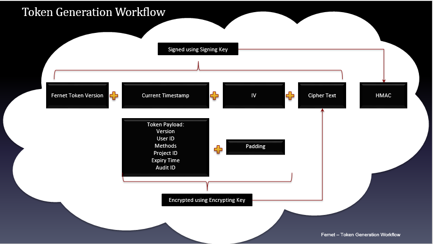
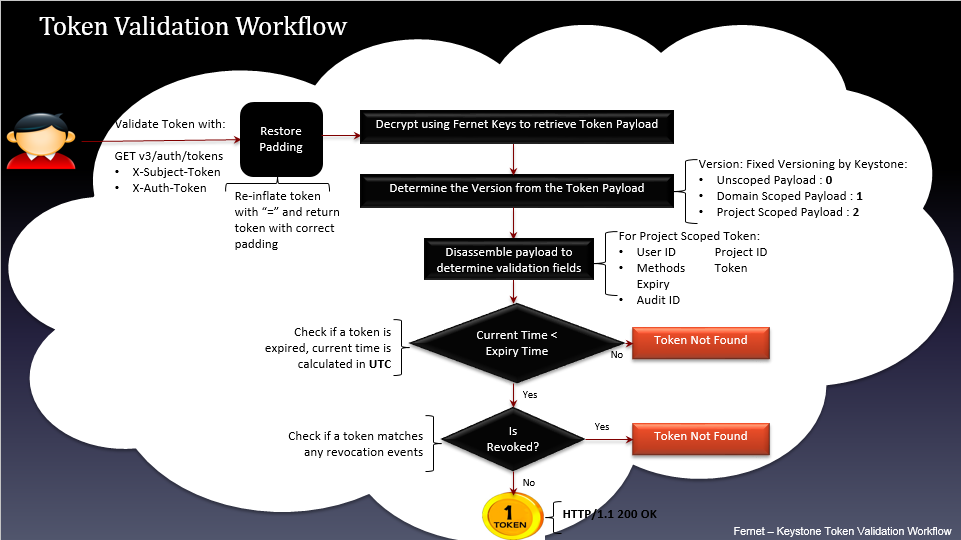

# Keystone Tokens

Tokens được sử dụng để xác thực và uỷ quyền cho các tương tác của bạn với các Openstack API khác nhau. Tokens có nhiều phạm vi, đại diện cho nhiều uỷ quyền và nguồn nhận dạng khác nhau.

## 1. Authorization scopes

Tokens dùng để chuyển tiếp thông tin về user's role assignment của bạn. Nó không hiếm khi một user được gán nhiều role, đôi khi là nhiều project, domain, hoặc toàn bộ hệ thống. Chúng được gọi là phạm vi uỷ quyền, trong đó token có phạm vi hoạt động duy nhất. Ví dụ, một token có phạm vi cho một project không thể tái sử dụng để làm gì khác tại project khác.

### 1.1. Unscoped tokens

Một **Unscoped token** không chứa service catalog, roles, project scope cũng như domain scope. Trường hợp sử dụng chính của nó chỉ đơn giản để chứng minh danh tính của bạn với Keystone sau đó (thường là để tạo các token có phạm vi), mà không cần trình bày thông tin gốc của bạn.

Các điều kiện sau phải được đáp ứng để nhận unscoped token:

- Bạn không được chỉ định phạm vi uỷ quyền trong yêu cầu xác thực của mình (ví dụ, trên command line với các tuỳ chọn như **--os-project-name** hoặc **--os-domain-id**)

- Danh tính của bạn không được có project mặc định liên kết với nó mà bạn cũng có role assignment, và do đó được uỷ quyền.

### 1.2. Project-scoped tokens

Các Project-scoped token (token phạm vi project) thể hiện sự uỷ quyền của bạn để hoạt động trong một tenancy cụ thể trong cloud và rất hữu ích để xác thực chính bạn khi làm việc với hầu hết các dịch vụ khác.

Nó chứa một service catalog, một bộ các role, và chi tiết của project mà bạn có uỷ quyền.

### 1.3. Domain-scoped tokens

Domain-scoped tokens có trường hợp sử dụng hạn chế trong Openstack. Chúng thể hiện sự uỷ quyền của bạn để vận hành một cấp độ domain, cao hơn mức của người dùng và các project có trong đó (thường là quản trị viên cấp domain). Tuỳ thuộc vào cấu hình Keystone, chúng rất hữu ích khi làm việc với một domain duy nhất trong Keystone.

Nó chứa một danh sách hạn chế service (chỉ những dịch vụ không yêu cầu rõ ràng về endpoint của mỗi project), một bộ các role, và chi tiết về project mà bạn có uỷ quyền.

Nó cũng có thể được sử dụng để làm việc với các mối quan tâm cấp domain trong các dịch vụ khác, chẳng hạn như để định cấu hình quota toàn domain áp dụng cho tất cả user hay project trong một domain cụ thể.

### 1.4. System-scoped tokens

Có các API trong Openstack phù hợp trong khái niệm project hay domain, nhưng cũng có các API ảnh hưởng đến toàn bộ hệ thống triển khai (ví dụ như sửa đổi endpoint, quản lý dịch vụ, hoặc liệt kê thông tin về các hypervisor). Các yêu cầu này yêu cầu sử dụng System-scoped token, đại diện các role assignment mà người dùng phải thực hiện khi triển khai nói chung.

## 2. Token providers

Loại token do Keystone cấp có thể cấu hình thông qua file `/etc/keystone/keystone.conf`. Phiên bản hiện tại hỗ trợ 2 token providers là `fernet` và `jws`.

### 2.1. Fernet tokens

Định dạng fernet token được giới thiệu từ phiên bản Openstack Kilo và hiện nay đã trở thành token provider mặc định của Keystone. Không giống với các loại token khác, fernet token không cần phải tồn tại ở backend. Mã hoá AES256 được sử dụng để bảo vệ thông tin lưu trữ trong token và tính toàn vẹn được xác minh bằng chữ ký SHA256 HMAC. Chỉ Identity service mới có quyền truy cập vào các khoá được sử dụng để mã hoá và giải mã fernet token. Giống như UUID token, fernet token phải được gửi lại cho Identity service để xác thực chúng. 

Việc triển khai có thể xem xét sử dụng fernet provider trái ngược với JWS provider nếu họ lo ngại về việc công khai payload sử dụng để build tokens.

### 2.2. JWS tokens

Định dạng JSON Web Signature (JWS) token là một loại JSON Web Token (JWT) và nó đã được triển khai trong phiên bản Openstack Stein. JWS tokens đã được ký, có nghĩa là thông tin được sử dụng để build token ID không bị mờ đối với người dùng và có thể được giải mã bởi bất kỳ ai. JWS tokens là tạm thời hoặc không bền vững, có nghĩa là nó không bloat database hoặc không yêu cầu sao chép trên các node. Vì JWS token provider sử dụng khoá không đối xứng, token được ký bằng private key và xác thực bằng public key. JWS token provider chỉ hỗ trợ ES256 JSON Web Algorithm (JWA), là thuật toán ECDSA swrr dụng đường cong P-256 và SHA-256

## 3. Tìm hiểu Fernet Token

### 3.1. Cơ bản về Fernet

- Fernet token được sử dụng đầu tiên tại Openstack Kilo. Không giống như các loại token trước, Fernet không yêu cầu sử dụng backend

- Fernet token chứa một lượng nhỏ dữ liệu ví dụ như thông tin để nhận diện người dùng, project, thời gian hết hiệu lực,... Nó được ký số bởi symmetric key để ngăn ngừa việc giả mạo. 

- Dữ liệu trong Fernet token được bảo vệ bởi các thuật toán mã hoá 

- Thư mục chứa Fernet key: `/etc/keystone/fernet-keys/`

### 3.2. Fernet key

- Fernet key được dùng trong việc mã hoá và giải mã các Fernet token. Trong mỗi Fernet key bao gồm 2 khoá nhỏ hơn: 128-bit AES256 encryption key và 128-bit SHA256 HMAC signing key. Fernet key được lưu tại key repo mà payload có thể chuyển đến thư viện xử lý mã hoá và giải mã token.

- Fernet sẽ đến thư mục chứa các key, thực hiên tất cả mã hoá bằng cách sử dụng khoá đầu tiên trong danh sách và cố gắng giải mã bằng tất cả các khoá từ danh sách đó. 

### 3.3. Các loại key

Keystone yêu cầu một key repo để tạo ra Fernet token. Các key này được dùng để mã hoá và giải mã thông tin trong payload của token. Mỗi key trong repo có thể có 1 trong 3 trạng thái. Trạng thái của key xác định Keystone sẽ sử dụng key đó làm gì với fernet token. Các loại khác nhau như sau:

- **Primary key**: Dùng để mã hoá và giải mã token. Key này luôn luôn có chỉ số lớn nhất trong repo.

- **Secondary key**: Khi có một primary key mới, primary key cũ sẽ trở thành secondary key. Sử dụng để giải mã token. Các secondary key có chỉ số nằm giữa 0 và primary key.

- **Staged key**: Staged key là một loại key đặc biệt có một số điểm giống với secondary key. Chỉ có duy nhất một staged key trong repo. Giống như secondary key, staged key dùng để giải mã token. Staged key sẽ trở thành primary key trong lần rotate tiếp theo. Staged key luôn có file name là `0` trong key repo.

### 3.4. Fernet key rotate

Hình dưới đây mô tả quá trình rotate fernet key


- Bước đầu chưa có key repo sẽ khởi tạo một key repo bằng `keystone-manager` để tạo 2 khoá trong repo. Khi 2 file được tạo thì sẽ có file tên 1 là primary key và file 0 sẽ là staged key và không có secondary key.

- Lần rotate đầu tiên, staged 0 sẽ trở thành primary key 2, primary key 1 trở thành secondary key và staged mới sẽ được tạo ra với file name là 0.

- Lần rotate thứ 2, staged 0 trở thành primary key 3, primary key 2 trở thành secondary key 2, secondary 1 giữ nguyên và tạo ra staged key mới.

Khi sử dụng fernet token yêu cầu chú ý về thời hạn của token và vòng đời của khoá. Vấn đề nảy sinh khi secondary key bị xoá khỏi key repo trong khi vẫn cần dùng key đó để giải mã một token chưa hết hạn (token này được mã hoá bởi key đã bị xoá). Để giải quyết vấn đề này, trước hết cần lên kế hoạch xoay khoá. Ví dụ bạn muốn token hợp lệ trong vòng 24 giờ và muốn xoay khoá cứ mỗi 6 giờ. Như vậy để giữ 1 key tồn tại trong 24 giờ cho mục đích decrypt thì cần thiết lập option `max_active_keys=6` trong file cấu hình keystone. Điều này giúp cho việc giữ tất cả các key cần thiết nhằm mục đích xác thực token mà vẫn giới hạn được số lượng key trong key repo.

```
token_expiration = 24
rotation_frequency = 6
max_active_keys = (token_expiration / rotation_frequency) + 2
```

### 3.5. Các trường của Fernet token

- Fernet Format Version (0x80): 8 bits, biểu thị phiên bản của định dạng token

- Current Timestamp: Số nguyên 64-bits không dấu, chỉ nhãn thời gian tính theo giây, tính từ 01/01/1970, chỉ ra thời điểm token được tạo ra.

- Initialization Vector (IV): Key 128-bits sử dụng mã hoá AES và giải mã Ciphertext.

- Ciphertext: Là keystone payload kích thước biến đổi tuỳ vào phạm vi của token. Cụ thể hơn, với token có phạm vi project, Keystone payload bao gồm: version, user id, method, project id, expiration time, audit id.

- HMAC: 256-bits SHA256 HMAC (Keyed-Hash Message Authentication Code) - Mã xác thực thông báo sử dụng hàm một chiều có khoá với signing key kết nối 4 trường ở trên.

### 3.6 Token Generation Workflow



Với key và message nhận được, quá trình tạo fernet token như sau:

- Ghi thời gian hiện tại vào trường timestamp

- Lựa chọn một IV duy nhất

- Xây dựng ciphertext:

	- Padd message với bội số là 16 bytes (thao tác bổ sung một số bit cho văn bản trong mã hoá khối AES)
	
	- Mã hoá padded message sử dụng thuật toán AES 128 trong chế độ CBC với IV đã chọn và encryption-key được cung cấp
	
- Tính toán trường HMAC theo mô tả trên sử dụng signing-key mà người dùng được cung cấp

- Kết nối các trường theo đúng format token ở trên.

- Mã hoá base64 toàn bộ token.

### 3.7. Token validation workflow



- Gửi yêu cầu xác thực token với API GET v3/auth/tokens

- Khôi phục lại padding, trả lại token với padding chính xác 

- Decrypt sử dụng Fernet Keys để thu lại token payload

- Xác định phiên bản của token payload (Unscoped token: 0, Domain-scoped: 1, Project-scoped: 2)

- Tách các trường của payload để chứng thực. Ví dụ với token phạm vi project gồm các trường sau: user id, project id, method, expiration, audit id.

- Kiểm tra xem token đã hết hạn chưa. Nếu thời điểm hiện tại lớn hơn so với thời điểm hết hạn thì trả về thông báo "Token not found". Nếu token chưa hết hạn thì chuyển sang bước tiếp theo.

- Kiểm tra xem token đã bị thu hồi chưa. Nếu token đã bị thu hồi (tương ứng với 1 sự kiện thu hồi trong bảng revocation_event của database keystone) thì trả về thông báo "Token not found". Nếu chưa bị thu hồi thì trả lại token (thông điệp phản hồi thành công HTTP/1.1 200 OK)

## Nguồn

https://docs.openstack.org/keystone/stein/admin/tokens.html