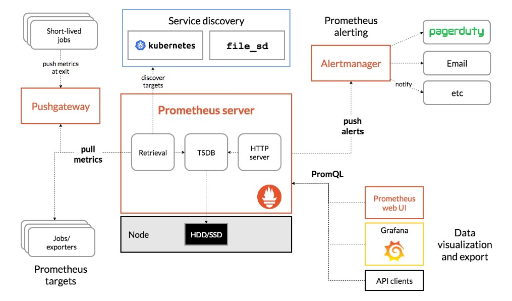

# Tìm hiểu chung về Prometheus

## 1. Prometheus là gì?

[Prometheus](https://github.com/prometheus) là một hệ thống giám sát và cảnh báo mã nguồn mở được xây dựng ban đầu tại [SoundCloud](http://soundcloud.com). Từ khi ra mắt vào năm 2012 đến nay, đã có nhiều công ty và tổ chức chọn sử dụng Prometheus, và dự án đã sở hữu một cộng đồng developer và người dùng rất tích cực. Bây giờ Prometheus trở thành một dự án mã nguồn mã độc lập và được duy trì không phụ thuộc vào bất kỳ công ty nào. Để nhấn mạnh và làm rõ cấu trúc quản lý của dự án, Prometheus đã tham gia [Cloud Native Computing Foundation](https://cncf.io/) vào năm 2016 với tư cách là hosted project thứ hai, sau [Kubernetes](http://kubernetes.io/)

## 2. Tính năng

Các tính năng chính của Prometheus:

- Mô hình dữ liệu đa chiều với dữ liệu time series định danh bởi metric name và cặp key/value

- PromQL, một ngôn ngữ truy vấn linh hoạt để tận dụng mô hình dữ liệu trên

- Không phụ thuộc vào lưu trữ phân tán

- Thu thập time series data thông qua một pull model sử dụng HTTP

- Đẩy time series data được hỗ trợ thông qua một gateway trung gian

- Targets được discovered thông qua discovery service hoặc cấu hình tĩnh

- Hỗ trợ nhiều chế độ đồ thị và dashboard.

## 3. Thành phần

Hệ sinh thái Prometheus bao gồm nhiều thành phần, phần lớn thành phần là tuỳ chọn:

- [Prometheus server](https://github.com/prometheus/prometheus), thành phần chính dùng để scrapes và lưu trữ time series data.

- [client libraries](https://prometheus.io/docs/instrumenting/clientlibs/) hỗ trợ các ngôn ngữ lập trình để tương tác với Prometheus

- [push gateway](https://github.com/prometheus/pushgateway) hỗ trợ short-lived jobs

- Các [exporters] riêng biệt cho các service như HAProxy, StatsD, Graphite, etc

- [alertmanager](https://github.com/prometheus/alertmanager) để xử lý các cảnh báo

- Nhiều công cụ hỗ trợ khác.

Hầu hết các thành phần của Prometheus được viết bằng ngôn ngữ [Go](https://golang.org/), làm cho nó dễ dàng xây dựng và triển khai như static binaries.

## 4. Kiến trúc

Sơ đồ dưới đây mình họa cho kiến trúc của Prometheus và một số các thành phần trong hệ sinh thái của nó:

Prometheus scrapes metric từ instrumented jobs, trực tiếp hoặc thông qua một push gateway trung gian cho short-lived jobs. Nó lưu trữ tất cả các mẫu được scrapes cục bộ và chạy các quy tắc trên dữ liệu này để tổng hợp và ghi lại chuỗi thời gian mới từ dữ liệu hiện có hoặc tạo cảnh báo. Grafana hoặc các API consumer khác có thể được sử dụng để visualize dữ liệu thu thập được.

## 5. Use case

### Prometheus phù hợp khi

- Prometheus hoạt động tốt cho việc ghi lại các timeseries dạng số thuần. Nó phù hợp với cả giám sát tập trung và kiến trúc giám sát hướng dịch vụ. Trong một thế giới của microservice, sự hỗ trợ cho việc thu thập và truy vấn dữ liệu đa chiều là một thế mạnh đặc biệt.

- Prometheus được thiết kế để đảm bảo độ tin cậy, là hệ thống bạn sử dụng trong thời gian ngừng hoạt động để cho phép bạn chưẩn đoán nhanh các sự cố. Mỗi Prometheus server là độc lập, không phụ thuộc vào network storage hoặc các remote services khác. Bạn có thể tin tưởng nó khi các thành phần khác trong cơ sở hạ tầng của bạn hỏng và bạn không cần thiết lập cơ sở hạ tầng mở rộng để sử dụng nó.

### Prometheus không phù hợp khi

- Các giá trị của Prometheus là đáng tin cậy. Bạn luôn có thể xem các thống kê về hệ thống của bạn, ngay cả khi nó trong tình trạng lỗi. Nếu bạn cần độ chính xác 100%, như các yêu cầu thanh toán hoá đơn, Prometheus không phải là một lựa chọn tốt vì dữ liệu thu thập được có thể không được chi tiết và đầy đủ. Trong trường hợp đó, bạn tốt nhất nên sử dụng một hệ thống khác để thu thập và phân tích dữ liệu cho việc làm hoá đơn, và sử dụng Prometheus cho phần giám sát còn lại.

## Tham khảo

https://github.com/trangnth/ghichep-prometheus/blob/master/Doc/01.%20overview.md

https://prometheus.io/docs/introduction/overview/