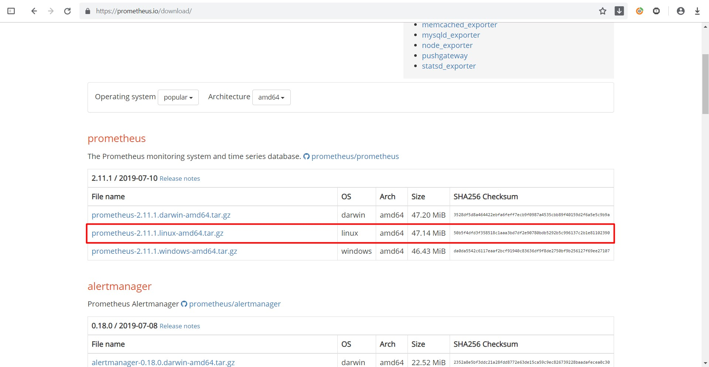
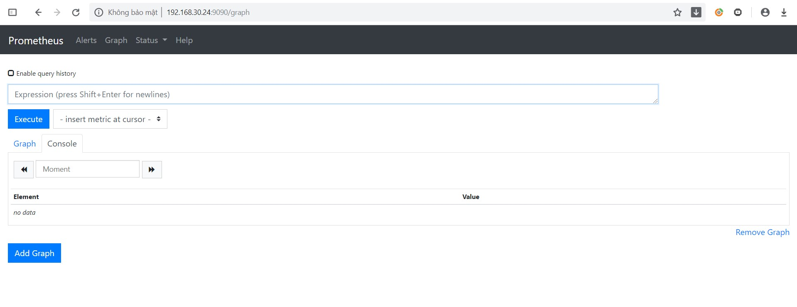
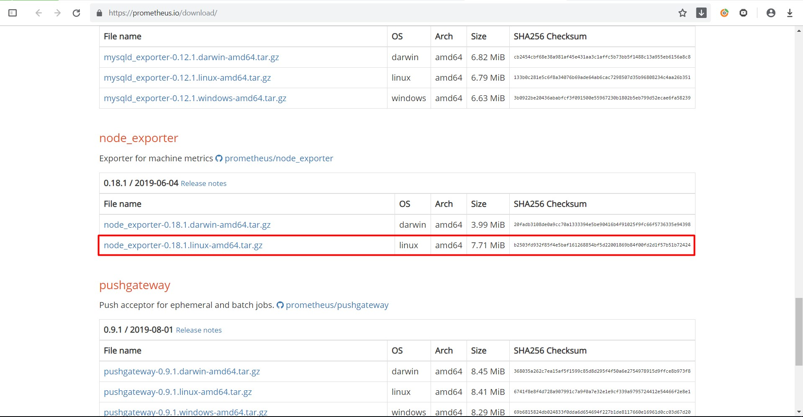
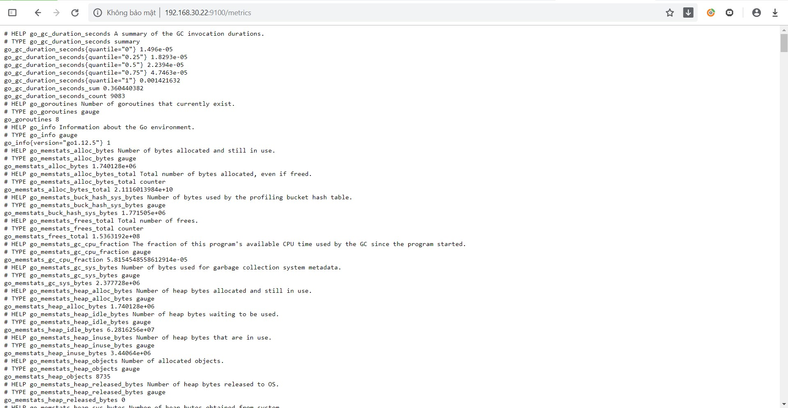
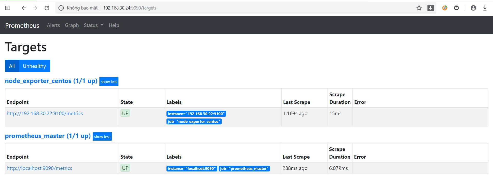

# Cài đặt Prometheus trên CentOS 7

## 1. Cài đặt và cấu hình Prometheus

- **Bước 1**: Update hệ thống

```
yum update -y
```

- **Bước 2**: Disable SELinux

```
sed -i 's/\(^SELINUX=\).*/\SELINUX=disabled/' /etc/sysconfig/selinux
sed -i 's/\(^SELINUX=\).*/\SELINUX=disabled/' /etc/selinux/config
setenforce 0
```

- **Bước 3**: Tải gói Prometheus

Truy cập đường dẫn:

```
https://prometheus.io/download/
```

và copy URL gói Prometheus cho Linux:



Tải gói về máy:

```
wget https://github.com/prometheus/prometheus/releases/download/v2.11.1/prometheus-2.11.1.linux-amd64.tar.gz
```

- **Bước 4**: Cấu hình Prometheus

Thêm user Prometheus

```
useradd --no-create-home --shell /bin/false prometheus
```

Tạo các thư mục:

```
mkdir /etc/prometheus
mkdir /var/lib/prometheus
```

Thay đổi quyền sở hữu cho các thư mục vừa tạo:

```
chown prometheus:prometheus /etc/prometheus
chown prometheus:prometheus /var/lib/prometheus
```

Giải nén gói Prometheus:

```
tar -xvzf prometheus-2.11.1.linux-amd64.tar.gz
```

Copy `prometheus` và `promtool` đến thư mục `/usr/local/bin`:

```
cp prometheus-2.11.1.linux-amd64/prometheus /usr/local/bin/
cp prometheus-2.11.1.linux-amd64/promtool /usr/local/bin/
```

Thay đổi quyền sở hữu cho user prometheus:

```
chown prometheus:prometheus /usr/local/bin/prometheus
chown prometheus:prometheus /usr/local/bin/promtool
```

Copy thư mục `consoles` và `console_libraries` vào thư mục `/etc/prometheus`:

```
cp -r prometheus-2.11.1.linux-amd64/consoles /etc/prometheus/
cp -r prometheus-2.11.1.linux-amd64/console_libraries/ /etc/prometheus/
```

Thay đổi quyền sở hữu cho user prometheus:

```
chown -R prometheus:prometheus /etc/prometheus/consoles
chown -R prometheus:prometheus /etc/prometheus/console_libraries
```

Tạo file cấu hình Prometheus `/etc/prometheus/prometheus.yml`:

```
cat <<EOF > /etc/prometheus/prometheus.yml
global:
  scrape_interval: 10s

scrape_configs:
  - job_name: 'prometheus_master'
    scrape_interval: 5s
    static_configs:
      - targets: ['localhost:9090']
EOF
```

Phân quyền cho file:

```
chown prometheus:prometheus /etc/prometheus/prometheus.yml
```

Thêm file service cho Prometheus tại systemd:

```
cat <<EOF > /etc/systemd/system/prometheus.service
[Unit]
Description=Prometheus
Wants=network-online.target
After=network-online.target

[Service]
User=prometheus
Group=prometheus
Type=simple
ExecStart=/usr/local/bin/prometheus \
    --config.file /etc/prometheus/prometheus.yml \
    --storage.tsdb.path /var/lib/prometheus/ \
    --web.console.templates=/etc/prometheus/consoles \
    --web.console.libraries=/etc/prometheus/console_libraries

[Install]
WantedBy=multi-user.target
EOF
```

Khởi động Prometheus:

```
systemctl daemon-reload
systemctl start prometheus
systemctl enable prometheus
```

Thêm rule firewall:

```
firewall-cmd --zone=public --add-port=9090/tcp --permanent
firewall-cmd --reload
```

- **Bước 5**: Truy cập giao diện web Prometheus

Truy cập theo đường dẫn:

```
http://ip_prometheus:9090
```



## 2. Cài đặt Node Exporter

- **Bước 1**: Tải gói Node Exporter

Copy link download gói node_exporter:



Tải gói về:

```
wget https://github.com/prometheus/node_exporter/releases/download/v0.18.1/node_exporter-0.18.1.linux-amd64.tar.gz
```

- **Bước 2**: Cài đặt và cấu hình

Giải nén gói:

```
tar -xvzf node_exporter-0.18.1.linux-amd64.tar.gz
```

Tạo user cho node_exporter:

```
useradd -rs /bin/false nodeusr
```

Di chuyển file `node_exporter` tới thư mục `/usr/local/bin/`

```
mv node_exporter-0.18.1.linux-amd64/node_exporter /usr/local/bin/
```

Tạo file systemd cho node_exporter:

```
cat <<EOF > /etc/systemd/system/node_exporter.service
[Unit]
Description=Node Exporter
After=network.target

[Service]
User=nodeusr
Group=nodeusr
Type=simple
ExecStart=/usr/local/bin/node_exporter

[Install]
WantedBy=multi-user.target
EOF
```

Khởi động node_exporter:

```
systemctl daemon-reload
systemctl start node_exporter
systemctl enable node_exporter
```

Thêm rules firewall:

```
firewall-cmd --permanent --add-port=9100/tcp
firewall-cmd --reload
```

- **Bước 3**: Kiểm tra

Truy cập địa chỉ:

```
http://ip_node_exporter:9100/metrics
```



- **Bước 4**: Cấu hình thêm node cần giám sát trên Prometheus server

Thêm cấu hình vào file `/etc/prometheus/prometheus.yml`:

```
global:
  scrape_interval: 10s

scrape_configs:
  - job_name: 'prometheus_master'
    scrape_interval: 5s
    static_configs:
      - targets: ['localhost:9090']
  - job_name: 'node_exporter_centos'
    scrape_interval: 5s
	static_configs:
	  - target: ['ip_node_exporter:9100']
```

- **Bước 5**: Khởi động lại Prometheus và kiểm tra

Khởi động lại Prometheus:

```
systemctl restart prometheus
```

Truy cập giao diện web Prometheus:

```
http://ip_prometheus:9090/targets
```



## Tham khảo

https://www.fosslinux.com/10398/how-to-install-and-configure-prometheus-on-centos-7.htm

https://github.com/trangnth/ghichep-prometheus/blob/master/Doc/02.%20install.md