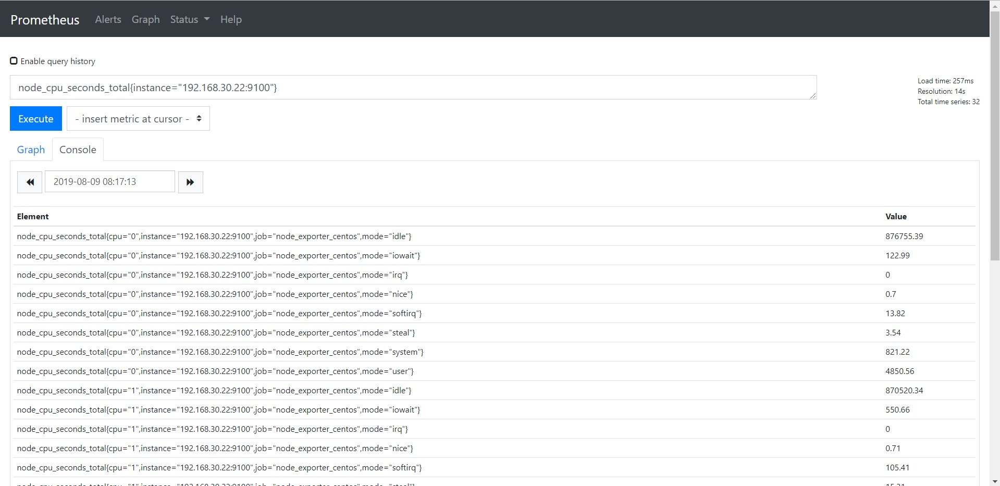

# Querying Prometheus

## 1. Basic

Prometheus cung cấp một ngôn ngữ truy vấn gọi là PromQL, cho phép các user select và aggrerate time series data trong thời gian thực. Kết quả của một biểu thức chính quy có thể trình bày như một biểu đồ, được xem như tabular data (dữ liệu bảng) trong Prometheus's expression browser hoặc được consumed bởi một ứng dụng khác ngoài hệ thống thông qua API.

Ví dụ: Truy vấn `node_cpu_seconds_total{instance="192.168.30.22:9100"}` để hiển thị tất cả các metric `node_cpu_seconds_total` có lable là `instance="192.168.30.22:9100"`



### 1.1 Expression language data types

Trong Expression language của Prometheus, một expression hoặc sub-expression có thể là 1 trong 4 kiểu sau:

- **Instant vector**: Một chuỗi các single sample của time series có cùng timestamp

- **Range vector**: Một chuỗi của time series gồm một loạt các data point theo thời gian

- **Scalar**: Một giá trị numeric floating point đơn giản

- **String**: Giá trị string đơn giản, hiện tại đã không còn sử dụng

### 1.2 Literals

#### String literals

Strings cũng có thể được chỉ định như một từ trong cặp dấu `'`, `"` hoặc dấu (`).

PromQL có các quy tắc giống như [Go](https://golang.org/ref/spec#String_literals). Trong dấu ngoặc đơn hoặc ngoặc đôi, dấu \ để bắt đầu ngắt chuỗi, theo sau nó có thể là a, b, f, n, r, t, v hoặc \.

Trong dấu backticks (`) không có xử lý escaping (ký từ ngắt chuỗi), Không giống như Go, Prometheus không loại bỏ các dòng mới bên trong backticks.

Ví dụ:

```
"this is a string"
'these are unescaped: \n \\ \t'
`these are not unescaped: \n ' " \t`
```

#### Float literals

Giá trị Scalar float có thể được viết như các chữ số `[-](digits)[.(digits)]`

Ví dụ:

```
-2.43
```

### 1.3 Time series Selectors

#### Instant vector selector

Instant vector selectors cho phép chọn một chuỗi time series và một giá trị single sample cho mỗi timestamp (instant): dạng đơn gian nhất là chỉ có một metric name được chỉ định. Điều này dẫn đến một instant vector chứa các phần tử cho tất cả các time selectors có metric name này.

Ví dụ lựa chọn tất cả các Time series có metric name là `http_requests_total`

Nó có thể tiếp tục filter theo các label của nó bằng cách khớp với các label trong cặp dấu `{}`

```
http_requests_total{job="prometheus",group="canary"}
```

Có thể dùng thêm một số các ký hiệu khác để thể hiện match hoặc không match với các label value:

- `=`: Chọn label khớp chính xác với chuỗi được đưa ra

- `!=`: Chọn label không khớp với chuỗi đưa ra

- `=~`: Chọn label khớp regex với chuỗi đưa ra

- `!~`: Chọn label không khớp regex với chuỗi đưa ra

Ví dụ, query tất các `http_requests_total` time series với staging, testing, and development environments và HTTP methods khác với `GET`

```
http_requests_total{environment=~"staging|testing|development",method!="GET"}
```

Label matchers khớp với các label values cũng sẽ chọn tất cả các time series không có một bộ label cụ thể nào. Sử dụng regex-matches, nó có thể sẽ match với nhiều các label name khác nhau.

#### Range Vector Selectors

Range Vector được chỉ định là một số được biểu diễn trong `[]`, sau đo có thể là một trong số các đơn vị sau:

- s - Seconds

- m - Minutes

- h - Hours

- d - Days

- w - Weeks

- y - Years

#### Offset modifier

Offset modifier cho phép thay đổi time offset cho các individual instant và range vector trong một query. 

Ví dụ, expression dưới đây trả về giá trị của `http_requests_total` 5 phút trước so với thời gian truy vấn hiện tại.

```
http_requests_total offset 5m
```

Chú ý rằng offset modifier luôn luôn cần những selectors theo ngay sau đó, ví dụ:

```
sum(http_requests_total{method="GET"} offset 5m) // GOOD.
sum(http_requests_total{method="GET"}) offset 5m // INVALID.
```

Tương tự với range vectors. Ví dụ dưới đây trả về tỉ lệ trong 5 phút của `http_requests_total` trong một tuần trước:

```
rate(http_requests_total[5m] offset 1w)
```

### 1.4 Subquery

Subquery cho phép bạn chạy một instant query cho một range và resolution. Kết quả của một subquery là một range vector.

Syntax:

```
<instant_query> '[' <range> ':' [<resolution>] ']' [ offset <duration> ]
```

Trong đó: `<resolution>` có thể có hoặc không. Mặc định thì sẽ sử dụng global interval.

## 2. Operators

### 2.1 Binary Operators

#### 2.1.1 Toán tử số học

Các toán tử số học hiện có trong Prometheus:

- `+`: Cộng

- `-`: Trừ

- `*`: Nhân

- `/`: Chia

- `%`: Chia lấy phần dư

- `^`: Luỹ thừa

**Between two scalars**: Như 1 phép tính bình thường, kết quả trả về là kết quả của phép tính giữa 2 scalars.

**Between an instant vector and a scalar**: Toán tử được áp dụng cho tất cả giá trị của mọi data sample trong vector (Ví dụ: một time series instant vector được nhân với 2, kết quả sẽ được 1 vector mới với tất cả các giá trị của vector cũ được nhân với 2)

**Between two instant vectors**: Một binary arithmetic operator được áp dụng cho mỗi entry trong vector bên trái và nó matching element với vector phía bên phải. Kết quả là một vector với grouping labels trở thành output label set. Metric name sẽ bị loại bỏ. Entries không match với entry trong right-hand vector thì sẽ không được tìm thấy trong result.

#### 2.1.2 Toán tử so sánh

Các toán tử so sánh hiện có trong Prometheus:

- `==`: Bằng

- `!=`: Khác

- `>`: Lớn hơn

- `<`: Nhỏ hơn

- `>=`: Lớn hơn hoặc bằng

- `<=`: Nhỏ hơn hoặc bằng

#### 2.1.3 Toán tử logic

Các toán tử logic chỉ được định nghĩa giữa 2 instant vector:

- `and`: Intersection

- `or`: Union

- `unless`: Complement

### 2.2 Aggregation operators

Prometheus hỗ trợ built-in aggregation operators sử dụng để aggregation các phần tử của một single instant vector, kết quả trong sẽ nằm trong một vector mới ít các phần tử hơn với các giá trị được aggregated:

- `sum`: Tính tổng mẫu

- `min`: Chọn giá trị nhỏ nhất trong mẫu

- `max`: Chọn giá trị lớn nhất trong mẫu

- `avg`: Tính trung bình mẫu

- `stddev`: Tính độ lệch mẫu

- `stdvar`: Tính phương sai mẫu

- `count`: Đếm số element trong vector

- `count_values`: Đếm số element có cùng giá trị

- `bottomk`: Giá trị k elements nhỏ nhất theo giá trị mẫu

- `topk`: Giá trị k lớn nhaatstheo giá trị mẫu,

- `quantile`: calculate φ-quantile (0 ≤ φ ≤ 1) over dimensions

**Syntax**:

```
<aggr-op>([parameter,] <vector expression>) [without|by (<label list>)]
```

**Ví dụ**:

- Nếu metric `http_requests_total` có time series với các labels là `application`, `instance` và `group`, chún ta sẽ tính tổng số các HTTP requests cho mỗi application và group cho tất cả các instance:

```
sum(http_requests_total) without (instance)
```

Hoặc có thể viết như sau;

```
sum(http_requests_total) by (application, group)
```

- Nếu muốn tính tổng tất cả các request của HTTP gửi cho tất cả các app thì có thể viết đơn giản như sau:

```
sum(http_requests_total)
```

- Để đếm số binaries đang chạy cho mỗi build version có thể viết như sau:

```
count_values("version", build_version)
```

- Để lấy 5 request HTTP lớn nhất được tính trong tất cả các instance:

```
topk(5, http_requests_total)
```

### 2.3 Binary operator precedence

Dưới đây là danh sách precedence of binary operators trong Prometheus với độ ưu tiên từ cao tới thấp

**1.** ^

**2.** *, /, %

**3.** +, -

**4.** ==, !=, <=, <, >=, >

**5.** and, unless

**6.** or

Các Operators có cùng mức độ ưu tiên sẽ thực hiện lần lượt từ trái qua phải. Ví dụ với biểu thức `2 * 3 % 2` sẽ tương đương như `(2 * 3) % 2`. Tuy nhiên với `^` thì sẽ thực hiện từ phải qua, ví dụ `2 ^ 3 ^ 2` sẽ tương đương với `2 ^ (3 ^ 2)`.

## Tham khảo

https://github.com/trangnth/ghichep-prometheus/blob/master/Doc/06.%20querying.md

https://prometheus.io/docs/prometheus/latest/querying/basics/