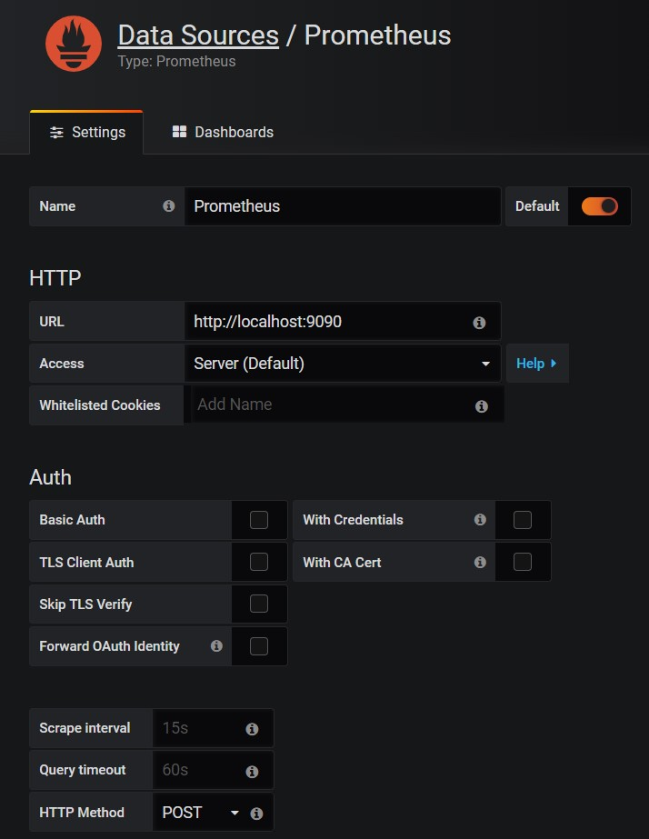

# Tích hợp Grafana với Prometheus

## 1. Cài đặt Grafana

- Thêm repo Grafana

```
cat > /etc/yum.repos.d/grafana.repo <<'EOF'
[grafana]
name=grafana
baseurl=https://packages.grafana.com/oss/rpm
repo_gpgcheck=1
enabled=1
gpgcheck=1
gpgkey=https://packages.grafana.com/gpg.key
sslverify=1
sslcacert=/etc/pki/tls/certs/ca-bundle.crt
EOF
```

- Cài đặt Grafana

```
yum install -y grafana fontconfig initscripts 
```

- Khởi động Grafana

```
systemctl start grafana-server
systemctl enable grafana-server
```

- Cấu hình firewalld (nếu dùng):

```
firewall-cmd --permanent --add-port=3000/tcp
firewall-cmd --reload
```

- Truy cập địa chỉ `http://ip_grafana_server:3000` với username:password là `admin:admin` để vào giao diện Grafana.

- Thêm datasource trên Grafana



## 2. Một số các query expression để tạo panel:

- Uptime
	
```
time() - (node_boot_time_seconds{instance="instance_ip:9100"})
```

- %CPU Used

```
100 * (1 - avg by(instance)(irate(node_cpu_seconds_total{mode="idle", instance="instance_ip:9100"}[5m])))
```

- %CPU System

```
sum(rate(node_cpu_seconds_total{instance="prometheus:9100",mode="system"}[5m])) * 100 / count(count by (cpu)(node_cpu_seconds_total{instance="prometheus:9100"}))
```

- RAM Total

```
node_memory_MemTotal_bytes{instance="prometheus:9100"}
```

- RAM Free

```
node_memory_MemFree_bytes{instance="prometheus:9100"}
```

- Cached

```
node_memory_Cached_bytes{instance="prometheus:9100"}
```

- Network receive

```
rate(node_network_receive_bytes_total{instance='prometheus:9100',device='eth0'}[5m])
```

- % disk "/" used

```
100 - ((node_filesystem_free_bytes{mountpoint='/', instance='prometheus:9100'} / node_filesystem_size_bytes{instance='prometheus:9100'}) * 100)
```

- Disk "/" Free

```
node_filesystem_avail_bytes{instance="prometheus:9100",mountpoint="/"}
```

## Tham khảo

https://github.com/hocchudong/ghichep-prometheus/blob/master/4.Ket_hop_Prometheus_va_Grafana.md

