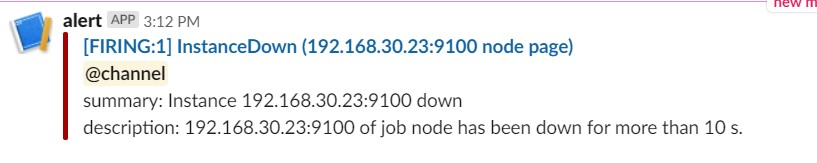
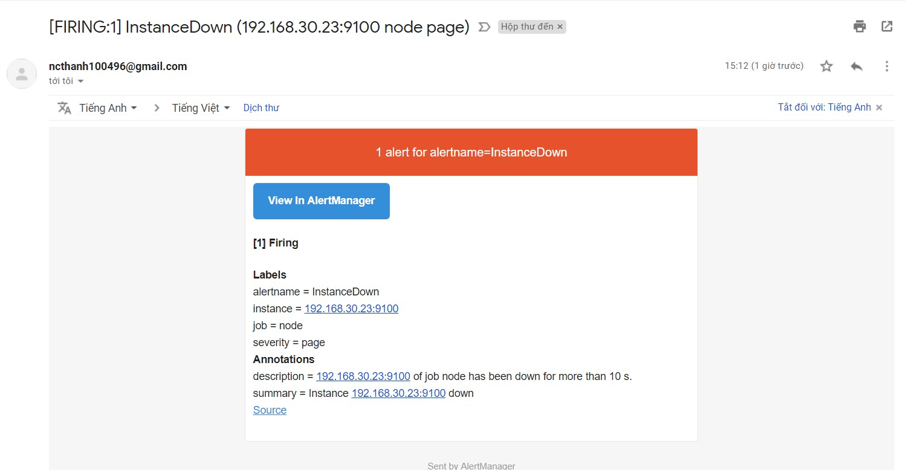
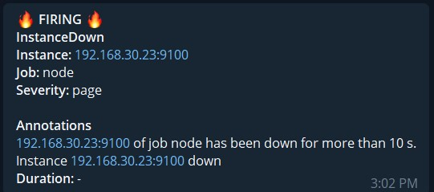
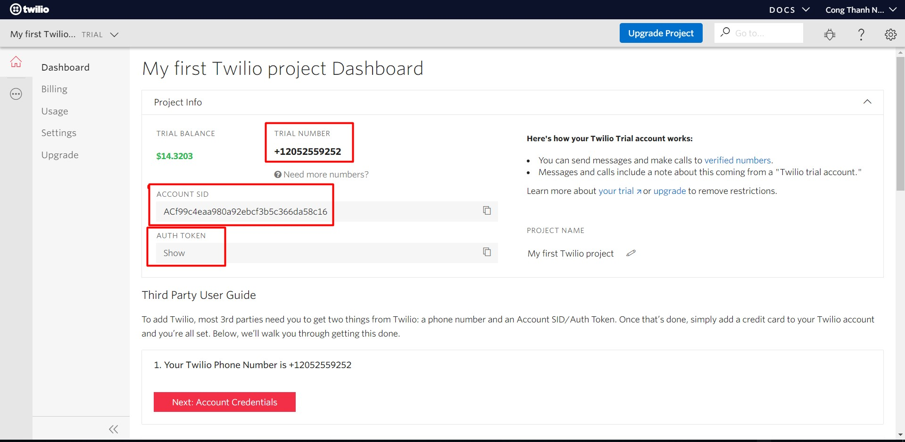
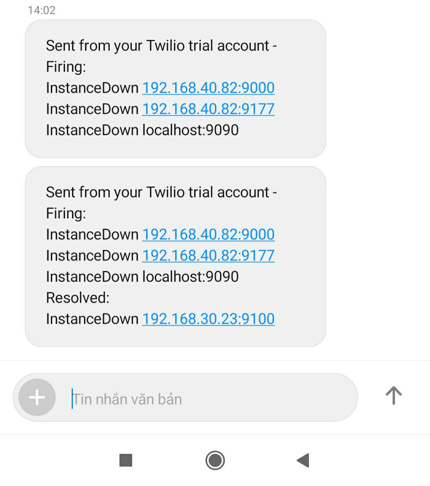

# Alerting

Alerting hoạt động trên Prometheus với 2 thành phần:

- Alerting rules

- Alertmanager


- Luồng hoạt động:

	- Prometheus-server sẽ xử lý các alert-rules
	
	- Nếu rule được match, Prometheus-server sẽ gửi thông tin đến Alertmanager
	
	- Alertmanager sẽ gửi các cảnh báo đến nơi đã cấu hình.
	
## 1. Alerting rules

Alerting rules cho phép xác định các điều kiện đưa ra cảnh báo, dựa trên language expressions và gửi thông báo đi.

```
ALERT <alert name>
  expr <expression>
  [ FOR <duration> ]
  [ LABELS <label set> ]
  [ ANNOTATIONS <label set> ]
```

- **expr**: Biểu thức, điều kiện để đưa ra cảnh báo

- **FOR**: Chờ đợi trong 1 khoảng thời gian để đưa ra cảnh báo

- **LABELS**: Đặt nhãn cho cảnh báo 

- **ANNOTATIONS**: Chứa thêm các thông tin cho cảnh báo

Ví dụ:

```
# Alert for any instance that is unreachable for >5 minutes.
ALERT InstanceDown
  expr up == 0
  FOR 5m
  LABELS { severity = "page" }
  ANNOTATIONS {
    summary = "Instance {{ $labels.instance }} down",
    description = "{{ $labels.instance }} of job {{ $labels.job }} has been down for more than 5 minutes.",
  }

# Alert for any instance that have a median request latency >1s.
ALERT APIHighRequestLatency
  expr api_http_request_latencies_second{quantile="0.5"} > 1
  FOR 1m
  ANNOTATIONS {
    summary = "High request latency on {{ $labels.instance }}",
    description = "{{ $labels.instance }} has a median request latency above 1s (current value: {{ $value }}s)",
  }
```

### Kiểm tra các cảnh báo đang hoạt động

- Web Prometheus có tab `Alerts` hiển thị thông tin các alert đang hoạt động.

Alert có 2 chế độ (Pending và Firing), chúng cũng được lưu dưới dạng time series:

```
ALERTS{alertname="<alert name>", alertstate="pending|firing", <additional alert labels>}
```

Nếu alert hoạt động sẽ có value là 1, không hoạt động thì value là 0

### Gửi thông báo

Để gửi thông báo đi ta cần tới thành phần **Alertmanager**

## 2. Alertmanager

Alertmanager xử lý cảnh báo được gửi bởi ứng dụng như là Prometheus-server. Nó có các cơ chế:

- **Grouping**: Phân loại cảnh báo có các tính chất tương tự nhau. Điều này thực sự hữu ích trong một hệ thống lớn với nhiều thông báo được gửi đồng thời.

Ví dụ: Một hệ thống với nhiều server mất kết nối đến cơ sở dữ liệu, thay vì mỗi server gửi 1 cảnh báo đến admin thì Grouping giúp cho việc giảm số lượng cảnh báo trùng lặp, thay vào đó là một cảnh báo chứa đầy đủ thông báo của các server.
	
- **Inhibition**: Là một khái niệm về việc chặn thông báo cho một số cảnh báo nhất định nếu các cảnh báo khác đã được kích hoạt

Ví dụ: Một cảnh báo đang kích hoạt, thông báo cluster không thể truy cập (unreachable). Alertmanager có thể được cấu hình là tắt các cảnh báo về các metric khác liên quan đến các máy chủ trong cluster khi cảnh báo đó được kích hoạt. Điều này lọc bớt những cảnh báo không liên quan đến vấn đề hiện tại

- **Silence**: Tắt cảnh báo trong một thời gian nhất định. Nó được cấu hình dựa trên việc match với các điều kiện thì sẽ không có cảnh báo nào được gửi khi đó.

- **High availability**: Alertmanager hỗ trợ cấu hình để tạo một cluster với độ khả dụng cao.

## 3. Cấu hình gửi cảnh báo

- Cài đặt Alertmanager

```
useradd --no-create-home --shell /bin/false alertmanager
cd /opt
wget https://github.com/prometheus/alertmanager/releases/download/v0.18.0/alertmanager-0.18.0.linux-amd64.tar.gz
tar xvf alertmanager-0.18.0.linux-amd64.tar.gz

mv alertmanager-0.18.0.linux-amd64/alertmanager /usr/local/bin/
mv alertmanager-0.18.0.linux-amd64/amtool /usr/local/bin/

chown alertmanager:alertmanager /usr/local/bin/alertmanager
chown alertmanager:alertmanager /usr/local/bin/amtool

rm -rf alertmanager-0.18.0.linux-amd64*

mkdir /etc/alertmanager
chown alertmanager:alertmanager /etc/alertmanager
```

### 3.1 Cảnh báo qua mail và slack

- Cấu hình file `/etc/alertmanager/alertmanager.yml` như sau:

```
global:
  smtp_smarthost: 'smtp.gmail.com:587'
  smtp_from: 'user_send@gmail.com'
  smtp_auth_username: 'username'
  smtp_auth_password: 'password'

  slack_api_url: 'web_hooks_api'

route:
  group_by: [alertname, datacenter, app]
  receiver: 'team-1'

receivers:
  - name: 'team-1'
    email_configs:
    - to: 'user_receiver@gmail.com'
    slack_configs:
    - channel: '#prometheus_alerts'
      text: "<!channel> \nsummary: {{ .CommonAnnotations.summary }}\ndescription: {{ .CommonAnnotations.description }}"
```

Thay đổi `smtp_auth_username`, `smtp_auth_password` và `slack_api_url` phù hợp.

- Cấp quyền cho file cấu hình

```
chown alertmanager:alertmanager /etc/alertmanager/alertmanager.yml
```

- Tạo rule alert

```
touch /etc/prometheus/alert.rules.yml
chown prometheus:prometheus /etc/prometheus/alert.rules.yml
cat <<EOF > /etc/prometheus/alert.rules.yml
groups:
- name: Instances
  rules:
  - alert: InstanceDown
    expr: up == 0
    for: 10s
    labels:
      severity: page
    # Prometheus templates apply here in the annotation and label fields of the alert.
    annotations:
      description: '{{ $labels.instance }} of job {{ $labels.job }} has been down for more than 10 s.'
      summary: 'Instance {{ $labels.instance }} down'
EOF
chown prometheus:prometheus /etc/prometheus/alert.rules.yml
```

- Để check cú pháp sử dụng lệnh:

```
promtool check rules /etc/prometheus/alert.rules.yml
```

- Khai báo Alertmanager với Prometheus

Thêm vào file `/etc/prometheus/prometheus.yml`

```
rule_files:
  - alert.rules.yml

alerting:
  alertmanagers:
  - static_configs:
    - targets:
      - localhost:9093
```

Sửa lại file `/etc/systemd/system/prometheus.service`

```
ExecStart=/usr/local/bin/prometheus \
    --config.file /etc/prometheus/prometheus.yml \
    --storage.tsdb.path /var/lib/prometheus/ \
    --web.console.templates=/etc/prometheus/consoles \
    --web.console.libraries=/etc/prometheus/console_libraries
    --web.external-url=http://ip_alertmanager
```

- Chạy Alertmanager dưới systemd 

```
cat <<EOF > /etc/systemd/system/alertmanager.service
[Unit]
Description=Alertmanager
Wants=network-online.target
After=network-online.target

[Service]
User=alertmanager
Group=alertmanager
Type=simple
WorkingDirectory=/etc/alertmanager/
ExecStart=/usr/local/bin/alertmanager --config.file=/etc/alertmanager/alertmanager.yml --web.external-url http://ip_alertmanager:9093

[Install]
WantedBy=multi-user.target
EOF
```

- Khởi động service

```
systemctl daemon-reload
systemctl restart prometheus
systemctl start alertmanager
systemctl enable alertmanager
```

- Test cảnh báo:





### 3.2 Cảnh báo qua telegram

- Cài đặt các gói cần thiết:

```
yum install git bzr -y
```

- Cài golang:

```
wget https://dl.google.com/go/go1.12.9.linux-amd64.tar.gz
tar -C /usr/local -xzf go1.12.9.linux-amd64.tar.gz
```

- Thêm vào file `.bash_profile`:

```
export GOPATH=$HOME/go
export PATH=$PATH:/usr/local/go/bin:$GOPATH/bin
```

Áp dụng thay đổi:

```
source ~/.bash_profile
```

- Cài đặt alertmanager-bot:

```
GO111MODULE=on go get github.com/metalmatze/alertmanager-bot/cmd/alertmanager-bot
```

- Tạo template cho cảnh báo telegram:

```
touch /root/telegram_alert.tmpl

cat > /root/telegram_alert.tmpl <<'EOF'
{{ define "telegram.default" }}
{{ range .Alerts }}
{{ if eq .Status "firing"}}🔥 <b>{{ .Status | toUpper }}</b> 🔥{{ else }}<b>{{ .Status | toUpper }}</b>{{ end }}
<b>{{ .Labels.alertname }}</b>
<b>Instance:</b> {{ .Labels.instance }}
<b>Job:</b> {{ .Labels.job }}
<b>Severity:</b> {{ .Labels.severity }}

<b>Annotations</b>
{{ .Annotations.description }}
{{ .Annotations.summary }}
<b>Duration:</b> {{ duration .StartsAt .EndsAt }}{{ if ne .Status "firing"}}
<b>Ended:</b> {{ .EndsAt | since }}{{ end }}
{{ end }}
{{ end }}
EOF
```

- Cấu hình firewall (nếu có):

```
firewall-cmd --permanent --add-port=8080/tcp
firewall-cmd --reload
```

- Tạo bot và lấy token, id tham khảo tại [đây](https://github.com/doedoe12/Internship/blob/master/Graphite-Collectd-Grafana/Grafana/02.Grafana_Alert.md#2-g%E1%BB%ADi-c%E1%BA%A3nh-b%C3%A1o-qua-telegram)

- Cấu hình để alertmanager-bot chạy dưới systemd:

Tạo file `/etc/systemd/system/alertmanager-bot.service` và thêm vào nội dung dưới. Chú ý thay `alertmanager.url`, `telegram.admin`, `telegram.token` phù hợp:

```
[Unit]
Description=Alertmanager-bot
Wants=network-online.target
After=network-online.target

[Service]
User=root
Group=root
Type=simple
ExecStart=/root/go/bin/alertmanager-bot \
--alertmanager.url=http://ip_alertmanager:9093 \
--bolt.path=/tmp/bot.db \
--listen.addr=0.0.0.0:8080 \
--store=bolt \
--telegram.admin=telegram_id \
--telegram.token=telegrambot_token \
--template.paths=/root/telegram_alert.tmpl

[Install]
WantedBy=multi-user.target
```

- Khởi động alertmanager-bot:

```
systemctl daemon-reload
systemctl start alertmanager-bot
systemctl enable alertmanager-bot
```

- Cấu hình alertmanager:

Sửa file cấu hình `/etc/alertmanager/alertmanager.yml`, thêm cấu hình:

```
webhook_configs:
    - send_resolved: True
      url: 'http://ip_alertmanager-bot:8080'
```

- Khởi động lại alertmanager:

```
systemctl restart alertmanager
```

- Test cảnh báo



### 3.3 Cảnh báo qua sms sử dụng provider `Twilio`

- Truy cập trang chủ [Twilio](https://www.twilio.com/) và tạo tài khoản dùng thử. Sau đó lấy một trial number để sử dụng, tài khoản free sẽ có 14,5$ để sử dụng thử.



Lưu lại các thông tin `ACCOUNT SID`, `AUTH TOKEN` và `TRIAL NUMBER` để cấu hình cho `sachet`

- Cài đặt sachet (yêu cầu đã cài đặt git và golang như bên trên):

```
go get github.com/messagebird/sachet/cmd/sachet
```

- Cấu hình sachet:

```
mkdir /etc/sachet
cat <<EOF > /etc/sachet/sachet.yml
providers:
  twilio:
    account_sid: 'ACCOUNT SID'
    auth_token: 'AUTH TOKEN'

templates:
  - /etc/sachet/notifications.tmpl

receivers:
  - name: 'team-1'
    provider: 'twilio'
    to:
      - '+84xxxxxxxxx'
    from: '+12052559252'
EOF
```

Thay `ACCOUNT SID`, `AUTH TOKEN` của bạn vào, tại dòng `to` điền số điện thoại nhận cảnh báo, `from` thì điền vào `TRIAL NUMBER`

- Tạo file template:

```
cat <<EOF > /etc/sachet/notifications.tmpl
{{ define "telegram_title" }}[{{ .Status | toUpper }}{{ if eq .Status "firing" }}:{{ .Alerts.Firing | len }}{{ end }}] {{ .CommonLabels.alertname }} @ {{ .CommonLabels.identifier }} {{ end }}

{{ define "telegram_message" }}
{{ if gt (len .Alerts.Firing) 0 }}
*Alerts Firing:*
{{ range .Alerts.Firing }}• {{ .Labels.instance }}: {{ .Annotations.description }}
{{ end }}{{ end }}
{{ if gt (len .Alerts.Resolved) 0 }}
*Alerts Resolved:*
{{ range .Alerts.Resolved }}• {{ .Labels.instance }}: {{ .Annotations.description }}
{{ end }}{{ end }}{{ end }}

{{ define "telegram_text" }}{{ template "telegram_title" .}}
{{ template "telegram_message" . }}{{ end }}
EOF
```

- Cấu hình sachet chạy dưới systemd

```
touch /etc/systemd/system/sachet.service
cat <<EOF > /etc/systemd/system/sachet.service
[Unit]
Description=Sachet
Wants=network-online.target
After=network-online.target

[Service]
User=root
Group=root
Type=simple
ExecStart=/root/go/bin/sachet \
    --config /etc/sachet/sachet.yml \
    -listen-address :9876

[Install]
WantedBy=multi-user.target
EOF
```

- Khởi động sachet

```
systemctl daemon-reload
systemctl start sachet
systemctl enable sachet
```

- Cấu hình Alertmanager:

Chỉnh sửa file cấu hình của alertmanager `/etc/alertmanager/alertmanager.yml`:

```
...
receivers:
  - name: 'team-1'
    webhook_configs:
      - url: 'http://ip_sachet:9876/alert'
...
```

Thay ip của Sachet vào url.

- Khởi động lại Alertmanager

```
systemctl restart alertmanager
```

- Kết quả:


	
## Tham khảo

https://github.com/trangnth/ghichep-prometheus/blob/master/Doc/04.%20alert.md

https://github.com/hocchudong/ghichep-prometheus/blob/master/5.Thiet_lap_canh_bao.md