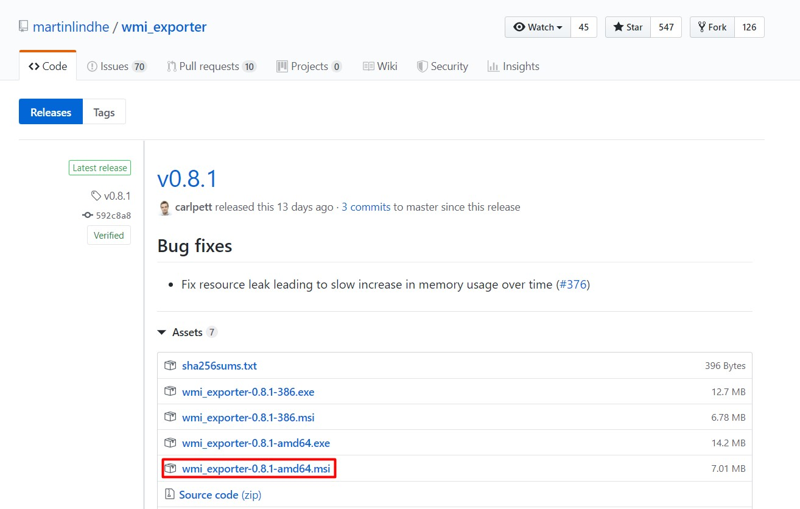
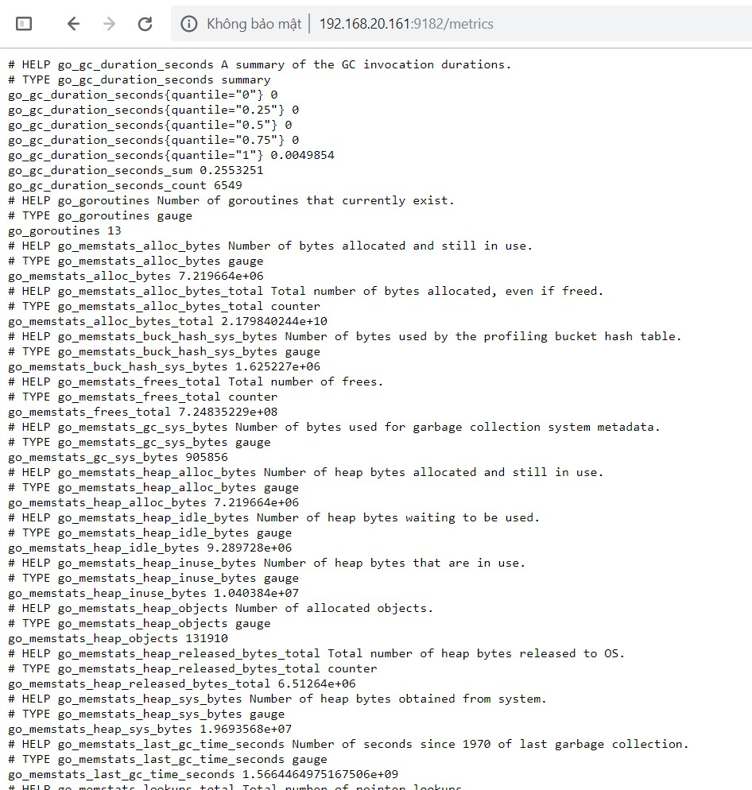
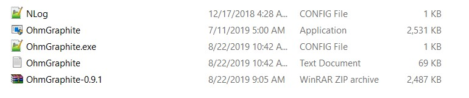
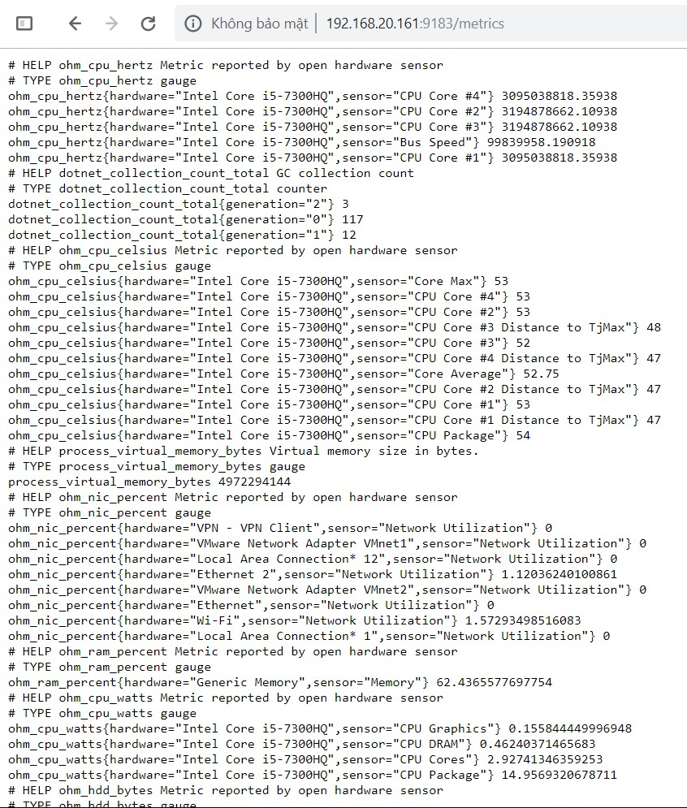
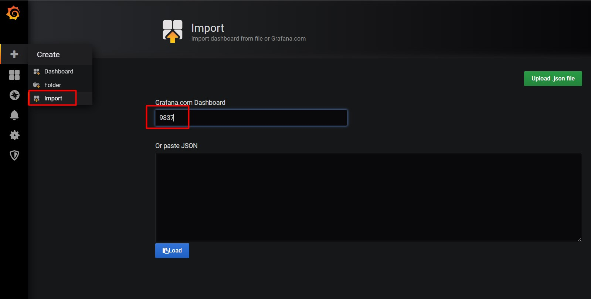
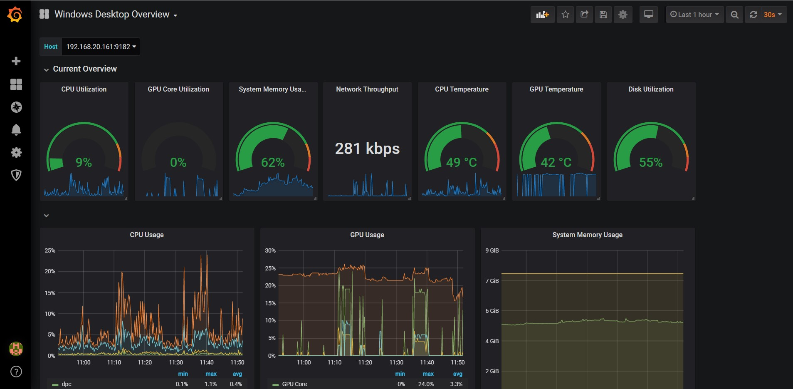

# Cấu hình Exporter cho Windows

## Chuẩn bị

- Windows: 192.168.20.161/24

- Firewall mở port 9182, 9183 cả 2 chiều

## Cấu hình

### 1. Cấu hình trên node Windows

- Tải wmi_exporter tại https://github.com/martinlindhe/wmi_exporter/releases



- Chạy file cài đặt vừa tải về, sau đó truy cập `http://192.168.20.161:9182/metrics` để kiểm tra:



Để lấy thêm các thông số khác có thể thực hiện như sau:

- Tải `wmi_exporter-0.8.1-amd64.msi` về đặt tại thư mục `C:\`, sau đó mở powershell với quyền admin và gõ lệnh:

```
PS C:\> msiexec /i C:\wmi_exporter-0.8.1-amd64.msi ENABLED_COLLECTORS=os,cpu,cs,hyperv,logical_disk,memory,net,process,service,system,tcp,textfile,vmware
```

Để lấy thêm các thông tin về nhiệt độ cpu, gpu,... tải exporter [OhmGraphite](https://github.com/nickbabcock/OhmGraphite)

- Tạo thư mục để chứa OhmGraphite, sau đó tải tại đây https://github.com/nickbabcock/OhmGraphite/releases

- Sau khi tải về thì giải nén file zip:



- Sửa file `OhmGraphite.exe.config`:

```
<?xml version="1.0" encoding="utf-8"?>
<configuration>
  <appSettings>
    <add key="type" value="prometheus" />
    <add key="prometheus_port" value="9183" />
    <add key="prometheus_host" value="*" />
  </appSettings>
  <startup>
    <supportedRuntime version="v4.0" sku=".NETFramework,Version=v4.6.1" />
  </startup>
</configuration>
```

- Sau đó mở powershell bằng quyền admin, di chuyển tới thư mục OhmGraphite và chạy lệnh sau:

```
.\OhmGraphite.exe install
```

Lệnh này sẽ cài đặt OhmGraphite thành 1 service, chúng ta có thể dễ dàng quản lý với `service.msc`

- Start service OhmGraphite và truy cập địa chỉ `http://192.168.20.161:9183/metrics` để kiểm tra:



### 2. Cấu hình trên Prometheus server

- Thêm vào file cấu hình Prometheus `/etc/prometheus/prometheus.yml`

```
- job_name: 'windows_node'
    scrape_interval: 5s
    static_configs:
      - targets: ['192.168.20.161:9182']
      - targets: ['192.168.20.161:9183']
```

- Khởi động lại Prometheus

```
systemctl restart prometheus
```

### 3. Thêm dashboard trên Grafana

- Import dashboard



- Kết quả



## Tham khảo

https://github.com/trangnth/ghichep-prometheus/blob/master/Doc/07.%20windows-exporter.md

https://github.com/martinlindhe/wmi_exporter

https://github.com/nickbabcock/OhmGraphite