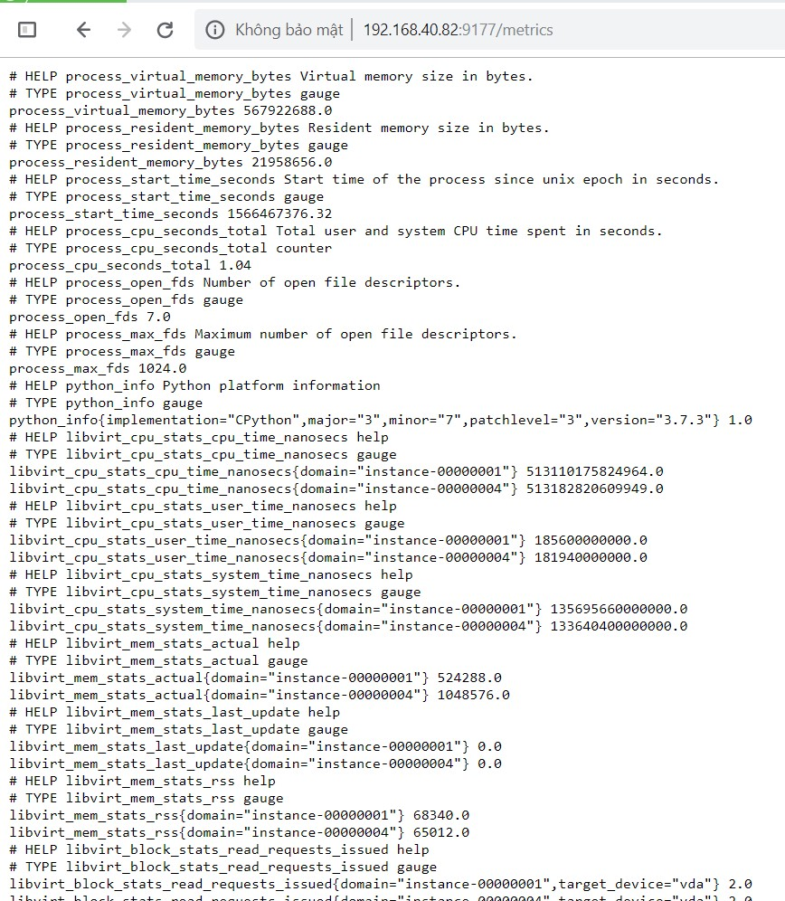

# Libvirt Exporter

- Cài đặt python 3.7

```
yum install gcc openssl-devel bzip2-devel libffi-devel -y
cd /usr/src
wget https://www.python.org/ftp/python/3.7.3/Python-3.7.3.tgz
tar xzf Python-3.7.3.tgz
cd Python-3.7.3
./configure --enable-optimizations
make altinstall
rm -f /usr/src/Python-3.7.3.tgz
```

- Cài đặt exporter

```
cd /root
git clone https://github.com/beylistan/prometheus_libvirt_exporter.git
cd prometheus_libvirt_exporter/
pip3.7 install --upgrade pip
yum install -y libvirt libvirt-devel
pip install -r requirements.txt
```

- Chạy exporter

```
python3.7 libvirt_exporter.py -si 3
```

Kiểm tra trên web



- Cấu hình trên Prometheus server

Chỉnh sửa file cấu hình `/etc/prometheus/prometheus.yml`

```
- job_name: 'libvirt_exporter'
    scrape_interval: 5s
    static_configs:
      - targets: ['192.168.40.82:9000']
      - targets: ['192.168.40.82:9177']
```

- Khởi động lại prometheus

```
systemctl restart prometheus
```

## Tham khảo

https://github.com/beylistan/prometheus_libvirt_exporter

https://github.com/trangnth/ghichep-prometheus/blob/master/Doc/12.%20libvirt_exporter.md

