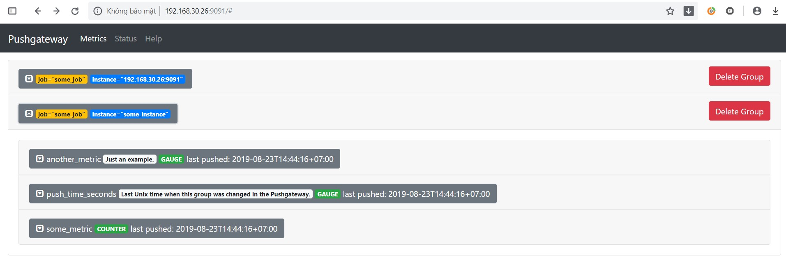

# Tìm hiểu về Pushgateway

## 1. Tổng quan


Prometheus Pushgateway cung cấp các số liệu của các công việc tạm thời cho Prometheus server. Vì các công việc này tồn tại không đủ lâu để có thể scrape, thay vào đó thì các số liệu được đẩy đến Pushgateway, sau đó Pushgateway phơi các số liệu này cho Prometheus.

Pushgateway là một service trung gian cho phép bạn push metrics từ các jobs mà không thể scraped, push time series từ short-lived service-level batch jobs tới các service trung gian để Prometheus có thể scrape.

Đôi khi bạn có các applications hoặc jobs không trực tiếp export metrics. Các ứng dụng đó cũng không được thiết kế cho việc đó (ví dụ các batch jobs), hoặc bạn có thể lựa chọn không lấy các metric trực tiếp từ các ứng dụng của mình, khi đó bạn sẽ cần tới push gateway để làm trung gian.

## 2. Cài đặt

- Cài đặt Git:

```
yum install -y git
```

- Cài đặt Go:

```
wget https://dl.google.com/go/go1.12.9.linux-amd64.tar.gz
tar -C /usr/local -xzf go1.12.9.linux-amd64.tar.gz
```

- Cấu hình biến môi trường:

Thêm vào file `.bash_profile`

```
export GOPATH=$HOME/go
export PATH=$PATH:/usr/local/go/bin:$GOPATH/bin
```

Áp dụng thay đổi:

```
source ~/.bash_profile
```

- Cài đặt Pushgateway:

```
go get github.com/prometheus/pushgateway
```

- Chạy thử Pushgateway:

```
# pushgateway
level=info ts=2019-08-23T04:16:19.821Z caller=main.go:79 msg="starting pushgateway" version="(version=, branch=, revision=)"
level=info ts=2019-08-23T04:16:19.821Z caller=main.go:80 build_context="(go=go1.12.9, user=, date=)"
level=info ts=2019-08-23T04:16:19.822Z caller=main.go:133 listen_address=:9091
```

- Pushgateway systemd:

```
cat > /etc/systemd/system/pushgateway.service << EOF
[Unit]
Description=Pushgateway
Wants=network-online.target
After=network-online.target

[Service]
User=root
Group=root
Type=simple
ExecStart=/root/go/bin/pushgateway \
    --persistence.file="/tmp/metric.store" \
    --persistence.interval=5m

[Install]
WantedBy=multi-user.target
EOF
```

- Khởi động dịch vụ:

```
systemctl daemon-reload
systemctl start pushgateway
systemctl enable pushgateway
```

## 3. Cấu hình trên Prometheus server

- Cấu hình trong file cấu hình của Prometheus:

```
- job_name: 'pushgateway'
    scrape_interval: 5s
    static_configs:
      - targets: ['192.168.30.26:9091']
	honor_labels: true
```

Pushgateway được cấu hình như target để scrape bởi Prometheus, sử dụng một trong các phương pháp thông thường. Tuy nhiên, bạn nên luôn đặt `honor_labels: true` trong file cấu hình.

## 4. Test

Gửi một sample đơn giản tới Pushgateway với định danh `{job="some_job"}`

```
echo "second_metric 99" | curl --data-binary @- http://192.168.30.26:9091/metrics/job/some_job
```

`192.168.30.26:9091` là địa chỉ của Pushgateway

Thêm metric khác với `{job="some_job",instance="some_instance"}`:

```
cat <<EOF | curl --data-binary @- http://192.168.30.26:9091/metrics/job/some_job/instance/some_instance
# TYPE some_metric counter
some_metric{label="val1"} 42
# TYPE another_metric gauge
# HELP another_metric Just an example.
another_metric 2398.283
EOF
```

Truy cập `http://192.168.30.26:9091` để kiểm tra



### Xoá metric

```
curl -X DELETE -g 'http://localhost:9091/metrics/job/some_job/instance/some_instance'
```

## Tham khảo

https://github.com/hocchudong/ghichep-prometheus-v2/blob/master/docs/Pushgateway.md

https://github.com/prometheus/pushgateway