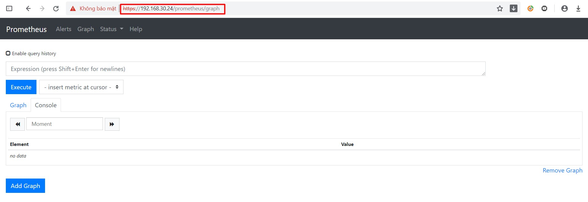
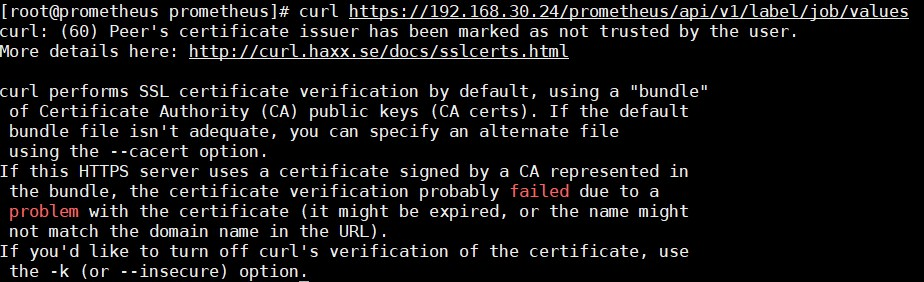
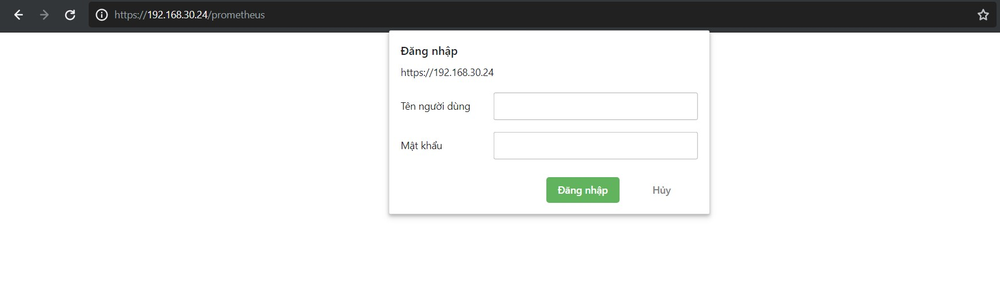

# Securing Prometheus API và UI endpoint

## Cấu hình sử dụng TLS

Prometheus không trực tiếp hỗ trợ TLS mã hoá kết nối tới Prometheus instance (ví dụ như tới Web UI hay dùng HTTP API), nếu muốn sử dụng TLS cho kết nối này, ta sẽ sử dụng reverve proxy. Ở đây tôi sẽ sử dụng `nginx`

Ta sẽ cấu hình `nginx` cho Prometheus server có URL sau: `https://192.168.30.24/prometheus`

- Tạo self-signed certificate và private key sử dụng lệnh sau:

```
mkdir -p /root/certs/prometheus
cd /root/certs/prometheus
openssl req -x509 -newkey rsa:4096 -nodes -keyout prometheus.key -out prometheus.crt
```

Điền thông tin tuỳ chọn, và chú ý tại mục `Common Name` phải điền domain name của bạn, ở đây tôi điền IP Prometheus là `192.168.30.24`

- Cấu hình nginx:

Tạo file `/etc/nginx/conf.d/prometheus.conf` và thêm vào cấu hình:

```
server {
        listen              443 ssl;
        server_name         192.168.30.24;
        ssl_certificate     /root/certs/prometheus/prometheus.crt;
        ssl_certificate_key /root/certs/prometheus/prometheus.key;

        location /prometheus {
            proxy_pass http://localhost:9090/prometheus;
        }
}
```

- Cấu hình firewall:

```
firewall-cmd --permanent --add-service=https
firewall-cmd --reload
```

- Sửa file `/etc/systemd/system/prometheus.service`

```
[Unit]
Description=Prometheus
Wants=network-online.target
After=network-online.target

[Service]
User=prometheus
Group=prometheus
Type=simple
ExecStart=/usr/local/bin/prometheus \
--config.file /etc/prometheus/prometheus.yml \
--storage.tsdb.path /var/lib/prometheus/ \
--web.console.templates=/etc/prometheus/consoles \
--web.console.libraries=/etc/prometheus/console_libraries \
--web.enable-admin-api \
--web.external-url=http://192.168.30.24/prometheus

[Install]
WantedBy=multi-user.target
```

- Khởi động lại dịch vụ:

```
systemctl restart prometheus
systemctl start nginx
systemctl enable nginx
```

- Kiểm tra

Vào web UI Prometheus bằng link:

```
https://192.168.30.24/prometheus 
```



Sử dụng HTTP API

```
curl --cacert /root/certs/prometheus/prometheus.crt https://192.168.30.24/prometheus/api/v1/label/job/values
```

Kết quả trả về:

```
{
  "status": "success",
  "data": [
    "libvirt_exporter",
    "node",
    "prometheus_master",
    "windows_node"
  ]
}
```

Không dùng option --cacert:

```
curl https://192.168.30.24/prometheus/api/v1/label/job/values
```



## Cấu hình sử dụng basic auth

- Tạo file để lưu username/password

```
htpasswd -c /etc/nginx/.htpasswd admin 
```

Có thể thay `admin` bằng username bất kỳ, sau đó nhập password để hoàn thành.

- Cấu hình nginx vào file `/etc/nginx/conf.d/prometheus.conf`

```
server {
        listen              443 ssl;
        server_name         192.168.30.24;
        ssl_certificate     /root/certs/prometheus/prometheus.crt;
        ssl_certificate_key /root/certs/prometheus/prometheus.key;

        location /prometheus {
            proxy_pass http://localhost:9090/prometheus;
            auth_basic "Prometheus";
            auth_basic_user_file /etc/nginx/.htpasswd;
        }
}
```

- Khởi động lại nginx:

```
systemctl restart nginx
```

- Kiểm tra

Truy cập địa chỉ `https://192.168.30.24/prometheus`



Nhập username/password vừa tạo để truy cập

Dùng curl:

```
curl --cacert /root/certs/prometheus/prometheus.crt https://192.168.30.24/prometheus/api/v1/label/job/values
```

kết quả trả về sẽ lỗi vì chưa xác thực, sử dụng curl với option `-u` để xác thực:

```
curl -u admin --cacert /root/certs/prometheus/prometheus.crt https://192.168.30.24/prometheus/api/v1/label/job/values
```

Sau khi nhập password được kết quả:

```
{
  "status": "success",
  "data": [
    "libvirt_exporter",
    "node",
    "prometheus_master",
    "windows_node"
  ]
}
```

## Tham khảo

https://0x63.me/tls-between-prometheus-and-its-exporters/

https://github.com/trangnth/ghichep-prometheus/blob/master/Doc/10.%20securing-prometheus-api.md

https://prometheus.io/docs/guides/tls-encryption/