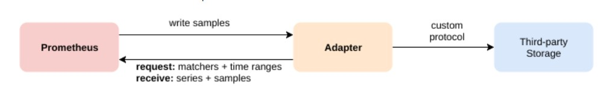

# Tìm hiểu về Storage của Prometheus

Prometheus bao gồm 1 local on-disk time series database, nhưng cũng có thể tuỳ ý tích hợp với các hệ thống remote storage.

## 1. Local storage

Time series database local của Prometheus lưu trữ time series data theo định dạng tuỳ chỉnh trên đĩa.

### On-disk layout

Các samples được nhóm vào các block mỗi 2 giờ. Mỗi block bao gồm một thư mục chứa một hoặc nhiều file chunk chứa toàn bộ các time series samples trong khoảng thời gian đó, một file metadata và một file index (nơi đánh index các metrics name và labels cho các time series trong chunk file). Khi series được xoá thông qua API, các bản ghi xoá được lưu trong các tombstone fil riêng biệt (thay vì ngay lập tức xoá các dữ liệu khỏi các file chunk).

Block đang ghi các samples hiện tại được lưu giữ trong bộ nhớ và chưa hoàn toàn persisted. Nó được bảo vệ khỏi crash bởi một write-ahead-log (WAL) có thể replayed khi Prometheus server khởi động lại sau khi bị crash. Write-ahead log files được lưu trong thư mục `wal` trong các segment 128MB. Các file này chứa dữ liệu thô, nên dung lượng sẽ lớn hơn các block file thông thường. Prometheus sẽ giữ tối thiểu 3 WAL file, tuy nhiên, các máy chủ lưu lượng truy cập cao có thể thấy nhiều hơn ba tệp WAL vì nó cần giữ dữ liệu thô ít nhất hai giờ.

Cấu trúc thư mục storage Prometheus sẽ trông giống như thế này:

```
./data
├── 01BKGV7JBM69T2G1BGBGM6KB12
│   └── meta.json
├── 01BKGTZQ1SYQJTR4PB43C8PD98
│   ├── chunks
│   │   └── 000001
│   ├── tombstones
│   ├── index
│   └── meta.json
├── 01BKGTZQ1HHWHV8FBJXW1Y3W0K
│   └── meta.json
├── 01BKGV7JC0RY8A6MACW02A2PJD
│   ├── chunks
│   │   └── 000001
│   ├── tombstones
│   ├── index
│   └── meta.json
└── wal
    ├── 00000002
    └── checkpoint.000001
```

Lưu ý rằng hạn chế của local storage là nó không thể clustered hay replicated. Do đó, không thể tuỳ ý scalable hay durable. Tuy nhiên, nếu yêu cầu về tính bền vững không quá nghiêm ngặt thì bạn vẫn có thể thành công trong việc lưu trữ dữ liệu của nhiều năm trong local storage.

Để tìm hiểu thêm chi tiết về cấu trúc các file, xem tại [đây](https://github.com/prometheus/prometheus/blob/master/tsdb/docs/format/README.md)

## 2. Compaction

Các block 2 giờ cuối cùng sẽ được nén thành các block dài hơn. 

Việc nén sẽ tạo ra các khối lớn hơn tới 10% thời gian lưu, hoặc 21 ngày, tùy theo mức nào nhỏ hơn.

## 3. Operational aspects

Prometheus có một vài flags để cấu hình local storage. Các flags quan trọng nhất là:

- `--storage.tsdb.path`: Cấu hình nơi lưu database. Mặc định là `data/`

- `--storage.tsdb.retention.time`: Cấu hình thời gian xoá dữ liệu cũ. Mặc định là `15d`.

- `--storage.tsdb.retention.size`: Cấu hình dung lượng tối đa storage blocks có thể sử dụng (không bao gồm dung lượng WAL). Dữ liệu cũ nhất sẽ bị xoá trước. Mặc định là `0` hoặc `disable`. Các đơn vị hỗ trợ: KB, MB, GB, PB.

- `--storage.tsdb.wal-compression`: Nén WAL. Phụ thuộc vào dữ liệu của bạn, có thể hy vọng kích thước WAL sẽ giảm đi một nửa với thêm một chút cpu load.

Trung bình, Prometheus chỉ sử dụng 1 đến 2 bytes cho mỗi samples. Vì vậy, có thể tính toán dung lượng của Prometheus server bằng công thức:

```
Dung lượng disk = Retention(giây) * Số lượng samples mỗi giây * Dung lượng một sample
```

Để điều chỉnh số lượng sample mỗi giây, bạn có thể giảm số lượng time series được scrape (giảm số target hoặc giảm số series mỗi target), hoặc có thể tăng scrape interval. Tuy nhiên, giảm số lượng series sẽ hiệu quả hơn vì các sample được nén lại trong một series.

Nếu local storage của bạn bị hỏng vì bất cứ lý do gì, cách tốt nhất là shutdown Prometheus và remove toàn bộ thư mục storage. Các filesystem không tuân thủ POSIX không được hỗ trợ bởi local storage của Prometheus, các lỗi có thể xảy ra mà không có khả năng phục hồi. 

Khi cả time và size retention được chỉ định, policy nào trigger trước sẽ được sử dụng tại instant đó.

Các block hết hạn sẽ được dọn dẹp theo lịch. Có thể phải mất đến 2 giờ để loại bỏ các expired block. Các expired block này phải hoàn toàn hết hạn trước khi được dọn dẹp.

## 4. Remote storage integrations

Prometheus's local storage bị hạn chế bởi single node về khả năng scalability và durability. Thay vì cố gắng giải quyết lưu trữ phân cụm trong chính Prometheus, Prometheus có một bộ giao diện cho phép tích hợp với các hệ thống lưu trữ từ xa.

### Overview

Prometheus tích hợp với các hệ thống remote storage bằng 2 cách:

- Prometheus có thể ghi các sample thu thập được tới một remote URL theo định dạng chuẩn

- Prometheus có thể đọc sample data từ một remote URL theo định dạng chuẩn



Cả 2 giao thức đọc và ghi đều sử dụng giao thức nén `snappy` mã hoá đệm qua HTTP. 

Thông tin về cấu hình tích hợp remote storage trong Prometheus xem tại [remote write](https://prometheus.io/docs/prometheus/latest/configuration/configuration/#remote_write) và [remote read](https://prometheus.io/docs/prometheus/latest/configuration/configuration/#remote_read)

Lưu ý, trên đường read, Prometheus chỉ tìm raw series data cho một bộ các label selector và time range từ đầu cuối. Tất cả ước lượng PromQL trên dữ liệu raw vẫn xảy ra trên chính Prometheus. Điều này có nghĩa là remote read queries có hạn chế về scalability, vì tất cả dữ liệu cần thiết phải tải vào Prometheus server truy vấn trước rồi xử lý ở đó.

Để tìm hiểu thêm về tích hợp hiện có với các hệ thống lưu trữ từ xa, xem thêm tại [Integrations documentation](https://prometheus.io/docs/operating/integrations/#remote-endpoints-and-storage)

## Nguồn

https://prometheus.io/docs/prometheus/latest/storage/