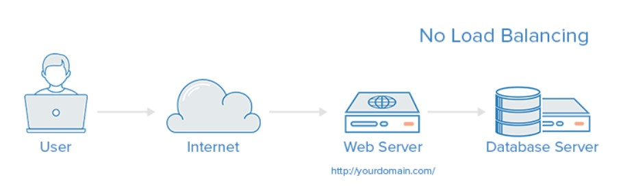
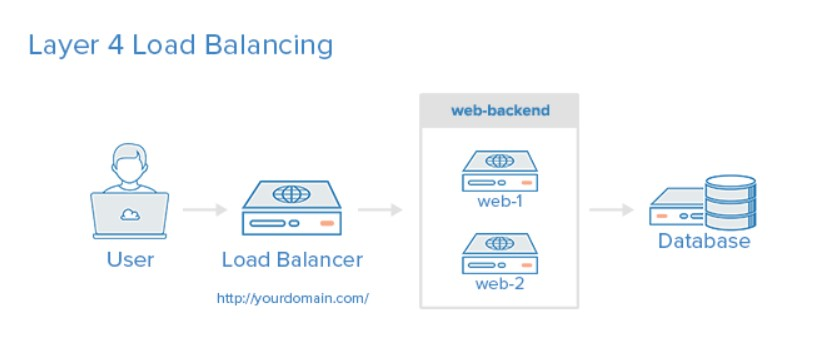
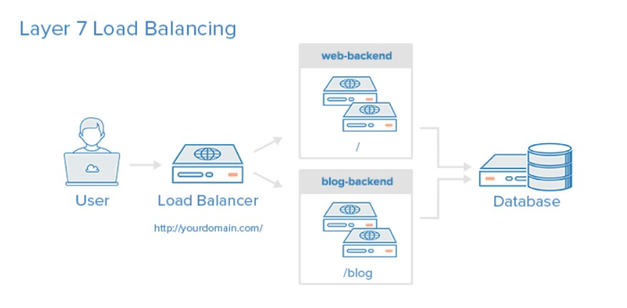
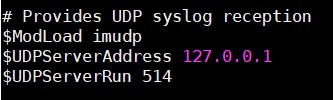
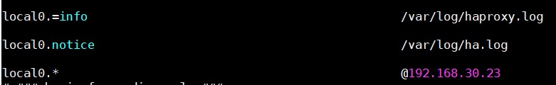

## Cấu hình HAProxy lưu log

### 1. Giới thiệu về HAProxy, Load Balancing concept

#### 1.1 Giới thiệu chung

HAProxy - viết tắt của High Availability Proxy, là phần mềm mã nguồn mở cân bằng tải TCP/HTTP và giải pháp proxy mã nguồn mở phổ biến, có thể chạy trên Linux, Solaris, và FreeBSD. Nó thường dùng để cải thiện hiệu suất (performance) và sự tin cậy (reliability) của môi trường máy chủ bằng cách phân tán lưu lượng tải (workload) trên nhiều máy chủ (như web, application, database). Nó cũng thường dùng cho môi trường cao cấp gồm: GitHub, Instagram, Twitter,...

High Availability hay còn được gọi là HA có nghĩa là “Độ sẵn sàng cao“, những máy chủ, thiết bị loại này luôn luôn sẵn sàng phục vụ, người sử dụng không cảm thấy nó bị trục trặc, hỏng hóc gây gián đoạn. Để đảm bảo được điều đó, tối thiểu có một cặp máy, thiết bị chạy song song, liên tục liên lạc với nhau, cái chính hỏng, cái phụ sẽ lập tức biết và tự động thay thế. Một ví dụ đơn giản nhất là một số máy chủ có hai bộ nguồn, tự động thay thế nóng cho nhau.

Load Balancing hay cân bằng tải là một phương pháp phân phối khối lượng tải trên nhiều máy tính hoặc một cụm máy tính để có thể sử dụng tối ưu các nguồn lực, tối đa hóa thông lượng, giảm thời gian đáp ứng và tránh tình trạng quá tải trên máy chủ.

#### 1.2 Các khái niệm trong HAProxy

##### Proxy

Proxy là 1 internet server làm nhiệm vụ chuyển tiếp, kiểm soát thông tin giữa client và server, proxy có 1 địa chỉ IP và 1 port cố định. Cách thức hoạt động: tất cả các yêu cầu từ client gửi đến server trước hết phải thông qua proxy, proxy kiếm tra xem yêu cầu nếu được phép sẽ gửi đến server và cũng tương tự cho server.

- Forward proxy: Là khái niệm proxy chúng ta dùng hàng ngày, nó là thiết bị đứng giữa 1 client và tất cả các server mà client đó muốn truy cập vào.

- Reverse proxy: là 1 proxy ngược, nó đứng giữa 1 server và tất cả các client và server mà server đó phục vụ, tương tự 1 nhà ga kiêm 1 trạm kiểm soát, các yêu cầu từ client gửi lên server bắt buộc phải ghé vào reverse proxy, tại đây yêu cầu sẽ được kiếm soát, lọc bỏ, và luân chuyển đến server. Ưu điểm của nó là khả năng quản lý tập trung, giúp chúng ta có thể kiếm soát mọi yêu cầu do client gửi lên server mà chúng ta cần bảo vệ.

##### Access Control List (ACL)

Trong cân bằng tải, ACL được dùng để kiểm tra điều kiện và thực hiện một hành động (ví dụ như lựa chọn một server hay chặn một request) dựa trên kết quả của việc kiểm tra đó. Việc sử dụng ACL cho phép tạo một môi trường có khả năng chuyển tiếp các request một cách linh hoạt dựa trên các yếu tố khác nhau mà người dùng có thể tùy chỉnh một cách dễ dàng.

Ví dụ:

```
acl url_blog path_beg /blog
```

ACL này thoả mãn nếu đường dẫn trong request của người dùng bắt đầu với /blog.

##### Backend

Backend là tập các máy chủ mà nhận các request được chuyển hướng. Backend được định nghĩa trong phần backend của cấu hình HAProxy. Cơ bản, 1 backend có thể được định nghĩa bởi:

- Thuật toán cân bằng tải nào được dùng

- Danh sách các máy chủ và cổng (port)

Một backend có thể chứa 1 hay nhiều máy chủ trong nó, thêm nhiều máy chủ vào backend sẽ gia tăng khả năng tải bằng cách phân phối lượng tải trên nhiều máy chủ. Gia tăng độ tin cậy cũng đạt được trong trường hợp này nếu một trong số các máy chủ của backend bị lỗi.

Ví dụ:

```
backend web-backend
    balance leastconn
    mode http
    server backend-1 web-backend-1.example.com check
    server backend-2 web-backend-2.example.com check
    server backend-3 backup-backend.example.com check backup
    
backend forum
    balance leastconn
    server forum-1 forum-1.example.com check
    server forum-2 forum-2.example.com check
    server forum-3 backup-forum.example.com check backup
```

Dòng `balance leastconn` chỉ ra rằng thuật toán để cân bằng tải là chọn những server có ít kết nối tới nhất.

Dòng `mode http` chỉ ra rằng proxy sẽ chỉ cân bằng cho các kết nối tại tầng 7 của Internet Layer (Tầng ứng dụng)

##### Frontend

Frontend được dùng để định nghĩa cách mà các request được điều hướng cho backend. Frontend được định nghĩa trong mục `frontend` của HAProxy configuration. Các cấu hình cho frontend gồm:

- Một bộ địa chỉ IP và port (ví dụ: 10.0.0.1:8080, *:443,...)

- Các ACL do người dùng định nghĩa

- Backend được dùng để nhận request

Một ví dụ cấu hình của frontend:

```
frontend web
  bind 0.0.0.0
  default_backend web-backend

frontend forum
  bind 0.0.0.0:8080
  default_backend forum
```

#### 1.3 Các loại cân bằng tải

##### Không có cân bằng tải

Đây là một dạng đơn giản nhất cho một ứng dụng web, thường được sử dụng cho môi trường dev, test khi số lượng người dùng ít và không có hoặc không cần đảm bảo tính tin cậy của ứng dụng.



Với mô hình này, người dùng sẽ kết nối trực tiếp với web server tại `yourdomain.com` và không có cân bằng tải nào được sử dụng. Nếu webserver gặp trục trặc, người dùng sẽ không thể kết nối đến ứng dụng web được nữa.

##### Cân bằng tải tại tầng 4 (tầng truyền vận)

Cách đơn giản nhất để có thể cân bằng tải tới nhiều server là sử dụng cân bằng tải trên tầng 4. Theo hướng này thì các request sẽ được điều hướng dựa trên khoảng địa chỉ IP và cổng (ví dụ một request tới địa chỉ `http://www.example.com/something` sẽ được điều hướng tới backend được dùng để điều hướng cho domain `example.com` với cổng 80)



##### Cân bằng tải tại tầng 7 (tầng ứng dụng)

Cân bằng tải tại tầng 7 là cách cân bằng tải phức tạp nhất và cũng là cách cân bằng tải có nhiều tuỳ biến nhất. Sử dụng cân bằng tải tại tầng 7, ta có thể điều hướng request dựa trên nội dung của request đó. Với kiểu cân bằng tải này, nhiều backend có thể được sử dụng cho cùng một domain và port.



Ví dụ, một người dùng request tới `example.com/something`, request đó sẽ được điều hướng đến một backend chuyên dụng cho `something`.

```
frontend web
    bind *:80
    mode http
    
    acl something_url   path    /something
    use_backend something-server if something_url
    
    default_backend web-backend
```

#### 1.4 Các thuật toán cân bằng tải

Các thuật toán cân bằng tải được sử dụng gồm

- roundrobin: Các request sẽ được chuyển đến server theo lượt. Đây là thuật toán mặc định được sử dụng cho HAProxy

- leastconn: Các request sẽ được chuyển đến server nào có ít kết nối đến nó nhất

- source: Các request được chuyển đến server bằng các hash của IP người dùng. Phương pháp này giúp người dùng đảm bảo luôn kết nối tới một server

#### 1.5 Tính sẵn sàng cao

Cân bằng tải trên tầng 4 và tầng 7 được miêu tả ở trên đều được sử dụng để cân bằng tải để chuyển các request tới các backend server. Tuy nhiên, chính cân bằng tải của bạn là một điểm lỗi (single point of failure), vì nếu cân bằng tải gặp sự cố nhưng các server đều chạy bình thường thì người dùng cũng không thể kết nối đến được ứng dụng web trong khi server vẫn đang chạy bình thường.

Một cài đặt cấu hình cao sẽ không có một điểm lỗi nào. Nó ngăn chặn việc nếu một máy chủ không hoạt động làm ảnh hưởng tới toàn bộ hệ thống.


Với mô hình có 2 cân bằng tải như trên, nếu một trong 2 cân bằng tải không hoạt động, ứng dụng vẫn có thể hoạt động bình thường. Hay nếu một trong hai server không hoạt động, server còn lại sẽ có thể chịu tải thay cho nó.

### 2. Cài đặt HAProxy

- Tải và cài đặt HAProxy

```
yum install -y haproxy 
```

- Cấu hình haproxy

`vi /etc/haproxy/haproxy.cfg`

```
global
    chroot      /var/lib/haproxy
    pidfile     /var/run/haproxy.pid
    maxconn     4000
    user        haproxy
    group       haproxy
    daemon

defaults
   log global
   mode http
   option httplog
   option dontlognull
   timeout connect 5000
   timeout client 50000
   timeout server 50000

frontend http_front
   bind *:80
   stats uri /haproxy?stats
   default_backend http_back

backend http_back
   balance roundrobin
   server web1 192.168.30.24:80 check
   server web2 192.168.30.25:80 check
```

- Khởi động HAProxy và cho phép khởi động cùng hệ thống:

```
systemctl start haproxy
systemctl enable haproxy
```

- Mở port 80 để người dùng có thể truy cập

```
firewall-cmd --add-port=80/tcp --permanent
firewall-cmd --reload
```

- Truy cập vào địa chỉ của haproxy để kiểm tra


- F5 lại web và kiểm tra


Như vậy HAProxy đã hoạt động, vì sử dụng thuật toán roundrobin nên các request sẽ được direct lần lượt qua hai server.

### 3. Cấu hình HAProxy lưu log

Thêm dòng sau vào file cấu hình `/etc/haproxy/haproxy.cfg` vào trường `global`

```
log 127.0.0.1 local2
```

Dòng trên có ý nghĩa là HAProxy sẽ gửi message tới rsyslog tại địa chỉ 127.0.0.1 nhưng mặc định rsyslog sẽ không lắng nghe trên bất kì địa chỉ nào, mở file `/etc/rsyslog.conf` và bỏ comment các dòng sau:



Sau đó tạo file `/etc/rsyslog.d/haproxy.conf` và thêm vào các dòng sau:



Chức năng của các dòng trên là:

- Khai báo file log chứa thông tin địa chỉ gửi request tới và request sẽ tới backend nào

- Khai báo file log chứa thông tin trạng thái của dịch vụ và trạng thái các backend

- Đẩy log đến Log server `192.168.30.23`

Cuối cùng restart lại HAProxy và rsyslog:

```
systemctl restart haproxy
systemctl restart rsyslog
```

## Tham khảo

https://www.unixmen.com/installing-haproxy-for-load-balancing-on-centos-7/

https://viblo.asia/p/huong-dan-su-dung-haproxy-cho-load-balancing-ung-dung-4P856jp95Y3

https://github.com/thaonguyenvan/meditech-thuctap/blob/master/ThaoNV/HAProxy%20%2B%20KeepAlive/docs/lab-haproxy-keepalived.md

https://cloudcraft.info/huong-dan-bat-tinh-nang-log-tren-haproxy/