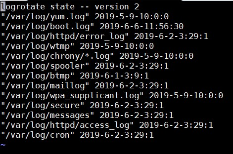

# Tìm hiểu về Logrotate

## 1. Tổng quan về Logrotate

- Logrotate là một công cụ chương trình hỗ trợ cho việc quản lý các file log trên hệ thống.

- Rotate ở đây có thể hiểu là tiến trình tạo ra 1 file log mới, còn file log cũ sẽ được xử lý theo các quy định cấu hình như xoá đi/nén lại/cất đi đâu đó.

- Log file là một file text nơi mà một chương trình ứng dụng sẽ xuất output chứa thông tin cần thiết hữu dụng cho các quản trị viên biết được điều gì đã và đang xảy ra đối với chương trình/hệ thống đó.

- Logrotate đơn thuần là một chương trình hoạt động theo việc xếp lịch crontab chứ không phải là một dịch vụ

### 1.1 Vai trò quan trọng của Logrotate

- Các file log rất quan trọng đối với quản trị viên hệ thống phục vụ cho việc theo dõi tình trạng và xử lý vấn đề liên quan đến hệ thống/ứng dụng. Không hay là nếu quá nhiều thông tin được log lại sẽ khiến cho dung lượng ổ cứng phải sử dụng nhiều cho việc chứa các file log.

- Nếu không kiểm soát tình trạng phình to của các file log trên hệ thống, thì bỗng một ngày hệ thống của bạn sẽ hết dung lượng bất đắc dĩ, thậm chí việc file log có dung lượng lớn quá cũng ảnh hưởng đến các tiến trình xử lý backup hoặc resize của server ảo.

- Một điều cần quan tâm nữa là, nếu bạn có quá nhiều file log như cả ngàn cả tỉ file log thì sẽ rất khó để tìm kiếm các thông tin mà bạn cần. Vậy nên rất là cần thiết để kiểm soát các file log nằm trong dung lượng file quy định và cả số lượng các file log có thể giữ lại trên hệ thống.

- Chương trình `logrotate` sinh ra để giúp bạn làm những công việc đó.

### 1.2 Logrotate hoạt động như thế nào?

- Chương trình logrotate sẽ chạy load file cấu hình `/etc/logrotate.conf` lên theo mặc định của script logrotate

- Hệ thống Linux sẽ chạy chương trình logrotate theo thời gian lịch crontab, mặc định là **daily**. Bạn có thể tìm thấy script chạy logrotate daily tại đường dẫn `/etc/cron.daily/logrotate`. Các file log chỉ có thể được rotate nếu chương trình logrotate chạy, phần cấu hình sẽ chỉ là phụ trợ thêm chỉ định rõ nội dung các file tương tác.

- Như vậy bạn phải lưu ý, nếu bạn cấu hình logrotate chạy mỗi ngày nhưng mà lại để crontab logrotate vào phần cron.weekly, thì các file log sẽ được rotate theo chu kì mỗi tuần chứ không theo daily trong cấu hình.

- Nếu không có file script thực thi logrotate thì bạn có thể sử dụng nội dung script mặc định của logrotate như sau:

```
#!/bin/sh

/usr/sbin/logrotate /etc/logrotate.conf
EXITVALUE=$?
if [ $EXITVALUE != 0 ]; then
	/usr/bin/logger -t logrotate "ALERT exited abnormally with [$EXITVALUE]"
fi
exit 0
```

- Cấu hình custom logrotate cho từng loại file log (tương ứng khi bạn muốn cấu hình cho từng loại dịch vụ riêng) thì sẽ được nằm trong thư mục `/etc/logrotate.d`. 

- Nếu muốn thêm một hoạt động logrotate đối với file log của dịch vụ mới thì hãy tạo một file cấu hình logrotate trong thư mục `/etc/logrotate.d`

- Nếu muốn tìm kiếm thông tin thêm về chương trình logrotate ngay trên hệ thống thì có thể xài lệnh `man`

```
man logrotate
```

- Logrotate lưu trạng thái hoạt động cơ bản đối với các loại file log nào đang được logrotate tương tác tại file `/var/lib/logrotate/logrotate.status`



## 2. Các giá trị cấu hình 

### 2.1 Log file

- Ta sẽ chỉ định cụ thể một hoặc nhiều file log với đường dẫn tuyệt đối của file log đó

- Bạn cũng có thể sử dụng **wildcard name** đối với mẫu chung các tên file log. Ví dụ như `/var/log/nginx/*.log`

- Bạn cũng có thể phân biệt danh sách các log file cụ thể bằng khoảng trắng

- Hoàn toàn có thể kết hợp cả **wildcard name** của file log và khoảng trắng phân biệt log file khác.

- Ví dụ:

```
/var/log/*.log /var/log/log.txt {
	...
	...
}
```

### 2.2 Số file log giữ lại 

```
rotate [count]
rotate 4
```

- Số lượng file log cũ đã được rotate giữ lại. Giả sử **count** = 4, tức là giữ lại 4 file log cũ, trường hợp đã có đủ 4 file log cũ thì file cũ nhất sẽ bị xoá đi để chứa file log mới đã được rotate.

### 2.3 Thời gian xoay vòng

Có 4 giá trị thời gian tương ứng sau:

- **daily**: Mỗi ngày

- **weekly**: Mỗi đầu tuần

- **monthly**: Mỗi đầu tháng

- **yearly**: Mỗi năm

Với mỗi giá trị cấu hình mà bạn chọn, log sẽ được rotate với khoảng thời gian tương ứng.

### 2.4 Rotate file log dựa vào dung lượng file

```
size [value]
size 100k
size 100M
size 100G
```

- Bên cạnh đó ta còn có thể quy định tiến trình rotate dựa vào dung lượng của file, ví dụ như nếu file đó đạt dung lượng lớn hơn hoặc bằng 100M sau khi kiểm tra thì sẽ bị rotate. Các đơn vị kích thước file có thể sử dụng là **k, M, G**.

- Phần cấu hình rotate dựa vào dung lượng file được ưu tiên cao hơn rotate dựa vào thời gian. Khi đó nếu 1 file log bị rotate theo cấu hình dung lượng file quy định thì thời gian rotate sẽ được khởi động lại mới.

- Ví dụ cho sự ưu tiên: Nếu 1 file log được cấu hình rotate theo tuần và theo size file quy định, nhưng đến giữa tuần file log đó bị rotate do đạt dung lượng cấu hình quy định. Lúc này, logrotate sẽ phải đợi sang tuần kế tiếp để thực hiên rotate log, do việc rotate theo size đã bypass luôn thời gian của tuần này, điều đó cũng tương tự với **daily**.

### 2.5 Nén file log

```
compress
```

- Nếu ta chỉ định giá trị cấu hình **compress** thì chương trình logrotate sẽ nén tất cả các file log lại sau khi đã được rotate

- Nếu chỉ định giá trị cấu hình này ở phần cấu hình toàn cục (global) thì tất cả các file log cũ sẽ bị nén.

```
nocompress
```

- Trong trường hợp bạn không muốn sử dụng tính năng nén file log cũ thì bạn nên sử dụng option **nocompress** 

```
compresscmd xz
```

- Mặc định, chương trình logrotate sử dụng chương trình **gzip** để nén các file log lại. Còn bạn muốn sử dụng chương trình nén khác như **bzip2**, **xz** hoặc **zip** thì hãy đặt tên chương trình đó thành biến sau giá trị cấu hình **compresscmd**.

```
delaycompress
```

- Cấu hình này sẽ hữu dụng trong trường hợp bạn không muốn file log cũ phải nén ngay sau khi vừa được rotate. Thay vào đó công việc nén sẽ được delay trễ hơn bằng việc sẽ nén file log cũ đó vào lần chạy logrotate đối với file log ở lần kế tiếp.

- Lưu ý là giá trị này chỉ có thể cấu hình hoạt động khi kèm với chức năng **compress** trong file cấu hình của bạn.

### 2.6 Kiểm soát phân quyền file log tạo mới

- Chúng ta có thể chỉ định khi logrotate xứ lý file log cũ xong theo quy định cấu hình thì kế tiếp sẽ tạo ra file log mới có tên tương ứng để thay thế file log hiện tại.

- Giá trị cấu hình **create** sẽ quy định việc file tạo ra file log mới đó.

- Trong một số trường hợp, chương trình dịch vụ khác của hệ thống bạn yêu cầu có sự phân quyền phù hợp để có thể đọc và tương tác với file log của dịch vụ thì sau khi rotate log bạn cần phải đảm bảo đúng phân quyền cho file log mới.

- Hoạt động tạo file này sẽ chạy trước script **postrotate**.

- Cấu trúc cấu hình lúc này sẽ là:

```
create [mode] [owner] [group]
create 0600 root root
```

- Nếu bạn không muốn tự động tạo file log mới thì sử dụng option **nocreate**

```
nocreate
```

### 2.7 Các giá trị cấu hình khác

```
missingok
```

- Nếu file log vì lý do gì đấy bị mất hoặc không tồn tại thì logrotate sẽ tự động di chuyển tới phần cấu hình log của file log khác mà không cần phải xuất ra thông báo lỗi. Ngược lại cấu hình sẽ là **nomissingok**

```
notifempty
```

- Không rotate log nếu file log này rỗng

```
dateext
```

- Thêm giá trị hậu tố vào các file log cũ, các giá trị hậu tố này là phần mở rộng về thời gian theo cấu trúc **YYYYMMDD** thay vì add vào giá trị hậu tố là các con số 1,2,3,...

```
sharedscripts
```

- Bình thường logrotate sẽ chạy **postrotate scripts** với mỗi một file log được rotate. Tức có nghĩa là nếu bạn cấu hình **wildcard name** hoặc các đường dẫn file log sử dụng chung 1 block cấu hình logrotate thì sẽ phải chạy **postrotate** cho mỗi log file nếu có cấu hình.

- Giá trị cấu hình này sẽ chỉ định chương trình logrotate hãy đợi cho đến khi kiểm tra hết tất cả các file log nằm trong block cấu hình thì kế đến mới hãy chạy nội dung script postrotate.

- Nếu một hay nhiều file log được rotate, thì lúc này postrotate script chỉ cần chạy 1 lần sau cùng là được. Ngược lại nếu không file log nào được rotate thì postrotate cũng sẽ không hoạt động.

### 2.8 Thực thi chương trình lệnh

- Logrotate có thể chạy các lệnh do quản trị viên trước hay sau quá trình rotate. Thường được áp dụng để khởi động lạ dịch vụ sử dụng file log nhằm không làm gián đoạn quá trình ghi log.

- Để chạy chương trình lệnh trước khi quá trình rotate bắt đầu ta tuân theo cấu trúc sau với lệnh thực thi sẽ nằm giữa **prerotate** và **endscript**:

```
prerotate
	touch /var/www/html/stop.txt
endscript
```

- Để chạy chương trình lệnh sau quá trình rotate, ta tuân theo cấu trúc sau với lệnh thực thi sẽ nằm giữa **postrotate** và **endscript**:

```
postrotate
	/etc/init.d/httpd restart
endscript
```

## Tham khảo

https://cuongquach.com/linux-tim-hieu-hoat-dong-va-cau-hinh-logrotate-tren-linux.html