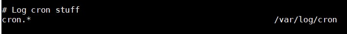
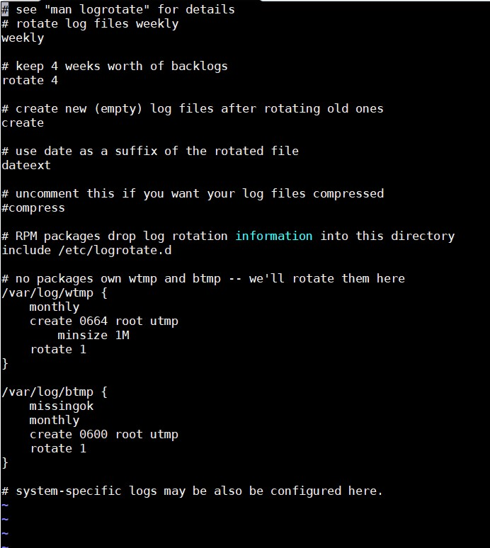

## 1. Tổng quan về Log

### 1.1 Khái niệm

`Log` là một tệp tin được tạo ra bởi một máy chủ web hoặc máy chủ proxy chứa tất cả các thông tin về các hoạt động trên máy chủ đó. 

Các file log hệ thống lưu những thông tin hoạt động của các function thiết yếu trong hệ thống. Ví dụ như cơ chế uỷ quyền, các tiến trình hệ thống, các message hệ thống, syslog,...

### 1.2 Tác dụng của Log

- Log ghi lại liên tục các thông báo về hoạt động của cả hệ thống hoặc của các dịch vụ được triển khai trên hệ thống và file tương ứng. Log file thường là các file văn bản thông thường dưới dạng **clear text**, tức là bạn có thể dễ dàng đọc được nó, vì thế có thể sử dụng các trình soạn thảo văn bản (vi, vim, nano,...) hoặc các trình xem văn bản thông thường (cat, tailf, head,...) là có thể xem được file log.

- Các file log có thể cho bạn bất cứ thứ gì bạn cần biết, để giải quyết các rắc rối mà bạn gặp phải miễn là bạn biết ứng dụng nào, tiến trình nào được ghi vào log nào cụ thể.

- Trong hầu hết hệ thống Linux thì `/var/log` là nơi lưu lại tất cả các log.

Việc sinh ra log để giúp quản trị viên theo dõi hệ thống của mình tốt hơn, hoặc giải quyết các vấn đề gặp phải với hệ thống hoặc service. Điều này đặc biệt quan trọng với các hệ thống cần phải online 24/24 để phục vụ nhu cầu của mọi người dùng.

### 1.3 Các loại log

Có thể phân loại Log ra làm 4 loại cơ bản

- Application Logs

- Event Logs

- Service Logs

- System Logs

### 1.4 Một số file log quan trọng

- `/var/log/syslog` hoặc `/var/log/messages`: Hiển thị thông báo và thông tin chung về hệ thống. Về cơ bản là một bản ghi tất cả hoạt động của hệ thống. `/var/log/messages` đối với các hệ thống Redhat-based,  `/var/log/syslog` đối với hệ thống Debian/Ubuntu

- `/var/log/auth.log` hoặc `/var/log/secure`: Chứa thông tin về việc SSH tới hệ thống

- `/var/log/boot.log`: Thông tin khởi động hệ thống

- `/var/log/maillog` hoặc `/var/log/mail.log`: Log của các mail server chạy trên hệ thống 

- `/var/log/kern`: Các log về kernel

- `/var/log/dmesg`: Device driver message, sử dụng lệnh `dmesg` để xem thông tin bên trong file này

- `/var/log/faillog`: Ghi lại thông tin đăng nhập thất bại, hữu ích cho việc điều tra tấn công dò đoán mật khẩu và tấn công vét cạn.

- `/var/log/cron`: Giữ các bản ghi cron jobs

- `/var/log/daemon.log`: Theo dõi các dịch vụ chạy nền

- `/var/log/btmp`: Ghi lại tất cả các cố gắng đăng nhập thất bại

- `/var/log/utmp`: Trạng thái đăng nhập hiện tại của người dùng

- `/var/log/wtmp`: Ghi lại mỗi lần đăng nhập/đăng xuất

- `/var/log/lastlog`: Giữ thông tin về lần đăng nhập cuối cùng của tất cả các user. Sử dụng lệnh `lastlog` để đọc file.

- `/var/log/yum.log`: Giữ thông tin về các package được cài đặt bằng lệnh `yum`

- `/var/log/httpd/`: Thư mục log của Apache

- `/var/log/spooler`: Thường sẽ không có gì, ngoại trừ các thông báo quan trọng từ USENET

### 1.5 Một số câu lệnh hỗ trợ xem log

| Câu lệnh | Ý nghĩa | Ghi chú |
|----------|---------|---------|
| more [file] | Dùng xem toàn bộ nội dung của thư mục | Đối với câu lệnh này nội dung được xem theo từng trang, sử dụng dấu cách để chuyển trang |
| tail [file] | In ra 10 dòng cuối cùng nội dung của file | Thêm tuỳ chọn -n [số dòng] sẽ in ra số dòng theo yêu cầu |
| head [file] | In ra 10 dòng đầu tiên của nội dung file | Thêm tuỳ chonk -n [số dòng] sẽ in ra số dòng theo yêu cầu |
| tail -f [file] | Dùng để xem ngay lập tức khi có log đến | Đây là câu lệnh dùng phổ biến nhất, nó giúp ta có thể xem ngay lập tức log mới đến, và nó sẽ in ra 10 dòng cuối cùng trong nội dung file đó |

## 2. Các thuật ngữ cơ bản

Có 4 thuật ngữ cơ bản mà chúng ta cần phải hiểu

| Thuật ngữ | Mô tả |
|-----------|-------|
| Facility | Identifier dùng để mô tả ứng dụng hoặc chương trình đã gửi thông điệp đến syslogd |
| Priority | Chỉ số này cho phép chúng ta biết được tầm  quan trọng của thông báo. Các mức được định nghĩa trong syslog, từ việc gỡ lỗi, thông tin dịch vụ cho đến các cảnh báo quan trọng khác. |
| Selector | Sự kết hợp của một hoặc nhiều Facility và các mức độ nghiêm trọng. Khi một sự kiện đến khớp với một Selector thì một Action được thực hiện |
| Action | Điều sẽ xảy ra khi một sự kiện khớp với Selector. Hành động đó có thể là ghi message đó vào tập tin nhật ký, lặp lại thông báo tới console hoặc thiết bị khác, viết nhật ký dưới tên một user khác, hoặc gửi message tới log server |

## 3. Syslog và Rsyslog

### 3.1 Syslog

Syslog là một giao thức dùng để xử lý các file log Linux. Các file log có thể được lưu tại chính máy đó hoặc có thể di chuyển và lưu tại 1 máy khác.

Một số đặc điểm của Syslog:

- Syslog có thể gửi qua UDP hoặc TCP

- Các dữ liệu log được gửi dạng cleartext

- Syslog mặc định dùng cổng 514

#### Lịch sử phát triển 

Syslog được phát triển năm 1980 bởi Eric Allman, nó là một phần của dự án Sendmail, và ban đầu chỉ được sử dụng duy nhất cho Sendmail. Nó đã thể hiện giá trị của mình và các ứng dụng khác cũng bắt đầu sử dụng nó. Syslog hiện nay trở thành giải pháp khai thác log tiêu chuẩn trên Unix/Linux cũng như trên hàng loạt các hệ điều hành khác và thường được tìm thấy trong các thiết bị mạng như router. Trong năm 2009, Internet Engineering Task Force (IETF) đưa ra chuẩn Syslog trong RFC 5424.

Syslog ban đầu sử dụng UDP, điều này là không đảm bảo cho việc truyền tin. Tuy nhiên sau đó IETF đã ban hành RFC 3195 (Đảm bảo tin cậy cho Syslog) và RFC 6587 (Truyền tải thông báo Syslog qua TCP). Điều này có nghĩa là ngoài UDP thì giờ đây Syslog cũng đã sử dụng TCP để đảm bảo an toàn cho quá trình truyền tin.

#### Các nguồn tạo log (Facility Level)

| Facility Number | Nguồn | Ý nghĩa |
|-----------------|-------|---------|
| 0 | kernel | Những log do kernel sinh ra |
| 1 | user | Log ghi lại cấp độ người dùng |
| 2 | mail | Log của hệ thống mail |
| 3 | daemon | Log của các tiến trình trên hệ thống |
| 4 | auth | Log từ quá trình đăng nhập hệ thống hoặc xác thực hệ thống |
| 5 | syslog | Log từ chương trình syslogd |
| 6 | lpr | Log từ quá trình in ấn |
| 7 | news | Thông tin từ hệ thống |
| 8 | uucp | Log UUCP subsystem | 
| 9 | | Clock daemon |
| 10 | authpriv | Quá trình đăng nhập hoặc xác thực hệ thống |
| 11 | ftp | Log của FTP daemon |
| 12 | ntp | Log từ dịch vụ NTP của các subserver |
| 13 | security | Kiểm tra đăng nhập |
| 14 | console | Log cảnh báo hệ thống |
| 15 | cron | Log từ clock daemon |
| 16 - 23 | local 0 - local 7 | Log dự trữ cho sử dụng nội bộ

#### Các mức cảnh báo của Log (Severity Level)

Các bản tin log trong hệ thống là vô cùng nhiều. Vì vậy để thuận tiện cho việc phân tích mức độ quan trong của log, mỗi dòng log đều được gắn một mã cảnh báo, tương ứng mức độ quan trọng của dòng log đó.

Thống kê số lượng về mức độ cảnh báo của các file log cũng cho chúng ta thấy một phần tình trạng hệ thống. Nếu cho lượng log **WARN** và **ERROR** xuất hiện nhiều thì chứng tỏ hệ thống không ổn.

| Code | Mức cảnh báo | Ý nghĩa | 
|------|--------------|---------|
| 0 | emerg | Thông báo tình trạng khẩn cấp |
| 1 | alert | Hệ thống cần can thiệp ngay |
| 2 | crit | Tình trạng nguy kịch | 
| 3 | error | Thông báo lỗi đối với hệ thống | 
| 4 | warn | Mức cảnh báo đối với hệ thống |
| 5 | notice | Chú ý đối với hệ thống | 
| 6 | info | Thông tin của hệ thống |
| 7 | debug | Quá trình kiểm tra hệ thống | 

#### File cấu hình

File cấu hình là `/etc/rsyslog.conf`

```
# rsyslog configuration file

# For more information see /usr/share/doc/rsyslog-*/rsyslog_conf.html
# If you experience problems, see http://www.rsyslog.com/doc/troubleshoot.html

#### MODULES ####

# The imjournal module bellow is now used as a message source instead of imuxsock.
$ModLoad imuxsock # provides support for local system logging (e.g. via logger command)
$ModLoad imjournal # provides access to the systemd journal
#$ModLoad imklog # reads kernel messages (the same are read from journald)
#$ModLoad immark  # provides --MARK-- message capability

# Provides UDP syslog reception
#$ModLoad imudp
#$UDPServerRun 514

# Provides TCP syslog reception
#$ModLoad imtcp
#$InputTCPServerRun 514


#### GLOBAL DIRECTIVES ####

# Where to place auxiliary files
$WorkDirectory /var/lib/rsyslog

# Use default timestamp format
$ActionFileDefaultTemplate RSYSLOG_TraditionalFileFormat

# File syncing capability is disabled by default. This feature is usually not required,
# not useful and an extreme performance hit
#$ActionFileEnableSync on

# Include all config files in /etc/rsyslog.d/
$IncludeConfig /etc/rsyslog.d/*.conf

# Turn off message reception via local log socket;
# local messages are retrieved through imjournal now.
$OmitLocalLogging on

# File to store the position in the journal
$IMJournalStateFile imjournal.state


#### RULES ####

# Log all kernel messages to the console.
# Logging much else clutters up the screen.
#kern.*                                                 /dev/console

# Log anything (except mail) of level info or higher.
# Don't log private authentication messages!
*.info;mail.none;authpriv.none;cron.none                /var/log/messages

# The authpriv file has restricted access.
authpriv.*                                              /var/log/secure

# Log all the mail messages in one place.
mail.*                                                  -/var/log/maillog


# Log cron stuff
cron.*                                                  /var/log/cron

# Everybody gets emergency messages
*.emerg                                                 :omusrmsg:*

# Save news errors of level crit and higher in a special file.
uucp,news.crit                                          /var/log/spooler

# Save boot messages also to boot.log
local7.*                                                /var/log/boot.log


# ### begin forwarding rule ###
# The statement between the begin ... end define a SINGLE forwarding
# rule. They belong together, do NOT split them. If you create multiple
# forwarding rules, duplicate the whole block!
# Remote Logging (we use TCP for reliable delivery)
#
# An on-disk queue is created for this action. If the remote host is
# down, messages are spooled to disk and sent when it is up again.
#$ActionQueueFileName fwdRule1 # unique name prefix for spool files
#$ActionQueueMaxDiskSpace 1g   # 1gb space limit (use as much as possible)
#$ActionQueueSaveOnShutdown on # save messages to disk on shutdown
#$ActionQueueType LinkedList   # run asynchronously
#$ActionResumeRetryCount -1    # infinite retries if host is down
# remote host is: name/ip:port, e.g. 192.168.0.1:514, port optional
#*.* @@remote-host:514
# ### end of the forwarding rule ###
```

File cấu hình của Syslog cho ta thấy nơi lưu log của các service cơ bản trong hệ thống. Ví dụ như:



Cấu hình Syslog được chia thành 2 trường:

- Trường 1: Chỉ ra nguồn tạo ra log và mức cảnh báo của log đó. 2 thành phần này được tách nhau bằng dấu `.`

- Trường 2: Chỉ ra nơi lưu log của tiến trình đó

Với các file log do Syslog quản lý, ta có thể tuỳ chỉnh việc lưu các log với mức độ như thế nào 

Ví dụ với dịch vụ mail:

- Nếu chỉ muốn lưu các log với mức độ cảnh báo là **INFO** trở lên (từ mức 6 tới mức 0)

```
mail.info		/var/log/mail
```

- Nếu chỉ muốn mail ghi lại các log với mức là info

```
mail.=info		/var/log/mail
```

- Nếu muốn lưu lại tất cả các mức của dịch vụ mail vào log

```
mail.*			/var/log/mail
```

- Lưu lại tất cả ngoại trừ các log INFO

```
mail.!info		/var/log/mail
```

#### Định dạng chung của một gói tin syslog

Định dạng hoàn chỉnh của một thông báo syslog gồm có 3 phần chính, độ dài một thông báo không được vượt quá 1024 bytes:

```
<PRI> HEADER MSG
```

`PRI`

**PRI** hay **Priority** là một số được đặt trong ngoặc nhọn, thể hiện cơ sở sinh ra log hoặc mức độ nghiêm trọng, là một số gồm 8 bit:

- 3 bit đầu tiên thể hiện cho tính nghiêm trọng của thông báo

- 5 bit còn lại đại diện cho cơ sở sinh ra thông báo

Giá trị Priority được tính như sau: Cơ sở sinh ra log x 8 + Mức độ nghiêm trọng

Ví dụ, thông báo từ kernel (Facility = 0) với mức độ nghiêm trọng (Severity =0) thì giá trị Priority = 0x8 +0 = 0.

Trường hợp khác, với "local use 4" (Facility =20) mức độ nghiêm trọng (Severity =5) thì số Priority là 20 x 8 + 5 = 165.

Vậy biết một số Priority thì làm thế nào để biết nguồn sinh log và mức độ nghiêm trọng của nó. Ta xét 1 ví dụ sau:

Priority = 191 Lấy 191:8 = 23.875 -> Facility = 23 ("local 7") -> Severity = 191 - (23 * 8 ) = 7 (debug)

`HEADER` 

Phần **HEADER** gồm các phần chính sau:

- Time stamp: Thời gian mà thông báo được tạo ra. Thời gian này được lấy từ thời gian hệ thống (Chú ý nếu như thời gian của server và thời gian của client khác nhau thì thông báo ghi trên log được gửi lên server là thời gian của máy client)

- Hostname hoặc IP

`MSG`

Phần **Message** hay **MSG** chứa một số thông tin về quá trình tạo ra thông điệp đó. Gồm 2 phần chính:

- Tag field 

- Content field 

**Tag field** là tên chương trình tạo ra thông báo. **Content field** chứa các chi tiết của thông báo.

### 3.2 Rsyslog 

Rsyslog - "The rocket-fast system for log processing" được bắt đầu phát triển từ năm 2004 bởi Rainer Gerhards. Rsyslog là một phần mềm mã nguồn mở sử dụng trên Linux dùng để chuyển tiếp các log message đến một địa chỉ trên mạng (log receiver, log server). Nó thực hiện giao thức syslog cơ bản, đặc biệt là sử dụng TCP cho việc truyền tải log từ client tới server. Hiện nay Rsyslog là phần mềm được cài đặt sẵn trên hầu hết hệ thống Unix và các bản phân phối của Linux như: Fedora, OpenSUSE, Debian, Ubuntu, RHEL, FreBSD,...

**Syslog** là một giao thức, và được sử dụng bởi dịch vụ **Rsyslog**. Dịch vụ Rsyslog mới là người đưa ra các quyết định sử dụng port nào để vận chuyển log, sau bao nhiêu lâu thì log sẽ được quay vòng,...

Phân biệt rõ Syslog và Rsyslog:

- Syslog: Giao thức dùng để xử lý file log trong Linux

- Rsyslog: Dịch vụ sử dụng Syslog

## 4. Log Rotation

Phần lớn các distro sẽ cài đặt một cấu hình Syslog mặc định cho bạn, bao gồm logging to messages và các log files khác trong /var/log 

Để ngăn cản những file này ngày càng trở nên cồng kềnh và khó kiểm soát, một hệ thống quay vòng log file nên được cài đặt

Hệ thống cron đưa ra các lệnh để thiết lập những log file mới, những file cũ được đổi tên bằng cách thay một con số ở hậu tố.

Với loại quay vòng này, /var/log/messages của ngày hôm qua sẽ trở thành messages.1 của ngày hôm nay và một message mới được tạo. Sự luân phiên này được cấu hình cho một số lượng lớn các file, và các log file cũ nhất sẽ được xoá khi sự luân phiên bắt đầu chạy. Ví dụ trong /var/log có các messages sau: messages. messages.1, messages-20181111, messages-20181118,...

Tiện ích thi hành rotation là logrotate. Lệnh này được cấu hình sử dụng cho một hoặc nhiều files - được xác định bởi các tham số đi cùng.

File cấu hình mặc định là `/etc/logrotate.conf` 



Trong file cấu hình trên, bạn sẽ thấy:

- Hệ thống sẽ quay vòng log files hàng tuần

- Lưu lại những thông tin logs đáng giá trong 4 tuần

- Sử dụng định dạng ngày tháng thêm vào để làm hậu tố của log files (20181111, 20181118,...)

- Thông tin về sự quay vòng log của các gói RPM nằm trong /etc/logrotate.d 

- Rotation được thiết lập cho 2 files: /var/log/wtmp và /var/log/btmp 

## Tham khảo

https://www.plesk.com/blog/featured/linux-logs-explained/

https://github.com/datkk06/ghichep-log/blob/master/docs/1.Ghi-chep-ve-log.md

https://github.com/trangnth/Tim-hieu-ELK/blob/master/Overview.md#bon

https://github.com/hocchudong/Mot-vai-hieu-biet-ve-log

https://blog.cloud365.vn/logging/nhap-mon-logging-phan3/