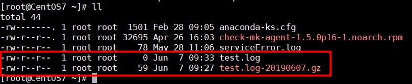

# Thực hành cấu hình Logrotate

## Yêu cầu

Cấu hình rotate file log theo giờ, theo kích thước file, nén lại các file cũ, xoá các file sau khi nén được hai file.

## Thực hành

- Mặc định Logrotate được chạy theo cron.daily, tức mỗi ngày 1 lần, nên ta phải di chuyển script của Logrotate từ cron.daily sang cron.hourly để có thể cấu hình rotate theo giờ:

```
mv /etc/cron.daily/logrotate /etc/cron.hourly/
```

- Tạo file cấu hình tại thư mục `/etc/logrotate.d/` với nội dung

```
/root/serviceError.log 
{
	missingok
	hourly
	rotate 2
	compress
}
```

File cấu hình trên sẽ rotate file `/root/serviceError.log` mỗi giờ, nén và giữ lại 2 file log cũ.

- Tạo file khác với nội dung:

```
/root/test.log 
{
	daily
	size 100
	rotate 2
	compress
}

Cấu hình trên rotate file `/root/test.log` theo dung lượng tối đa là 100B, nén và giữ lại 2 file log cũ.

## Thử nghiệm

- Thêm text vào file `/root/test.log` để lên hơn 100 Bytes, sau đó chạy lệnh sau để khởi động logrotate:

```
/usr/sbin/logrotate -s /var/lib/logrotate/logrotate.status /etc/logrotate.conf
```

- Kết quả



Đã có file cũ được nén lại.