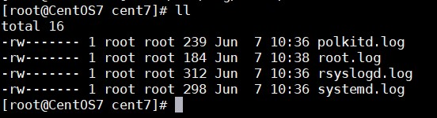

# Cấu hình log tập trung với rsyslog

## Thực hiện trên Syslog Server

Nếu dùng firewall thì thực hiện mở cổng 514

```
firewall-cmd --permanent --add-port=514/udp
firewall-cmd --reload
```

Chỉnh sửa trong file cấu hình `/etc/rsyslog.conf` của máy chủ Syslog Server để nó có thể nhận các bản tin log từ các client gửi về.

Bỏ comment ở 2 dòng:

```
$ModLoad imudp
$UDPServerRun 514
```

Để máy chủ log tạo thành các thư mục lưu riêng log đối với từng máy Client gửi về thêm dòng này vào cuối file cấu hình. (Chú ý đặt trên GLOBAL DIRECTIVES)

```
$template TmplAuth,"/var/log/%HOSTNAME%/%PROGRAMNAME%.log"
*.*     ?TmplAuth
```

Phân quyền cho syslog để nó có thể tạo các file và thư mục trong /var/log

```
chown syslog.syslog /var/log
```

Restart service Rsyslog

```
systemctl restart rsyslog
```

## Thực hiện trên Syslog Client

Thực hiện khai báo IP của Syslog server (dưới mục Rule)

```
*.*             @Syslog_IP:514
```

Restart service Rsyslog

```
systemctl restart rsyslog
```

## Kiểm tra trên Syslog Server

Trên thư mục /var/log/ của Syslog server sẽ xuất hiện thư mục log của Client. Thực hiện vào và kiểm tra log thu thập từ client.



## Cấu hình rsyslog đọc file bất kì rồi đẩy sang Syslog Server


## Tham khảo

https://viblo.asia/p/tim-hieu-ve-syslog-ng-rsyslog-va-xay-dung-he-thong-luu-log-tap-trung-XL6lAwVRKek