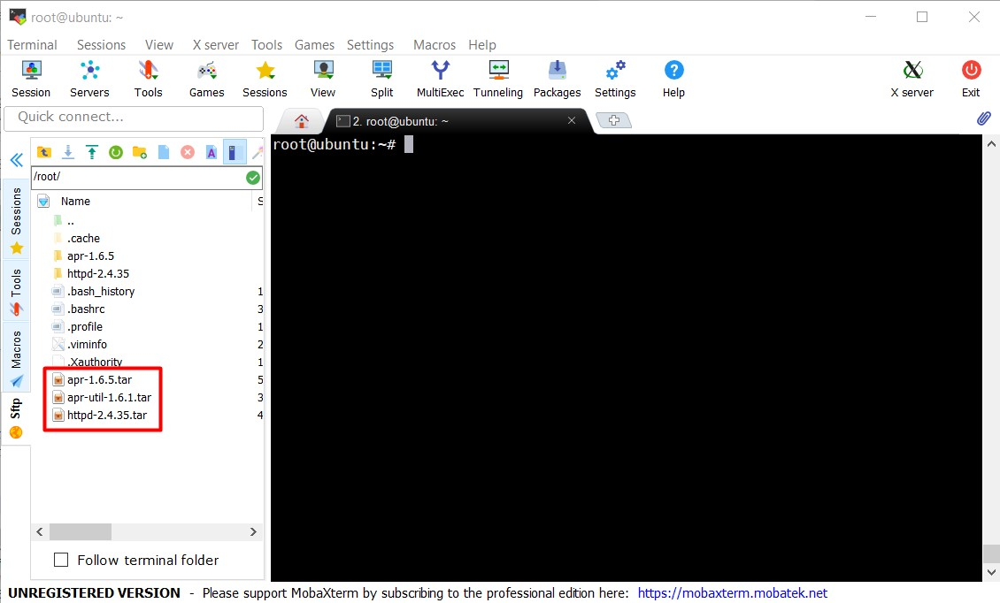
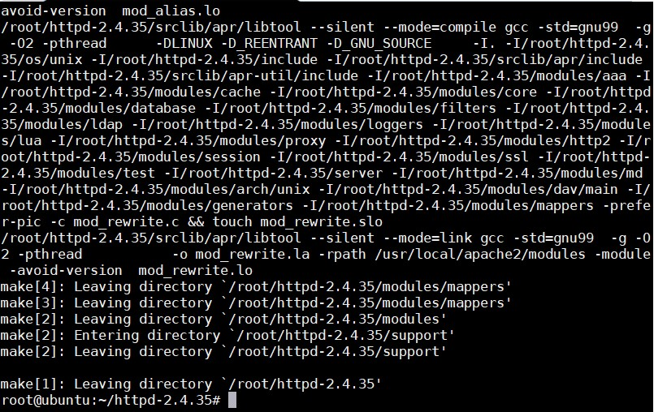
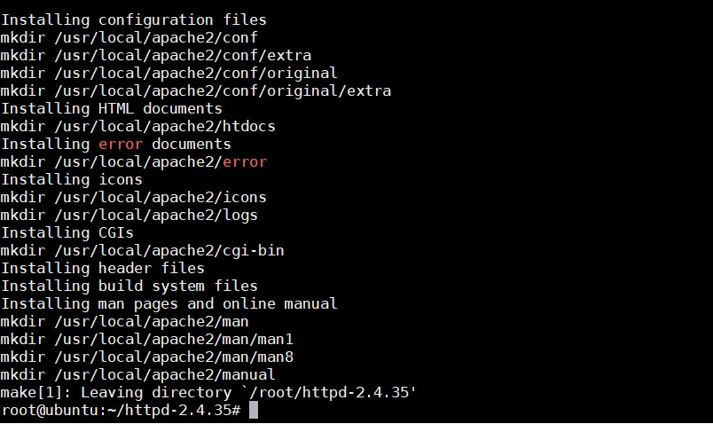
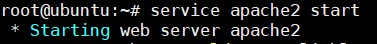

## Các cách để cài đặt 1 application trong Ubuntu ( Ví dụ Apache )

### Cài đặt tự động bằng Repository 

Sử dụng lệnh `sudo apt-get install apache2` để cài đặt apache 

### Cài đặt manual 

- Download source từ trang chủ của application, ở đây là apache HTTP server 2.4.35 (http://httpd.apache.org/download.cgi)


- Giải nén file source vừa download về

```
gunzip httpd-2.4.35.tar.gz
tar xvf httpd-2.4.35.tar
```

- Đọc file INSTALL để xem hướng dẫn cài đặt

- Truy cập vào thư mục vừa giải nén được và thực hiện lệnh:

```
./configure --prefix=PREFIX
```
	
	- PREFIX ở đây thay bằng đường dẫn mà bạn muốn cài đặt apache tại đó

Lệnh `./configure` này là 1 shell script để check xem hệ thống có đáp ứng đủ yêu cầu để cài đặt không, nếu thiếu các gói phụ thuộc thì phải tìm và cài đặt nó. Ở đây để cài đặt apache thì phải cần thêm các gói APR, APR-Util để cài đặt.



- Sau khi configure thành công không có lỗi gì, thực hiện tiếp lệnh sau để tiến hành cài đặt:

``` 
make
make install
``` 


	- Sử dụng lệnh `make`
	


	- Dùng lệnh `make` thành công không gặp lỗi
	


	- Dùng lệnh `make install` để bắt đầu quá trình cài đặt
	


	- Cài đặt thành công
	

