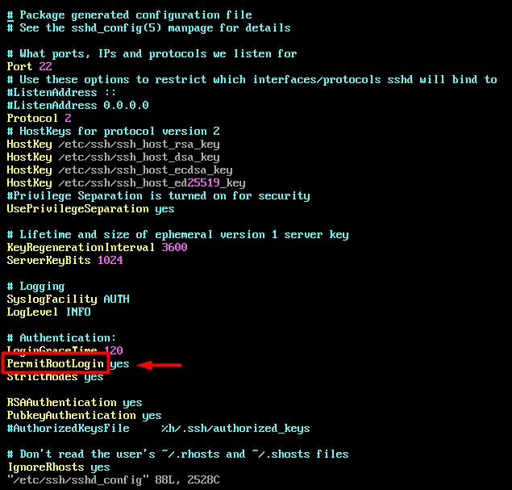
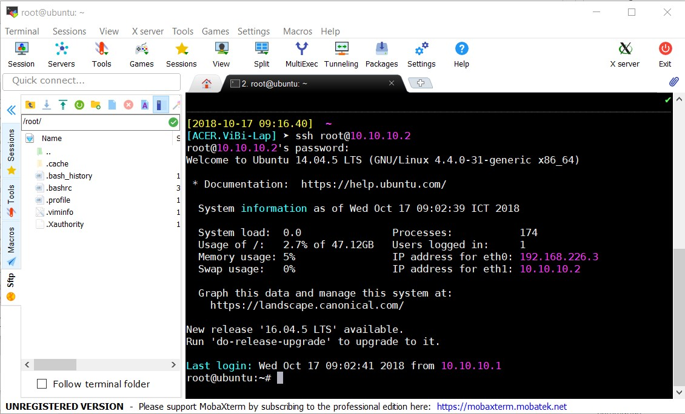

### Enable SSH root login

- Đầu tiên set password cho root bằng lệnh `sudo passwd`

- Sau đó sửa file cấu hình ssh bằng lệnh `sudo vi /etc/ssh/sshd_config`

Tại dòng PermitRootLogin, sửa `without_password` thành `yes`

Lưu file và thoát ra

- Khởi động lại SSH bằng lệnh `service ssh restart` để áp dụng các thay đổi.

- Sử dụng mobaxterm để SSH thử vào máy ảo

Điền password vừa tạo cho root

- SSH thành công bằng user root 

