# Ubuntu server 14.04

1. [Tổng quan](#tongquan)

2. [Cài đặt Ubuntu server 14.04](#caidat)

## 1. Tổng quan
### Linux
`Linux` là một hệ điều hành máy tính dựa trên Unix được phát triển và phân phối qua mô hình phần mềm tự do mã nguồn mở.
Chính xác thì `Linux` có nghĩa là nhân (kernel) của hệ điều hành, thành phần cốt lõi giúp một hệ thống điều hành các phần cứng. Và từ cái nhân này xây dựng lên các hệ điều hành khác, hệ điều hành này được gọi là các bản phân phối (distro) của linux. Do `Linux` mở nên bất cứ ai cũng có thể tạo một distro tùy ý cho mình.
Mỗi bản phân phối hướng đến một đối tượng, phục vụ một nhu cầu khác nhau. Các bản phân phối nổi tiếng hiện nay như: Ubuntu, Mint, Fedora, Arch, Suse,... Cơ bản đều dựa trên ba nhánh chính:
* Debian: Bản thân Debian cũng là một distro, trong nhánh này đều sử dụng phương thức quản lý gói là dpkg và phương thức cập nhật là apt. Tiêu biểu như: Ubuntu, Linux Mint Knoppix,... có sự thống nhất và ổn định cao hơn nhánh RedHat.

* Fedora: Phát triển dựa trên RedHat Linux Enterprise (RHEL). RHEL là một distro có tính chất thương mại và hướng tới người dùng doanh nghiệp, còn phiên bản chính thức của nó hướng tới người dùng cá nhân là Fedora. Ngoài ra còn một số các distro khác như: CentOS, Mandriva, OpenSUSE,... So với nhánh Debian, thì nhánh này ít có sự thống nhất hơn. mặc dù cùng sử dụng .rpm (vì vậy chúng còn có tên là các RPM distros) là đuôi tập tin cài đặt ứng dụng chính thức, các distros này sử dụng phương thức quản lí gói và cập nhật khá khác nhau.

* Slackware: Tiêu biểu như Arch, Gentoo,... là các distro được phát triển mà không dựa trên Debian hay RetHat, hầu hết việc sử dụng đều thông qua môi trường dòng lệnh.

Nổi tiếng và mạnh mẽ nhất hiện nay là Ubuntu và theo sau là Fedora. Fedora chỉ tập chung vào mã nguồn mở mà không có bất cứ một driver "đóng" nào, nếu cần thì đều phải tự tìm.

Ubuntu thì có giao diện thân thiện phù hợp cho người mới bắt đầu và kể cả những người có kinh nghiệm.

### Các phiên bản Ubuntu
Bản đầu tiên được phát hành vào ngày 20 tháng 10 năm 2004 là Ubuntu 4.10, các phiên bản mới được phát hành mỗi 6 tháng, đến nay có bản mới nhất là Ubuntu 18.04 phát hành vào tháng 4 năm 2018.

Các phiên bản được đặt tên có chữ cái bắt đầu theo thứ tự từ A -> Z cho các phiên bản, Bản đầu tiên là **Warty  Warthog**, gồm 2 từ đều bắt đầu bằng chữ `W`, bản được phát hành tiếp theo sau đó sẽ gồm 2 từ bắt đầu bằng chữ `A`, cứ như thế cho tới `Z` rồi lại quay lại.

Gồm có các bản thông thường và các bản hỗ trợ lâu dài.

Các phiên bản hỗ trợ dài hạn "Long Term Support", thường hỗ trợ 3 năm với máy đề bàn và 5 năm với server, các bản này sẽ ra mỗi 2 năm.

Thúc đẩy mạnh xu hướng phát triển các hệ điều hành máy trạm tự do dễ sử dụng

### Ubuntu Server
Ubuntu server được thiết kế riêng cho các mạng dịch vụ, chỉ có khả năng chạy như một file server đơn giản.

Không giống như Ubuntu Desktop, Ubuntu server không hỗ trợ các chương trình cài đặt đồ họa, thay vào đó là sử dụng các text menu-based.

## 2. Cài đặt Ubuntu Server 14.04

* Chọn ngôn ngữ

* Chọn Install Ubuntu Server để bắt đầu cài đặt

* Chọn ngôn ngữ

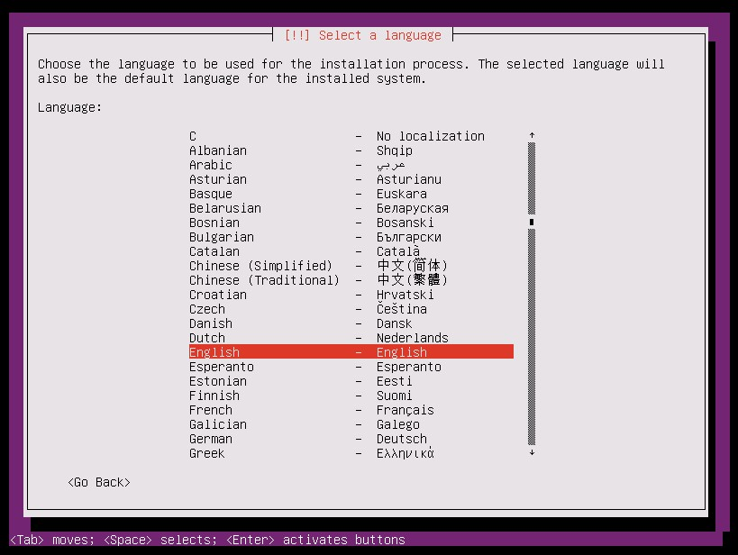

* Chọn khu vực

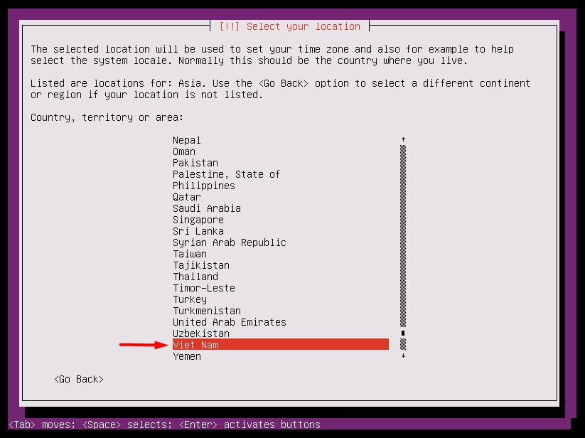

* Chọn ngôn ngữ nhập

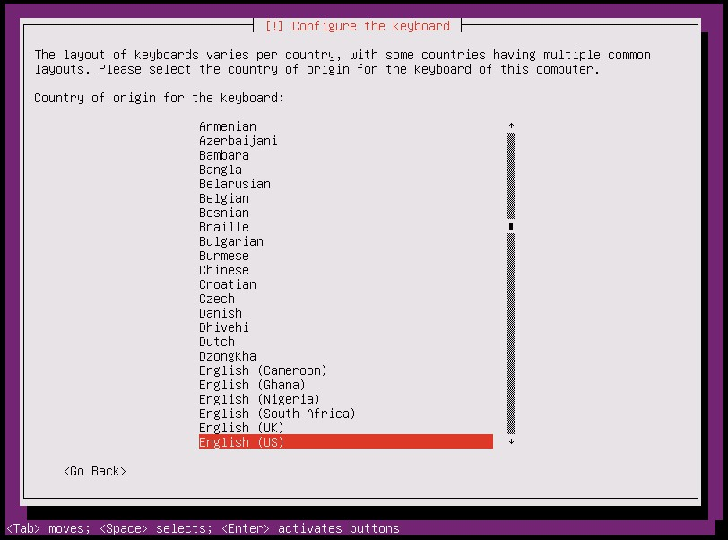

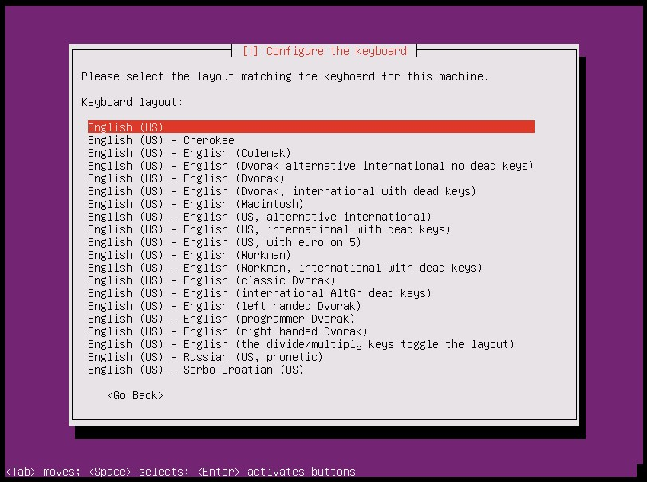

* Điền hostname rồi chọn `Continue` để tiếp tục

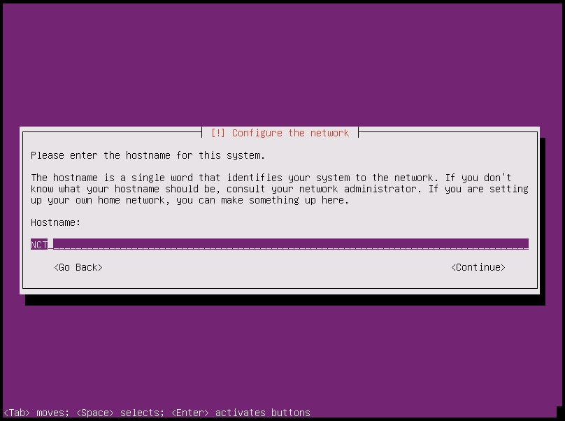

* Tạo username và password

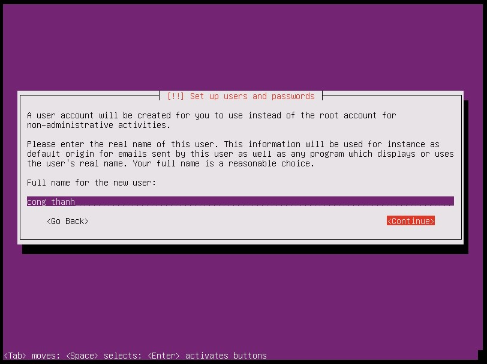

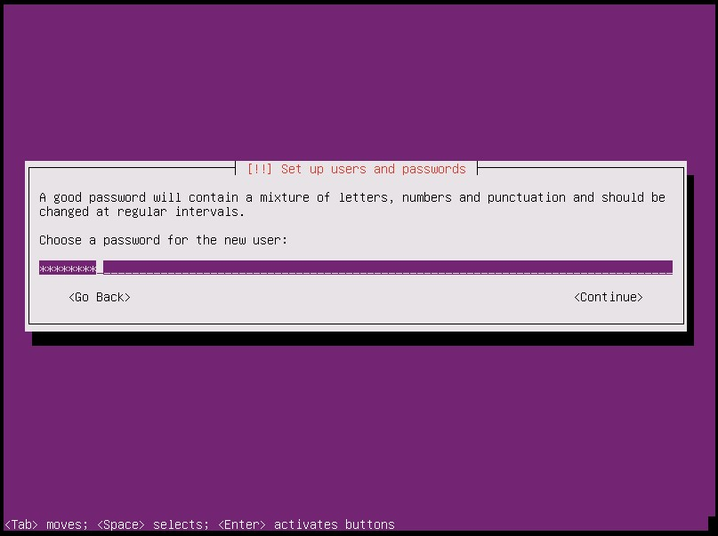

* Mã hoá thư mục home, chọn `No` nếu không muốn

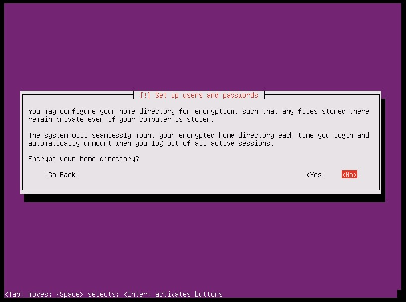

* Chọn timezone

* Phân vùng ổ cứng cho Ubuntu
Ở đây có 4 sự lựa chọn
	* `Guided - use entire disk:` Sử dụng cho ổ cứng chưa từng được phân vùng, máy tính sẽ tự động format lại toàn bộ ổ cứng và định dạng cho từng vùng đã chia.
	* `Guided - use entire disk and with set up LVM:` Tự động phân vùng bằng LVM, là một phương pháp cho phép ấn định không gian đĩa cứng thành những logical volume, khiến cho việc thay đổi kích thước các ổ đĩa dễ dàng hơn mà không phải sửa lại table của OS. Trong trường hợp bạn đã sử dụng hết phần bộ nhớ còn trống của partition và muốn mở rộng dung lượng thì LVM là một sự lựa chọn tốt.
	* `Guided - use entire disk and with set encrypted up LVM:` Giống với lựa chọn 2 nhưng sẽ cài đặt mã hóa ổ cứng để tăng tính bảo mật. 
	* `Manual:` Phân vùng thủ công.
	
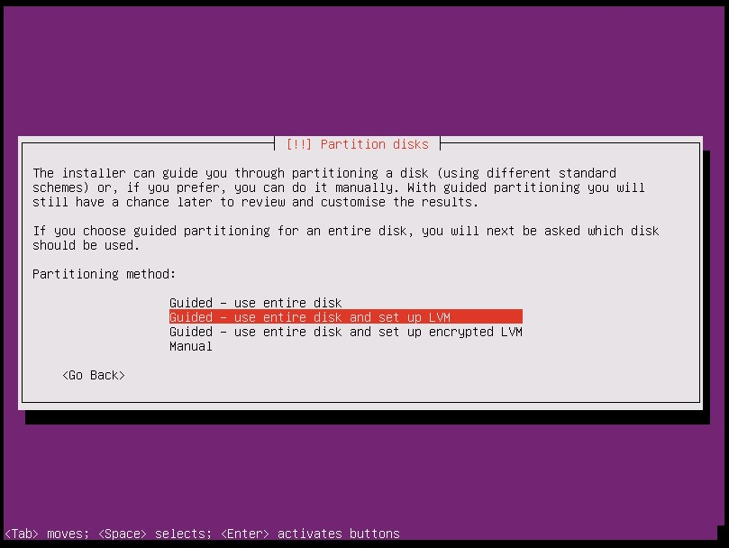

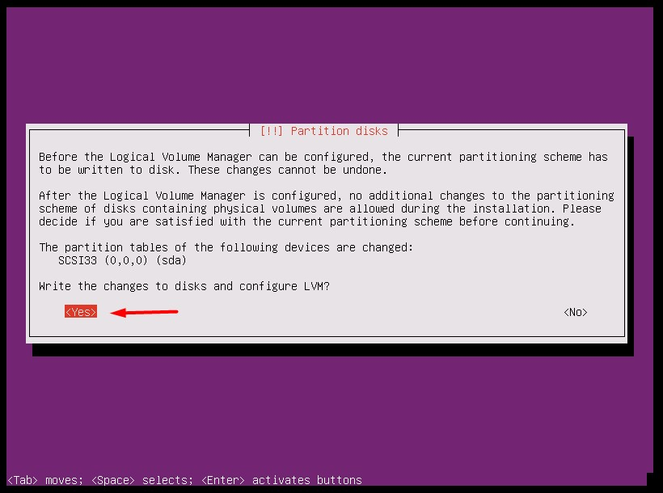

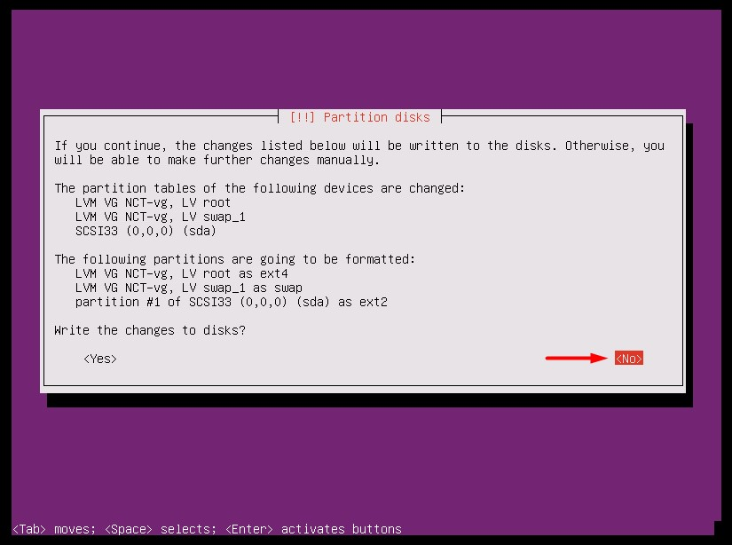

* Thiết lập proxy: có thể bỏ trống

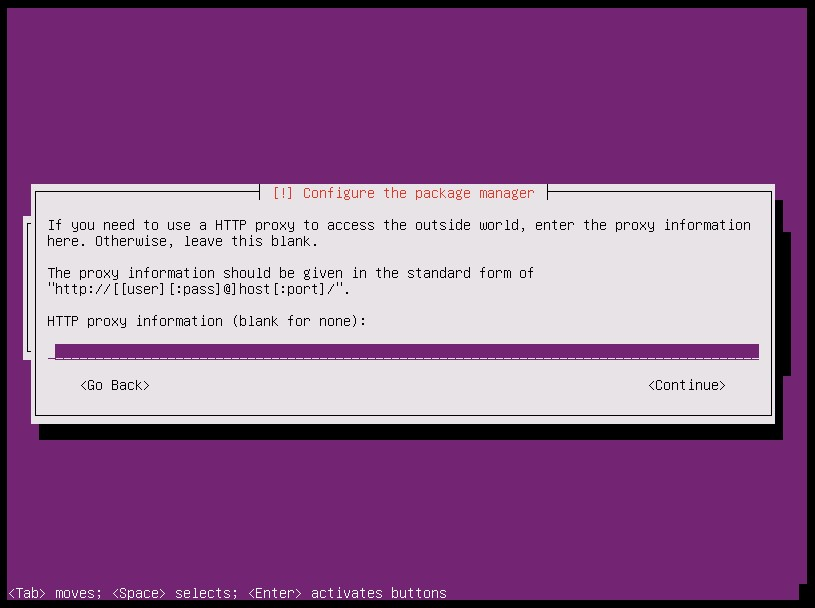

* Cấu hình update
	* `No automatic update:` Không tự động cập nhật
	* `Install security updates automatically`: Cho phép tự động cập nhật 
	* `Manage system with Landscape`: Quản lý từ xa
	

* Cài đặt các phần mềm hỗ trợ, dùng phím `Space` để chọn

* Cài đặt GRUB Bootloader 

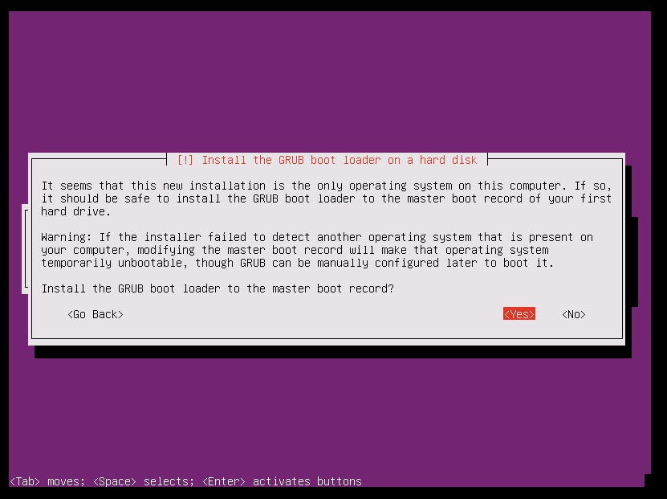

* Cài đặt thành công, chọn `Continue` để khởi động lại máy

* Nhập username và password vừa tạo ở trên để đăng nhập vào máy 

