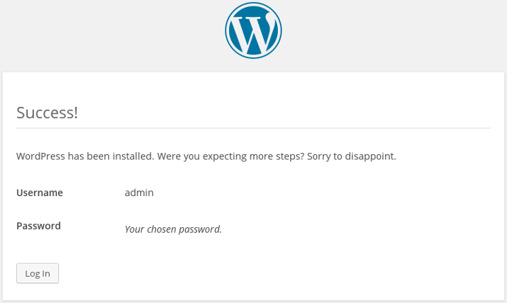
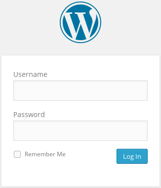
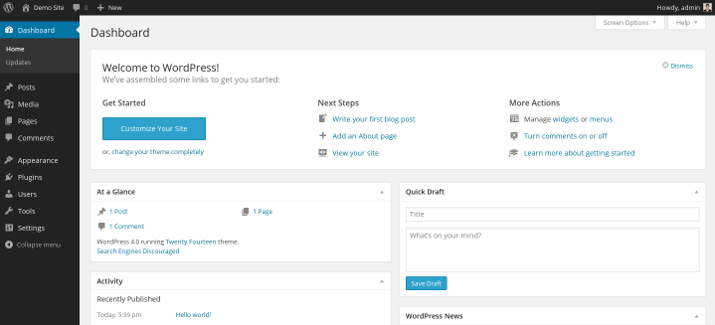

## Cài đặt Wordpress trên CentOS 7

### Chuẩn bị

- Cài Epel repo

`yum install epel-release`

- Cài Remi repo

`rpm -Uvh http://rpms.famillecollet.com/enterprise/remi-release-7.rpm`

- Cấu hình tường lửa

```
firewall-cmd --permanent --zone=public --add-service=http
firewall-cmd --permanent --zone=public --add-service=https
firewall-cmd --reload
```

### Cài đặt LAMP stack

#### Bước 1: Cài Apache

- Cài đặt 

`yum install httpd`

- Khởi động Apache

`systemctl start httpd`

- Khởi động Apache cùng hệ thống

`systemctl enable httpd`

#### Bước 2: Cài MariaDB

- Tạo file repo cho MariaDB

`vi /etc/yum.repos.d/MariaDB.repo`

- Copy nội dung sau vào file 

```
[mariadb]
name = MariaDB
baseurl = http://yum.mariadb.org/10.3/centos7-amd64
gpgkey=https://yum.mariadb.org/RPM-GPG-KEY-MariaDB
gpgcheck=1
```

- Cài đặt MariaDB

`yum install mariadb-server`

- Khởi động MariaDB

`systemctl start mariadb`

- Chạy script cấu hình secure của mariadb và làm theo hướng dẫn

`mysql_secure_installation`

- Khởi động MariaDB cùng hệ thống 

`systemctl enable mariadb`

#### Bước 3: Cài PHP

- Cài đặt 

`yum install php php-mysql`

- Khởi động lại Apache

`systemctl restart httpd`

### Cài đặt Wordpress

#### Bước 1: Tạo DB và User cho Wordpress

- Đăng nhập mysql shell

`mysql -u root -p`

- Tạo database mới

`CREATE DATABASE wordpress;`

- Tạo user `wordpress` với mật khẩu là `password`

`CREATE USER wordpress@localhost IDENTIFIED BY 'password';`

- Cấp toàn quyền cho user vừa tạo trên DB wordpress

`GRANT ALL PRIVILEGES ON wordpress.* TO wordpress@localhost;`

- Cập nhật thay đổi về quyền

`FLUSH PRIVILEGES;`

- Thoát MySQL shell 

`exit`

#### Bước 2: Cài Wordpress

- Tải Wordpress trên trang chủ

```
cd ~
wget http://wordpress.org/latest.tar.gz
```

- Giải nén file vừa tải

`tar xzvf latest.tar.gz`

- Chuyển thư mục `wordpress` đến thư mục Apache, sử dụng rsync để giữ nguyên quyền truy cập các file

`rsync -avP ~/wordpress/ /var/www/html/`

- Tạo một thư mục để lưu những file đã được upload của Wordpress

`mkdir /var/www/html/wp-content/uploads`

- Thay đổi quyền sở hữu thư mục Wordpress

`chown -R apache:apache /var/www/html/*`

#### Bước 3: Cấu hình Wordpress

- Vào thư mục Wordpress

`cd /var/www/html`

- Sử dụng file cấu hình mẫu 

`cp wp-config-sample.php wp-config.php`

- Mở file cấu hình

`vi wp-config.php`

- Tìm đến `MySQL settings`, thay đổi các thuộc tính `DB_NAME`, `DB_USER` và `DB_PASSWORD` bằng DB và user vừa tạo

```
// ** MySQL settings - You can get this info from your web host ** //
/** The name of the database for WordPress */
define('DB_NAME', 'wordpress');
/** MySQL database username */
define('DB_USER', 'wordpress');
/** MySQL database password */
define('DB_PASSWORD', 'password');
```

#### Bước 4: Hoàn tất cài đặt qua giao diện Web

- Truy cập giao diện web 

`http://server_ip`

- Chọn ngôn ngữ rồi tiếp tục

- Tạo tài khoản admin ban đầu


Nhập thông tin, sau đó chọn `Install WordPress` để tiếp tục 

- Tạo tài khoản thành công 



- Đăng nhập bằng tài khoản vừa tạo



- Giao diện Dashboard của WordPress



### Tham khảo

https://www.digitalocean.com/community/tutorials/how-to-install-wordpress-on-centos-7