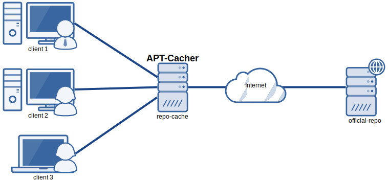
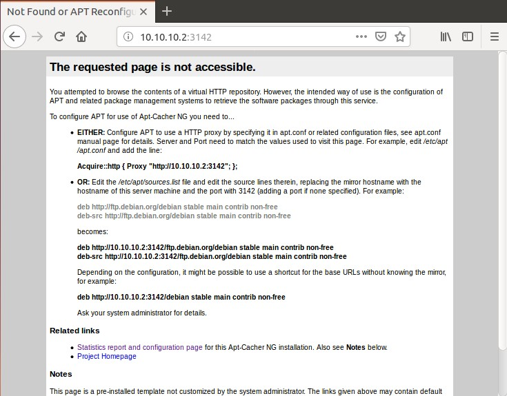
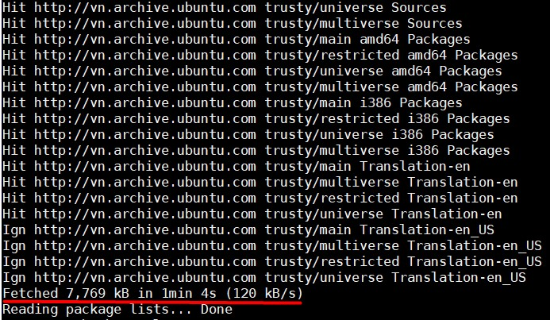
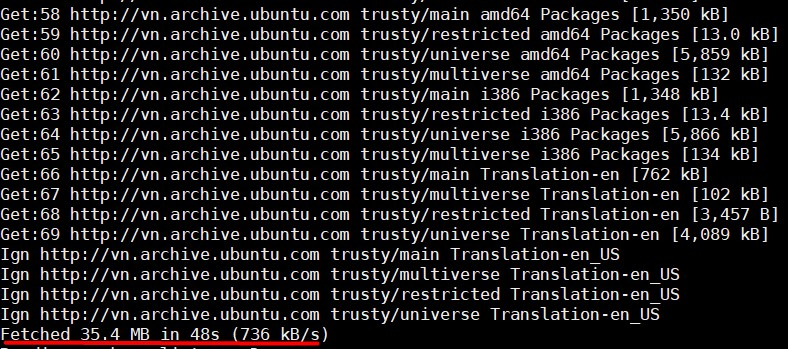
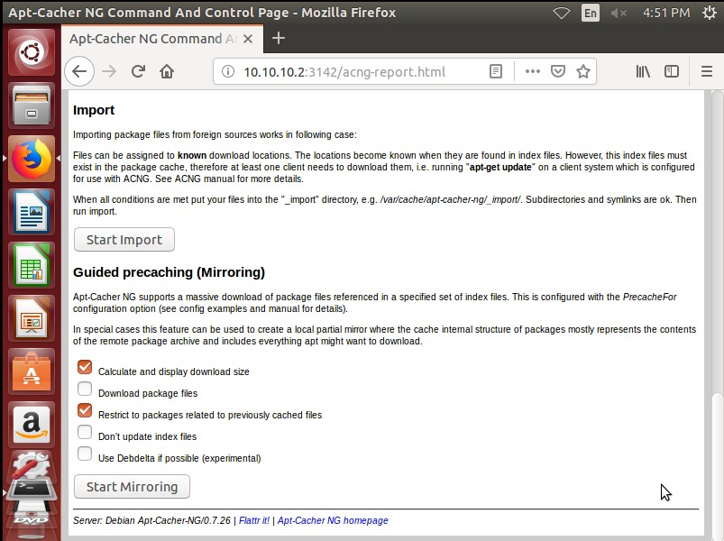
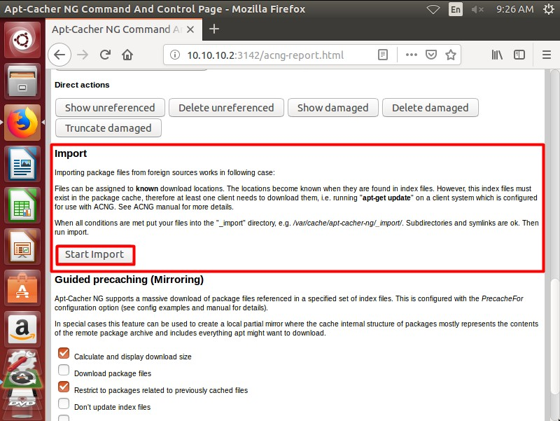
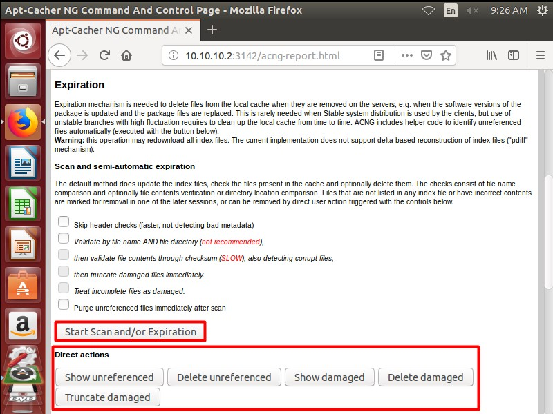

# apt-cacher-ng

## apt-cacher-ng là gì?

- apt-cacher-ng là một proxy server, dùng để lưu trữ bản sao các gói cài đặt được download từ internet về. Nhờ vậy, các máy khác trong mạng lần sau sẽ không phải mất thời gian tải các gói cài đặt từ internet về nữa.



- Hoạt động theo mô hình client-server 

- Với apt-cacher-ng, bạn có thể theo dõi sự update và download các gói phần mềm được thiết lập và hỗ trợ sử dụng trong cả các môi trường không phải Debian.

- Các tính năng:

	- Tiết kiệm thời gian 
	
	- Tiết kiệm băng thông
	
	- Có thể tích hợp các dữ liệu ISO image hoặc DVD để apt-cacher-ng sử dụng bằng tuỳ chọn `import`.
	
## Cài đặt và sử dụng 

### Mô hình 

- Server:

	- Ubuntu 14.04, có kết nối internet
	
	- Server cài apt-cacher-ng để trở thành caching proxy server 
	
- Client:

	- Ubuntu 14.04
	
### Server

- Cài đặt apache bằng câu lệnh:

```
apt-get install apache2
```

- Cài đặt apt-cacher-ng bằng lệnh:

```
apt-get install apt-cacher-ng
```

- Mở file cấu hình của apt-cacher-ng `/etc/apt-cacher-ng/acng.conf` và chỉnh sửa các nội dung:

	- Cấu hình thư mục chứa tất cả các gói phần mềm dpkg được cài đặt và cập nhật:
	
	`CacheDir: /var/cache/apt-cacher-ng`
	
	- Kích hoạt chế độ ghi lại log để theo dõi:
	
	`LogDir: /var/log/apt-cacher-ng`
	
	- Cấu hình port của `apt-cacher-ng` (mặc định là 3142, có thể thay đổi):
	
	`Port:3142`
	
	- Cấu hình `BindAddress` để server lắng nghe các request từ client:
	
	`BindAddress: 0.0.0.0`
	
	- Kích hoạt chế độ ghi lại report về lưu lượng và request qua `apt-cacher-ng` trên giao diện web:
	
	`ReportPage: acng-report.html`
	
	- Để chạy dịch vụ apt-cacher-ng, cần kích hoạt pid file:
	
	`PidFile: /var/run/apt-cacher-ng/pid`
	
	- Bỏ comment các dòng:
	
	`ExTreshold: 4`
	
	`VerboseLog: 1`
	
	- Sửa giá trị dòng DnsCacheSeconds
	
	`DnsCacheSeconds: 2000`
	
	- Để apt-cacher-ng cache cả packages cho CentOS thêm vào các dòng:
	
	```
	VfilePattern: ^/\?release=[0-9]+&arch=
	
	VfilePatternEx: ^(/\?release=[0-9]+&arch=.*|.*/RPM-GPG-KEY-examplevendor)$
	
	Remap-centos: file:centos_mirrors /centos
	```
	
	- Tạo mirror list bằng câu lệnh 
	
	`curl https://www.centos.org/download/full-mirrorlist.csv | sed 's/^.*"http:/http:/' | sed 's/".*$//' | grep ^http >/etc/apt-cacher-ng/centos_mirrors`
	
	- Thêm `PassThroughPattern: .*` vào file cấu hình
	
	- Khởi động lại dịch vụ apt-cacher:
	
	`service apt-cacher-ng restart`
	
- Kiểm tra lại trên trình duyệt ta được:



### Client 

- Trên máy Client Ubuntu, tạo file `01proxy` trong thư mục `/etc/apt/apt.conf.d/` để client gửi các request tới proxy apt-cacher-ng server có nội dung như sau:

`Acquire::http { Proxy "http://10.10.10.2:3142"; };`

- Trên client CentOS, dùng lệnh:

`echo "proxy=http://10.10.10.2:3142" >> /etc/yum.conf`

- Lưu lại là xong, bây giờ các máy client trong mạng LAN có thể cài đặt và cập nhật các gói phần mềm thông qua proxy apt-cacher-ng

### Test

- Dùng máy Client 1 update phần mềm, lúc này trên cache server chưa có packages nào nên sẽ phải tải từ Repo trên internet:



- Dùng Client 2 update phần mềm sau khi máy 1 đã update, lúc này các gói update trước từ máy 1 đã được cache lại trên apt-cacher-ng server nên tốc độ update nhanh lên rõ rệt.



### Mirror 1 repository

- Giao diện web của apt-cacher-ng cho bạn 1 tính năng Mirroring, tính năng này sẽ mirror 1 repo về server, cấu hình tại file `/etc/apt-cacher-ng/acng.conf`:

`PrecacheFor: uburep/dists/trusty-updates/*/binary-amd64/Packages*`

- Sau đó vào giao diện web:



- Ở đây có các lựa chọn:

	- **Calculate and display download size**: Tính toán và hiển thị dung lượng tải về
		
	- **Download package file**: Tích vào sẽ tiến hành download về ngay, không tích thì chỉ liệt kê những gói có thể download về thôi.
		
	- **Restrict to packages related to previously cached file**: Tuỳ chọn này để lọc các gói theo những gói đã có trong CacheDir.
		
	- **Don't update index files**: Tuỳ chọn cho phép không cập nhật các file index. (Mặc định khi nhấn Start Mirroring sẽ tự động cập nhật các file index của các gói).
		
	- **Use Debdelta if possible (experimental)**: Tuỳ chọn sử dụng Debdelta để download ( Debdelta là ứng dụng giúp bạn so sánh sự khác nhau giữa gói cũ và gói mới, giúp tiết kiệm băng thông bằng cách chỉ tải về phần khác nhau đó)
		
- Sau khi lựa chọn xong các tuỳ chọn, chọn `Start Mirroring` để bắt đầu.

### Import 



apt-cacher-ng có hỗ trợ chúng ta import các packages từ những nguồn khác. Để import ta chỉ cần copy các gói cài đặt có sẵn vào thư mục `/var/cache/apt-cacher-ng/_import` rồi quay lại Web UI và nhấn vào nút `Start Import` để import vào apt-cacher-ng.

Lưu ý: Các gói được import phải có đường dẫn download xác định trong index file, để chắc chắn rằng trong cache server có file index, chạy lệnh `apt-get update` tại 1 client bất kì để download file index.

Bạn cũng có thể import các gói cài đặt từ CD/DVD bằng cách mount nó vào thư mục `/var/cache/apt-cacher-ng/_import` rồi vào Web UI nhấn `Start Import`, sau khi import thành công thì có thể unmount.

### Loại bỏ phiên bản cũ đã lỗi thời của các gói cài đặt khỏi CacheDir

Khi đã cập nhật các gói cài đặt mới, các gói cài đặt cũ có thể được xoá đi tự động hoặc thủ công.

#### Manual

Phần Expiration trên Web UI là nơi để bạn thực hiện việc Scan xem những package nào đã cũ hoặc bị hỏng để xoá chúng đi



Nhấn `Start Scan and/or Expiration` để bắt đầu quá trình quét các gói đã cũ, có thể chọn tuỳ chọn `Purge unreferenced files immediately after scan` để xoá luôn các gói cũ sau khi Scan.

Hoặc bạn có thể dùng các hành động trực tiếp ở dưới phần `Direct actions`.

#### Automatic

apt-cacher-ng cung cấp một cron task được đặt lịch chạy tự động, file đó là `/etc/cron.daily/apt-cacher-ng`. Tiến trình này tự động thực hiện những hành động giống như khi bạn thực hiện task Expiration thủ công mà thôi