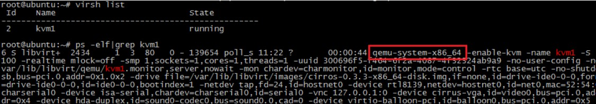
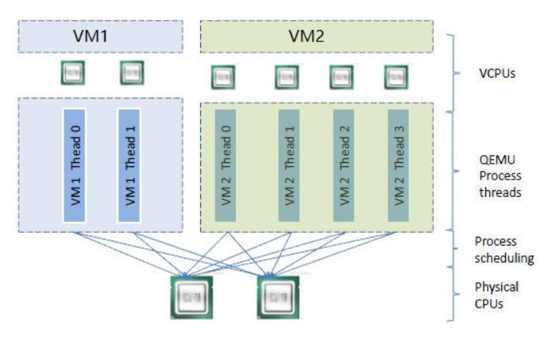

## CPU virtualization

Ảo hoá của KVM cần phải có hỗ trợ của CPU. Sử dụng câu lệnh sau để xem CPU có hỗ trợ ảo hoá KVM không

`egrep -o '(vmx|svm)' /proc/cpuinfo`

Nếu kết quả nhận được là `vmx` hoặc `svm` thì CPU hiện tại có hỗ trợ KVM. Các CPU của Intel và AMD đều hỗ trợ ảo hoá, ngoại trừ những mẫu CPU quá cũ.

Một máy ảo KVM thực chất là 1 tiến trình qemu-kvm trên máy host, được lập lịch như mọi tiến trình Linux khác.

Ví dụ, máy ảo kvm1 đang chạy trên máy thử nghiệm của tôi có thể thấy thông tin tiến trình trên host

Mỗi CPU ảo trên máy ảo tương ứng với một luồng trong tiến trình qemu-kvm:

Trong ví dụ này, host có 2 CPU vật lý với 2 máy ảo VM1 và VM2.

VM1 có 2 CPU ảo và VM2 thì có 4. Bạn có thể thấy rằng VM1 và VM2 có 2 và 4 luồng tương ứng, được đặt lịch trên 2 CPU vật lý.

Số lượng CPU ảo của máy ảo có thể nhiều hơn số lượng CPU vật lý. Gọi là CPU overcommit. KVM chấp nhận overcommit. Tính năng này cho phép máy ảo sử dụng hết tài nguyên của host CPU, nhưng chỉ khi tất cả các máy ảo đang chạy hết công suất cùng lúc. Đương nhiên, nếu mỗi 1 máy ảo đang bận, nó sẽ ảnh hưởng tới hiệu suất tổng thể, vậy nên khi sử dụng overcommit, bạn phải hiểu tải của máy ảo và cần phải kiểm tra.

## Memory virtualization

KVM chia sẽ bộ nhớ hệ thống vật lý qua ảo hoá bộ nhớ và nó được phân bố động tới các máy ảo.

Để chạy nhiều máy ảo trên một máy, KVM cần thực hiện VA (virtual memory) -> PA (physical memory) -> MA (machine memory) trực tiếp biên dịch địa chỉ. Hệ điều hành máy ảo điều khiển sự ánh xạ địa chỉ ảo tới địa chỉ vật lý của guest memory (VA -> PA), nhưng hệ điều hành máy ảo không thể truy cập trực tiếp vào bộ nhớ máy thật, vậy nên KVM có trách nhiệm ánh xạ bộ nhớ vật lý của guest sang bộ nhớ máy thật (PA -> MA). Việc triển khai cụ thể sẽ không được giới thiệu quá nhiều, và mọi người đều quan tâm để kiểm tra thông tin.

Một điểm khác cần nhắc tới là bộ nhớ cũng có thể vượt mức, tổng bộ nhớ của tất cả các máy ảo có thể vượt quá bộ nhớ vật lý của host. Tuy nhiên, nó cần phải kiểm tra đầy đủ khi được sử dụng, nếu không thì hiệu suất sẽ bị ảnh hưởng.

### Source

https://www.cnblogs.com/CloudMan6/p/5263981.html