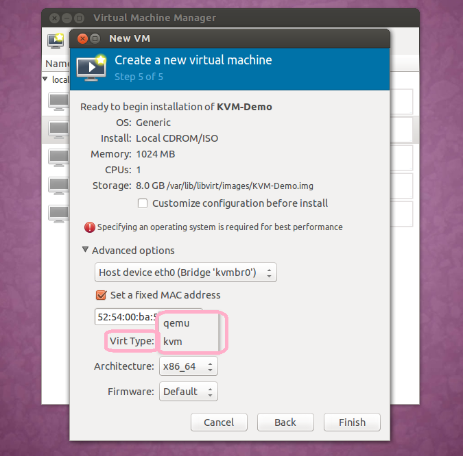
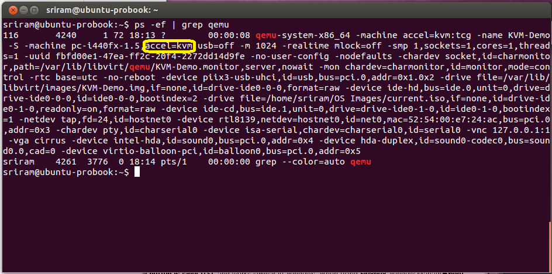
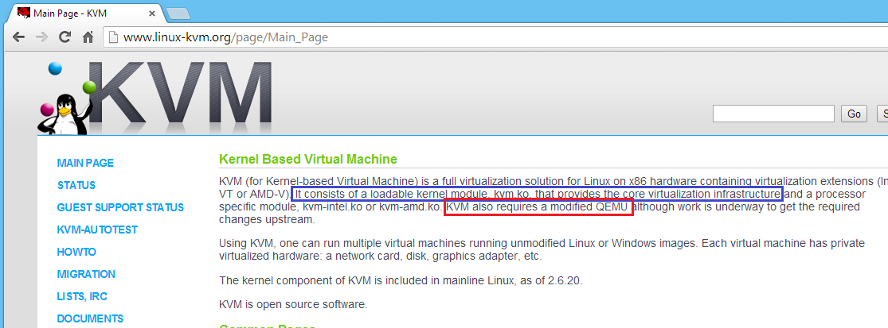
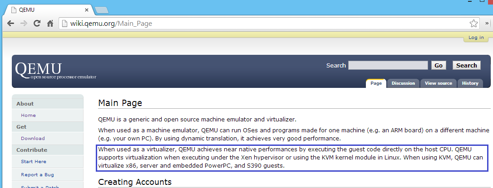

# KVM and QEMU - do you know the connection?

Nếu bạn từng hỏi ai đó rằng "Hypervisor mã nguồn mở nào là thịnh hành nhất", có thể câu trả lời mà bạn nhận được sẽ là KVM. Thật vậy, KVM (Kernel-based Virtual Machine) đóng một vai trò quan trọng trong môi trường ảo hoá dựa trên mã nguồn mở Linux. Tuy nhiên nó có thực sự là một hypervisor không? Hơn nữa, KVM có thể tự mình chạy các máy ảo? Ta sẽ đào sâu vào những câu hỏi này qua bài này. Ta sẽ hiểu được mối quan hệ giữa KVM và QEMU (Quick EMUlator).

## KVM and QEMU - the process ID check

Bạn có thể sử dụng `libvirt` và liên kết với Virtual Machine Manager GUI để bắt đầu một máy ảo. Trong GUI, bạn có thể chọn `Virt Type` là KVM hoặc QEMU. Tôi đã bật một máy ảo, một lần Virt Type là QEMU và một lần là KVM. Ở cả hai trường hợp, tôi đều dùng một lệnh `grep` của process ID để xem có gì khác biệt không.

Khi bật máy ảo với Virt Type là KVM, process ID cho thấy một thuộc tính `accel=kvm` như ảnh dưới

Và khi chạy máy ảo đó với Virt Type là QEMU, process ID hiển thị `accel=tcg`

Lưu ý là ở cả hai trường hợp, Cùng một `binary` được khởi chạy máy ảo, namely, _qemu-system-x8664. Sự khác nhau chính là acceleration type.

## KVM and QEMU - understanding hardware acceleration

Để hiểu về hardware acceleration, ta phải hiểu cách CPU máy ảo hoạt động. Ở phần cứng thật, hệ điều hành (OS) dịch các chương trình thành chỉ thị được thực thi bởi CPU vật lý. Ở một máy ảo, điều tương tự cũng diễn ra. Tuy nhiên, sự khác nhau là CPU ảo thực ra được mô phỏng (hoặc ảo hoá) bởi hypervisor. Bởi vậy, các phần mềm hypervisor phải dịch các chỉ thị cho CPU ảo và chuyển hoá nó thành các chỉ thị cho CPU vật lý. Việc này có một hiệu suất lớn.

Để giảm thiểu chi phí hiệu suất này, các bộ vi xử lý hiện đại đã hỗ trợ `virtualization extensions`. Intel hỗ trợ một công nghệ gọi là VT-x và AMD là AMD-V. Sử dụng các công nghệ này, một phần CPU vật lý có thể được trực tiếp ánh xạ đến CPU ảo. **Do đó các chỉ thị hiểu cho CPU ảo có thể được trực tiếp thực hiện bởi CPU vật lý**.

KVM là một Linux kernel module cho phép ánh xạ CPU vật lý tới CPU ảo. Sự ánh xạ này cải thiện hiệu năng phần cứng cho máy ảo và tăng tốc độ xử lý của máy ảo. Hơn nữa, QEMU sử dụng sự tăng tốc này khi Virt Type được chọn là KVM.

Vậy TCG là gì? Nếu CPU máy chủ của bạn không hỗ trợ ảo hoá mở rộng, thì nó là việc của trình mô phỏng (hoặc hypervisor) để thực hiện các chỉ thị CPU ảo bằng cách dịch. QEMU sử dụng TCG (Tiny Code Generator) để tối ưu dịch và thực hiện các chỉ thị của CPU ảo trên CPU vật lý.

## KVM and QEMU - Type 1 or Type 2 hypervisor

Các trang web của KVM và QEMU cho thấy rõ ràng KVM cần QEMU để cung cấp đầy đủ chức năng của trình ảo hóa. Chính nó, KVM là một nhà cung cấp cơ sở hạ tầng ảo hóa.

QEMU tự bản thân nó đã là một Type 2 hypervisor. Nó chặn các hướng dẫn dành cho CPU ảo và sử dụng hệ điều hành máy chủ để thực hiện các lệnh đó trên CPU vật lý. **Khi QEMU sử dụng KVM để tăng tốc phần cứng, sự kết hợp này trở thành một Type 1 hypervisor**. Sự khác biệt được ghi rõ ràng trong phần giới thiệu trên trang chủ QEMU.

## KVM and QEMU - the x86 dependency

Vì KVM thực chất là một driver cho CPU vật lý, nó được liên kết rất chặt chẽ với kiến trúc CPU (kiến trúc x86). Điều này có nghĩa là các lợi ích của việc tăng tốc phần cứng sẽ chỉ khả dụng nếu CPU của máy ảo sử dụng cùng kiến trúc (x86).

Nếu một máy ảo cần để chạy Power PC CPU nhưng hypervisor server lại có Intel CPU, thì KVM sẽ không hoạt động. Bạn phải dùng QEMU như là Virt Type và chịu chi hiệu năng.

## KVM and QEMU - the conclusion

Dựa trên những gì đã trình bày ở trên, một điều khá rõ ràng là QEMU đóng một vai trò rất quan trọng trong các giải pháp ảo hóa mã nguồn mở dựa trên Linux. **Đối với các ứng dụng thực tế, QEMU cần sự tăng tốc của KVM**. Tuy nhiên, khá rõ ràng rằng **KVM không thể tự mình trở thành một giải pháp ảo hoá toàn phần, KVM cần QEMU**.