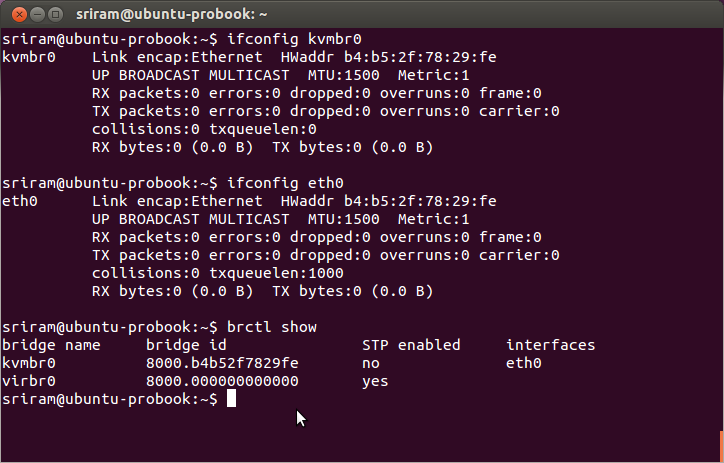
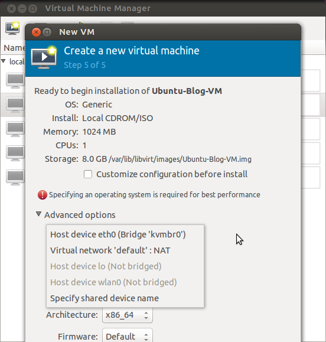
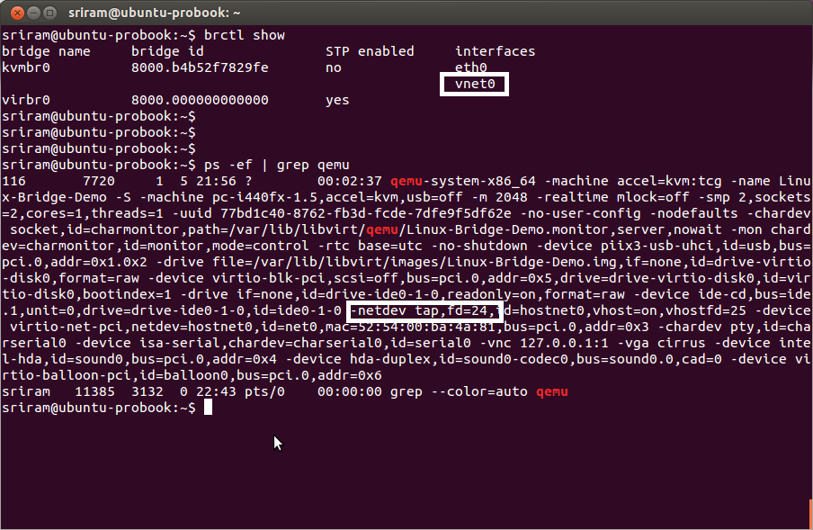
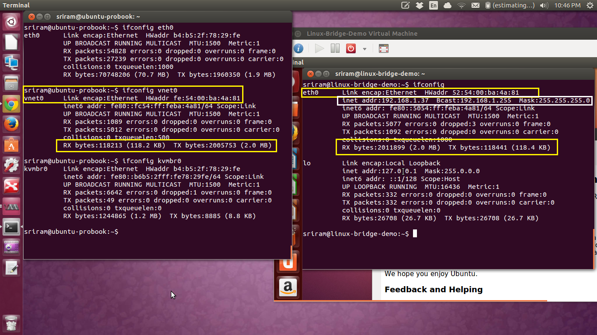

# Linux Bridge and Virtual Networking

Phần mềm định nghĩa mạng (SDN) đang là một làn sóng càn quét vào ngành công nghiệp mạng. Và một trong những chìa khoá của SDN là mạng ảo. Khi mà SDN và mạng ảo đang thịnh hành hiện nay, thì những hỗ trợ cho mạng ảo lại không được phát triển gần đây. Và Linux Bridge đã trở thành tiên phong cho vấn đề này.

## Linux Bridge - The Basics

Mạng ảo cần sự có mặt của một switch ảo ở trong máy chủ/hypervisor. Ngay cả khi nó được gọi là một Bridge, nhưng thực chất Linux Bridge là một switch ảo và được sử dụng cùng với KVM/QEMU hypervisor. Linux Bridge là một kernel module, được giới thiệu lần đầu ở 2.2 kernel (circa 2000). Và nó được quản lý bằng câu lệnh `brctl` trên Linux.

## The Simple Use Case

Giờ ta sẽ nghiên cứu sâu hơn một chút về Linux Bridge bằng các trường hợp sử dụng cơ bản nhất. Bạn muốn tạo một máy ảo trên máy chủ Linux đã cài đặt KVM của bạn. Trong số những cái khác, máy ảo này sẽ được cấu hình với một card mạng ảo. Để máy ảo này có thể kết nối với Internet, ta sẽ phải liên kết card mạng ảo của máy ảo với card mạng vật lý của máy chủ. Sự liên kết này được đơn giản hoá với Linux Bridge. 

Ảnh trên là một máy laptop chạy KVM. Tôi sử dụng mạng không dây nên laptop đã được kết nối mạng. Nhưng để minh hoạ khả năng của Linux Bridge, tôi sẽ tạo một máy ảo và kết nối nó với cổng của card mạng dây trên cùng cái laptop. Máy ảo mới tạo sẽ nhận địa chỉ IP (thông qua DHCP) từ router ở giữa.

## Hướng dẫn từng bước

### Bước 1: Đầu tiên tạo một bridge sử dụng lệnh `brctl` 

`sudo brctl addbr kvmbr0`

### Bước 2: Liên kết card mạng vật lý của máy chủ (eth0) vào bridge này. Lưu ý: Trước khi thực hiện bước này, đảm bảo rằng card mạng vật lý chưa được cấu hình địa chỉ IP.

`sudo brctl addif kvmbr0 eth0`

Kết thúc 2 bước, cấu hình mạng sẽ giống như thế này. Lưu ý rằng `kvmbr0` Linux bridge chỉ có duy nhất một interface lúc này (eth0).

### Bước 3: Tiếp theo, để tạo một máy ảo và chắc chắn rằng nó sử dụng Linux bridge được tạo ở trên cho ảo hoá mạng. Sử dụng công cụ đồ hoạ cho libvirt.

Khi máy ảo được tạo và bật lên, bạn sẽ thấy máy ảo có kết nối mạng ngoài.

## Let us connect the interfaces

Lệnh `brctl show` hiển thị rằng có interface khác trên `kvmbr0` Linux bridge. Interface `vnet0` là một interface ảo được tạo ra bới libvirt (VMM). Interface ảo này còn được gọi là `tap interface`. Bạn có thể thấy từ lệnh `PS` rằng lệnh KVM/QEMU đã khởi chạy máy ảo, sử dụng một tap interface như một thiết bị mạng.

Bây giờ, giống như bạn cắm dây mạng từ card vật lý vào một cổng (interface) trên một switch ảo, card mạng của máy ảo được kết nối tới `tap` interface ảo này trên Linux bridge. Hình dưới thể hiện quan hệ giữa card mạng ảo của máy ảo với Linux Bridge tap interface.

	- 1. Đầu tiên ta nhận thấy sự tương đồng giữa địa chỉ MAC của vnet0 (trên máy chủ) và eth0 (card mạng ảo trong máy ảo).
	
	- 2. Tiếp theo là dữ liệu được truyền và nhận trên từng interface. Đây là quan hệ 1-1 trực tiếp, TX bytes của card mạng máy ảo tương đồng với RX bytes của `vnet0` và ngược lại.
	
	- 3. Cuối cùng, ta có thể thấy rằng card mạng ảo đã được cấu hình với địa chỉ IP và gateway. Các cấu hình này được hoàn tất bằng DHCP server từ router vật lý. Điều này có nghĩa là card mạng ảo đã có kết nối external network.
	

	
## Tóm tắt

- Ta đã tạo ra một Linux bridge và thêm vào một interface card mạng vật lý của máy chủ.

- Khi tạo một máy ảo, ta dùng Linux bridge để ảo hoá mạng.

- Trình quản lý máy ảo (libvirt GUI) đã thực hiện một công việc ngầm để kết nối card mạng ảo và card mạng vật lý tới Linux bridge.

- Ta đã quan sát làm thế nào mà card mạng ảo của máy ảo được kết nối đến một `tap` interface trên máy chủ. Và tap interface được thêm vào Linux bridge như thế nào.

- Luồng lưu thông từ card mạng máy ảo tới `vnet0` tap interface, rồi tới Linux bridge (switch ảo) và ra ngoài bằng interface switch ảo (eth0) trên máy chủ.