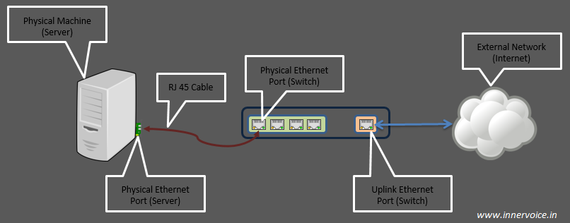
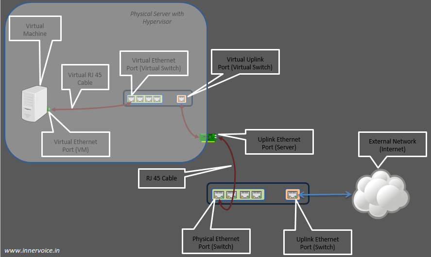

# Tap Interface and Linux Bridge

Trong bài [trước](https://github.com/doedoe12/Internship/blob/master/baidich/Linux_Bridge_and_Virtual_Networking.md) ta đã thấy sử dụng Linux Bridge ta có thể kết nối một cổng Ethernet ảo của một máy ảo với cổng Ethernet vật lý của hypervisor server. Giờ ta sẽ tập trung vào các cổng ảo để xem có gì xảy ra bên trong để cho mạng ảo thực sự hoạt động.

## Physical vs Virtual Networking

Lưu thông luồng dữ liệu mạng được xử lý bởi cổng Ethernet vật lý trên máy vật lý. Tương tự với máy ảo, luồng này cần được xử lý bởi cổng Ethernet ảo. Cuối cùng luồng từ cổng ảo này cần phải gửi tới mạng vật lý cho kết nối external. Làm sao việc này có thể diễn ra? Như ảnh bên dưới, các thành phần là chìa khoá cho mạng vật lý:

- Cổng Ethernet trên máy chủ - thường được gọi là pNIC (physical NIC)

- RJ45 Cable

- Cổng Ethernet trên switch vật lý

- Cổng Uplink trên switch vật lý - kết nối đến external network.

Vì mục đích của ảo hoá là giả lập đối tượng vật lý trong phần mềm, nó phải hỗ trợ một construct mà ở đó một cổng Ethernet ảo của máy ảo được kết nối với một switch ảo.

## Switch Ports

Linux bridge thực chất là một switch trong nhân Linux. Và giống như mọi switch khác, nó cần các `ports` hoặc `interfaces` để lưu thông luồng dữ liệu vào và ra của switch. Ta đã thấy cách thêm một interface vật lý vào bridge. Linux bridge cũng hỗ trợ `ports` ảo. Vì ports ảo thực ra là một đối tượng phần mềm, các đối tượng phần mềm khác có thể sử dụng nó để gửi các Ethernet frames tới switch ảo cho các tiến trình xa hơn. Với Ethernet traffic, những Linux ports ảo này còn được gọi là `tap` interfaces. Tap interfaces có thể được thêm vào Linux bridge giống như các interfaces vật lý. Với cách giải quyết này, một Linux bridge có thể chuyển các gói tin từ thế giới ảo tới thế giới thật (và ngược lại).

Như ảnh trên, khi ảo hoá xuất hiện, các thành phần sau đóng vai trò chìa khoá trong networking:

- Ethernet Port trên máy ảo (giả lập pNIC) - thường được biết tới là vNIC (virtual NIC). Port ảo được giả lập với sự trợ giúp từ KVM/QEMU.

- Dây cáp RJ45 ảo - ta sẽ xem nó được tạo ra như thế nào.

- Ethernet Port trên switch ảo - Với Linux Bridge, nó được biểu diễn bởi `tap interface` vì nó kết nối tới một vNIC.

- Uplink Port trên switch ảo - Nó là interface biểu diễn pNIC. Trong Linux eth0, eth1,... là những interfaces phần mềm biểu diễn các Ethernet Port vật lý.

- Trong trường hợp một máy chủ vật lý, Uplink port trên switch vật lý đã cung cấp kết nối external network. Trong trường hợp của máy ảo, Uplink port trên switch ảo cung cấp kết nối external network.

## Tap interfaces - Tại sao ta cần nó?

Giống như thiết bị vật lý tương ứng của nó, ports mạng máy ảo chỉ có thể tiến hành Ethernet frames. Trong môi trường không ảo hoá, interface NIC vật lý sẽ nhận và thực hiện các Ethernet frames. Nó sẽ loại bỏ cá bytes không liên quan đến Ethernet và chuyển tiếp payload (thường là các gói IP) đến hệ điều hành. Tuy nhiên với ảo hoá, việc này sẽ không hoạt động vì NICs ảo sẽ đợi các Ethernet frames. Đây là lúc tap interfaces xuất hiện. Tap interfaces là một đối tượng phần mềm đặc biệt, nó cho Linux bridge biết cách chuyển tiếp Ethernet frames. Nói cách khác, các máy ảo đã kết nối tới tap interfaces sẽ có thể nhận các Ethernet frames nguyên bản. Và nhờ có nó mà các máy ảo có thể tiếp tục mô phỏng máy vật lý từ một mạng.

## Có tồn tại cáp RJ45 ảo không?

Câu trả lời là không. Nhưng có một thứ cần thiết để kết nối một port Ethernet ảo của máy ảo tới tap interface trên Linux bridge. Sự kết nối này là thành quả của lập trình. Các chương trình như libvirt tạo ra một `file descriptor` sử dụng tap interface. Khi Linux bridge gửi Ethernet frames tới tap interface, nó thực ra là đang gửi các bytes tới một file descriptor. Các trình mô phỏng như QEMU, đọc các bytes từ file descriptor này và chuyển nó tới "hệ điều hành khách" bên trong máy ảo, thông qua port mạng ảo trên máy ảo.

**Note**: Tap interfaces được liệt kê như một phần của câu lệnh `ifconfig`