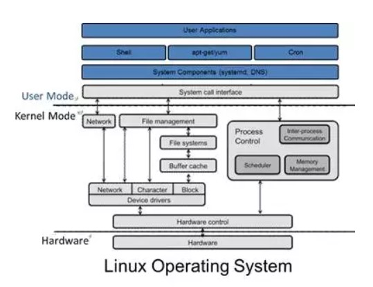
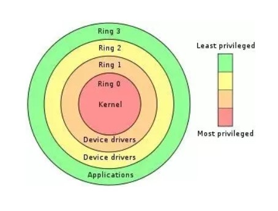

https://mp.weixin.qq.com/s?__biz=MzI1NzYzODk4OQ==&mid=2247483820&idx=1&sn=8a44b992491aea03e55eefb4815a1958&chksm=ea15168edd629f98e622dcb94e64fbb4a75055da98d620e7c83071b5d6d428904fa5c8e9c4ad&scene=21#wechat_redirect

# I'm a virtual machine kernel, I'm confused?

Nhân là nhân của hệ điều hành.

Tất cả các hệ điều hành đều có 1 nhân, và Windows hoặc Linux quản lý 3 tài nguyên quan trọng: Computing, Networking, và Storage.

Computing ám chỉ CPU và bộ nhớ, Network là các thiết bị mạng, Storage là ổ cứng và các thiết bị lưu trữ.

Nhân là một người quản gia lớn. Tưởng tượng chạy rất nhiều chương trình trên máy của bạn. Đó là words, excels, videos, musics. Mọi chương trình đều phải sử dụng CPU và bộ nhớ. Bạn phải trực tuyến và lưu đĩa cứng. Không có người quản gia lớn, mọi người sẽ dùng nó một cách tình cờ. Bởi vậy, người quản gia cần phải điều phối toàn bộ tài nguyên. Ai dùng đầu tiên, ai dùng sau, ai dùng, ai đặt tại đây, và ai đặt tại kia đều cần phải lo lắng về người quản gia.

Vậy nên trong máy tính gia đình, người quản gia có đặc quyền cao hơn là ở các chương trình bình thường, là được chạy ở kernel mode, trong khi các chương trình khác chạy ở user mode. Khi các ứng dụng user mode phải áp dụng cho tài nguyên công cộng, nó phải được đăng ký với quản gia. Quản gia sẽ giúp phân bổ nó, để nó có thể được sử dụng.

Để phân biệt kernel mode và user mode, CPU chia rõ ràng 4 cấp độ đặc quyền 0, 1, 2, 3 để làm việc này.

Khi tôi viết nhân Linux vào thời điểm đó, nó được ước lượng rằng những con bò lớn (?) không biết rằng ảo hoá sẽ toả sáng trong tương lai. Những big cows (?) đã tưởng rằng chỉ có 2 cấp đặc quyền, một là kernel state, hai là user state, nhưng thật ra có đến 4 cấp, quá sang, quá giàu. Nó được mở để sử dụng, kernel mode chạy ở cấp 0, và user mode chạy ở cấp 3, chiếm cả 2 đầu, quá nhiều để tồn tại.

Khi toà lâu đài lớn đang viết nhân Linux, nếu các chương trình user mode làm gì đó, cờ lê sẽ được tăng lên cấp 3. Khi bạn muốn áp dụng nhiều tài nguyên hơn, bạn phải áp dụng cờ lê đến cấp 0, và nhân có thể high (?). Quyền truy cập tài nguyên, áp dụng tài nguyên, trả về user state, cờ lê và trở lại. 

Chương trình này đã chạy rất mượt mà cho đến khi máy ảo xuất hiện.

Nếu bạn có dùng VMware, hay Virtualbox, bạn có thể dùng các phần mềm ảo hoá này để tạo một máy ảo, cài đặt Linux hay Windows vào máy ảo đó, và hệ điều hành bên ngoài cũng có thể là Linux hoặc Windows.

Khi bạn dùng phần mềm của máy ảo, như excel, nó sẽ được đặt trên taskbar. Nó là một ứng dụng bình thường.