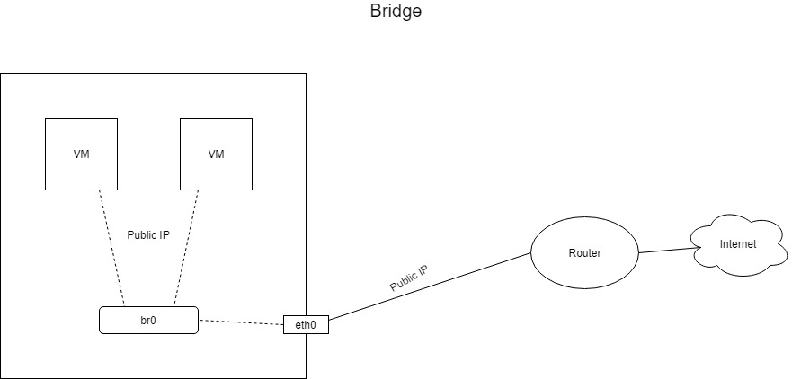
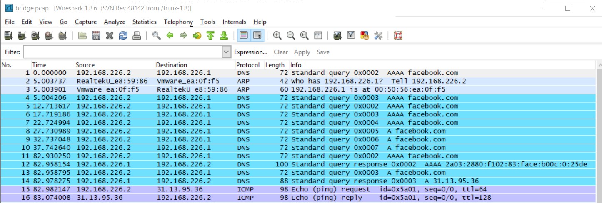
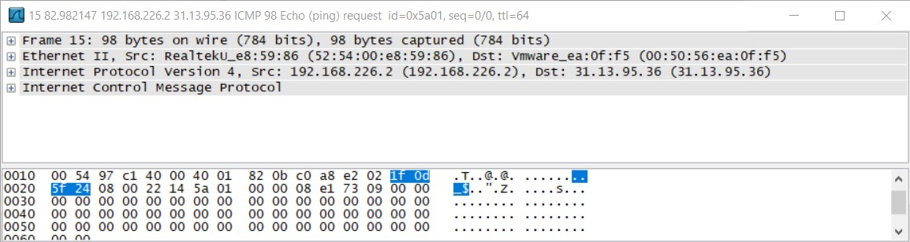
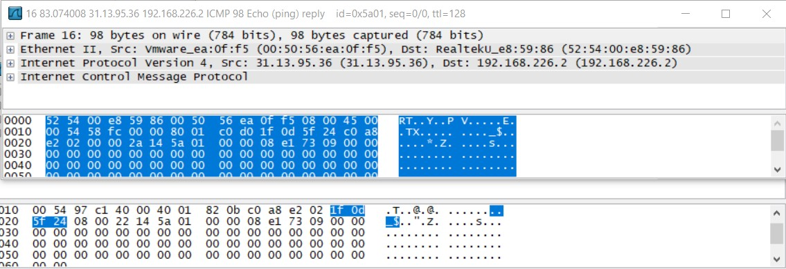
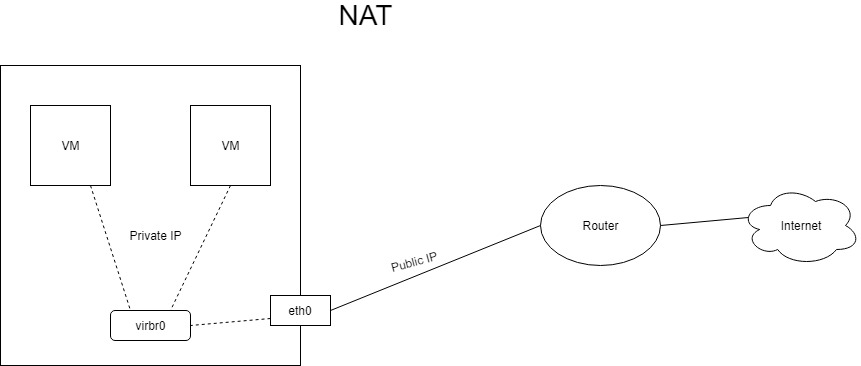
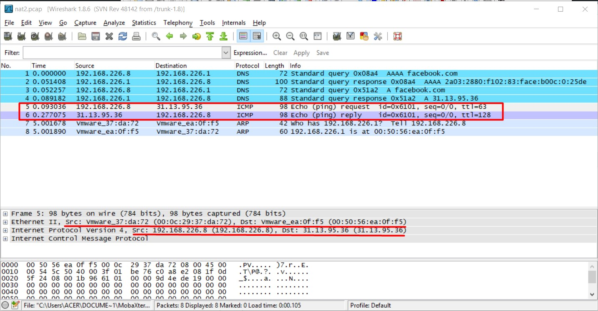

# Đường đi của gói tin trong chế độ mạng Bridge và NAT của KVM

Lưu ý: Bài sử dụng VMWare là môi trường ảo hoá nên sẽ coi các card mạng của VMWare như là card mạng vật lý.

## Bridge

Ở chế độ Bridge, các máy ảo sẽ nhận địa chỉ IP trực tiếp từ Router vật lý và sẽ có cùng dải mạng với máy vật lý, hoạt động như một máy vật lý. Do đó các card mạng máy ảo sẽ giao tiếp trực tiếp với card mạng vật lý, lúc này **br0** đóng vai trò là bridge để nối mạng ảo và mạng thật thành một mạng duy nhất. 

Sử dụng lệnh `tcpdump -n -i br0 -w /root/bridge.pcap` để capture gói tin trên `br0` và ghi vào file `bridge.pcap` để theo dõi đường đi của gói tin.

Tiếp theo thực hiện ping từ máy ảo đến facebook.com.

Mở file `bridge.pcap` để xem

Ở đây ta thấy có 3 địa chỉ IP giao tiếp với nhau:

- **192.168.226.2**: Địa chỉ IP của máy ảo

- **192.168.226.1**: Địa chỉ IP của Router vật lý

- **31.13.95.36**: Địa chỉ IP của facebook

Đầu tiên thì vNIC của máy ảo sẽ giao tiếp với pNIC để phân giải tên miền để nhận địa chỉ IP của facebook.

Chú ý vào 2 gói tin ICMP, đây là 2 gói tin của lệnh ping mà ta đã thực hiện.

Đầu tiên là gói request:

- Dòng **Internet Protocol Version 4** cho biết gói tin được gửi từ máy ảo đến facebook.

- Dòng **Ethernet II** cho ta thấy rằng gói tin này được chuyển từ vNIC máy ảo (địa chỉ MAC 52:54:22:e8:59:86) tới pNIC Router (địa chỉ MAC 00:50:56:ea:0f:f5) để ra ngoài mạng.

Tiếp theo xem gói reply từ facebook:

- Ta thấy địa chỉ nguồn và đích của gói tin chỉ là ngược lại với gói request.

### Kết luận

Vậy trong chế độ Bridge thì gói tin sẽ đi từ vNIC của máy ảo, qua br0 tới pNIC của Router rồi ra mạng ngoài.

## NAT 

Ở chế độ NAT, **virbr0** đóng vai trò giống như một router ảo để NAT địa chỉ IP của máy vật lý và cấp cho các máy ảo.

Ta cũng thực hiện ping tới facebook.com để xem đường đi gói tin.

Đầu tiên ta sẽ capture tại **virbr0** bằng lệnh `tcpdump -n -i virbr0 -w /root/nat.pcap`

Mở file `nat.pcap` để xem thông tin:

- **192.168.122.232**: IP máy ảo

- **192.168.122.1**: IP của router ảo virbr0

- **31.13.95.36**: IP của facebook

- **52:54:00:e8:59:86**: địa chỉ MAC máy ảo

- **52:54:00:54:2e:00**: địa chỉ MAC virbr0

Theo những gì ta thấy ở đây thì gói tin đã được chuyển từ máy ảo tới virbr0.

Tiếp theo capture tại card mạng máy vật lý **ens33** bằng lệnh `tcpdump -i ens33 -n -w /root/nat2.pcap`

Mở file `nat2.pcap`:

- **192.168.226.1**: IP Router 

- **192.168.226.8**: IP máy vật lý

- **31.13.95.36**: IP facebook

- **00:0c:29:37:da:72**: Địa chỉ MAC máy vật lý

- **00:50:56:ea:0f:f5**: Địa chỉ MAC router vật lý

Ở đây ta thấy rằng địa chỉ của máy ảo đã được chuyển hết thành địa chỉ máy vật lý, máy vật lý sẽ giao tiếp và chuyển gói tin tới router vật lý để ra ngoài mạng.

### Kết luận

Ở chế độ NAT, gói tin sẽ đi từ máy ảo, tới router ảo virbr0, và tại đây địa chỉ IP của máy ảo sẽ được NAT thành địa chỉ máy vật lý, gói tin được chuyển từ virbr0 tới máy thật, rồi từ máy thật tới router và ra ngoài mạng.